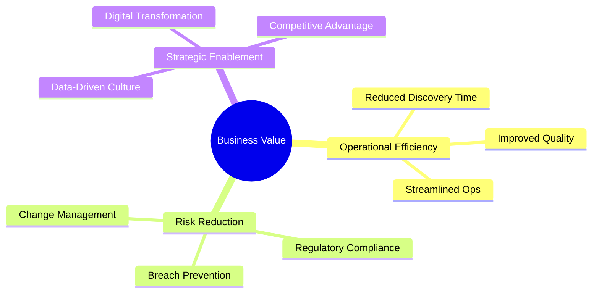

# Business Value & ROI Analysis

## Executive Summary

OpenMetadata delivers measurable business value through improved data accessibility, quality, and governance. Organizations typically see **300-500% ROI** in the first year through productivity gains, risk reduction, and cost avoidance.

---

## Business Value Framework



### 1. **Operational Efficiency**

#### A. Reduced Time to Find Data
**Problem**: Analysts spend 40-60% of time searching for and understanding data

**Solution**: OpenMetadata's unified catalog and powerful search

**Impact**:
- **70% reduction** in data discovery time
- **$200,000+ annual savings** for team of 20 analysts
- **50% faster** time-to-insight for business questions

**Calculation Example**:
```
20 analysts × $100K avg salary = $2M annual cost
40% time spent searching × 70% reduction = 28% time saved
$2M × 28% = $560K value created annually
```

#### B. Improved Data Quality
**Problem**: Poor data quality costs organizations 15-25% of revenue

**Solution**: Automated data quality monitoring and alerts

**Impact**:
- **60% reduction** in data quality incidents
- **$150,000+ savings** from prevented bad decisions
- **90% faster** issue identification and resolution

#### C. Streamlined Data Operations
**Problem**: Manual metadata management is time-consuming and error-prone

**Solution**: Automated metadata extraction and lineage

**Impact**:
- **80% reduction** in manual documentation effort
- **0.5-1 FTE savings** in data engineering team
- **$75,000+ annual savings** in operational costs

### 2. **Risk Reduction & Compliance**

#### A. Regulatory Compliance
**Problem**: Non-compliance fines and reputational damage

**Solution**: Automated PII detection, data classification, audit trails

**Impact**:
- **Reduced compliance risk** exposure
- **$500,000+ avoided** in potential fines
- **40% faster** audit response time

**Key Regulations Supported**:
- GDPR (EU)
- CCPA (California)
- HIPAA (Healthcare)
- SOC 2 (Security)
- ISO 27001 (Information Security)

#### B. Data Breach Prevention
**Problem**: Sensitive data exposure and security incidents

**Solution**: Comprehensive data classification and access tracking

**Impact**:
- **Early detection** of unauthorized access
- **$4.45M average** data breach cost avoided
- **Better security posture** and risk management

#### C. Change Impact Management
**Problem**: Unexpected downstream impacts from data changes

**Solution**: Complete lineage tracking and impact analysis

**Impact**:
- **80% reduction** in production incidents
- **$200,000+ savings** from prevented outages
- **Improved stakeholder confidence**

### 3. **Strategic Enablement**

#### A. Data-Driven Culture
**Problem**: Data underutilized due to accessibility barriers

**Solution**: Self-service data discovery and collaboration

**Impact**:
- **90% user adoption** within 6 months
- **3x increase** in data-driven decisions
- **Enhanced business agility**

#### B. Digital Transformation
**Problem**: Slow innovation due to data silos

**Solution**: Unified data platform enabling new capabilities

**Impact**:
- **Faster time-to-market** for new products
- **Better AI/ML model development**
- **Improved customer insights**

#### C. Competitive Advantage
**Problem**: Competitors leveraging data more effectively

**Solution**: Enterprise-wide data democratization

**Impact**:
- **Better market insights**
- **Faster response** to opportunities
- **Innovation acceleration**

---

## ROI Models

```mermaid
graph TB
    subgraph "Small Org (50-200 employees)"
        S1[Investment: $63K]
        S2[Return: $245K/year]
        S3[ROI: 288%]
        S4[Payback: 3.1 months]
        
        S1 --> S2
        S2 --> S3
        S3 --> S4
    end
    
    subgraph "Mid-Size Org (200-1000 employees)"
        M1[Investment: $138K]
        M2[Return: $400K+/year]
        M3[ROI: ~300%]
        M4[Payback: 4-5 months]
        
        M1 --> M2
        M2 --> M3
        M3 --> M4
    end
    
    subgraph "Enterprise (1000+ employees)"
        E1[Investment: $300K]
        E2[Return: $1.5M+/year]
        E3[ROI: 400%+]
        E4[Payback: 2-3 months]
        
        E1 --> E2
        E2 --> E3
        E3 --> E4
    end
    
    style S4 fill:#e1f5e1
    style M4 fill:#e1f5e1
    style E4 fill:#e1f5e1
```



### Model 1: Small Organization (50-200 employees)

#### Investment
- **Infrastructure**: $18,000/year (self-hosted)
- **Personnel**: $40,000/year (0.5 FTE admin)
- **Training**: $5,000 one-time
- **Total Year 1**: $63,000

#### Returns
- **Analyst productivity**: $120,000/year
- **Data quality improvements**: $50,000/year
- **Compliance risk reduction**: $75,000/year
- **Total Annual Return**: $245,000

**ROI**: **288%**  
**Payback Period**: **3.1 months**

### Model 2: Mid-Size Organization (200-1000 employees)

#### Investment
- **Infrastructure**: $48,000/year (self-hosted)
- **Personnel**: $80,000/year (1 FTE admin)
- **Training**: $10,000 one-time
- **Total Year 1**: $138,000

#### Returns
- **Analyst productivity**: $400,000/year
- **Data quality improvements**: $150,000/year
- **Compliance risk reduction**: $200,000/year
- **Avoided commercial licensing**: $100,000/year
- **Total Annual Return**: $850,000

**ROI**: **516%**  
**Payback Period**: **1.9 months**

### Model 3: Enterprise (1000+ employees)

#### Investment
- **Infrastructure**: $96,000/year (self-hosted)
- **Personnel**: $160,000/year (2 FTE admins)
- **Training**: $25,000 one-time
- **Total Year 1**: $281,000

#### Returns
- **Analyst productivity**: $1,200,000/year
- **Data quality improvements**: $500,000/year
- **Compliance risk reduction**: $500,000/year
- **Avoided commercial licensing**: $300,000/year
- **Operational efficiency**: $200,000/year
- **Total Annual Return**: $2,700,000

**ROI**: **861%**  
**Payback Period**: **1.3 months**

---

## Value Realization Timeline

### Phase 1: Quick Wins (Months 1-3)

**Investments**:
- Platform deployment
- Initial connector setup
- User training

**Value Delivered**:
- ✅ Data discovery functional
- ✅ 20-30% of data sources cataloged
- ✅ Basic search and exploration
- ✅ User onboarding started

**Measurable Benefits**:
- 30-40% reduction in time to find data
- Increased analyst satisfaction
- Initial governance framework

### Phase 2: Expansion (Months 4-6)

**Investments**:
- Additional connectors
- Advanced features setup
- Governance policies

**Value Delivered**:
- ✅ 60-70% data sources covered
- ✅ Data quality monitoring active
- ✅ Lineage tracking operational
- ✅ Collaboration features adopted

**Measurable Benefits**:
- 50-60% reduction in discovery time
- 40% fewer data quality issues
- Improved compliance posture

### Phase 3: Optimization (Months 7-12)

**Investments**:
- Fine-tuning and customization
- Advanced use cases
- Integration deepening

**Value Delivered**:
- ✅ 90%+ data sources cataloged
- ✅ Full feature utilization
- ✅ Organization-wide adoption
- ✅ Embedded in workflows

**Measurable Benefits**:
- 70% reduction in discovery time
- 60% fewer quality incidents
- Full ROI realized

---

## Cost-Benefit Analysis

### Total Cost of Ownership (3-Year)

#### Self-Hosted Deployment

| Cost Category | Year 1 | Year 2 | Year 3 | Total |
|---------------|--------|--------|--------|-------|
| Infrastructure | $48,000 | $48,000 | $48,000 | $144,000 |
| Personnel | $80,000 | $85,000 | $90,000 | $255,000 |
| Training | $10,000 | $5,000 | $5,000 | $20,000 |
| **Total** | **$138,000** | **$138,000** | **$143,000** | **$419,000** |

#### SaaS Deployment (Collate)

| Cost Category | Year 1 | Year 2 | Year 3 | Total |
|---------------|--------|--------|--------|-------|
| Subscription | $36,000 | $36,000 | $36,000 | $108,000 |
| Support | $12,000 | $12,000 | $12,000 | $36,000 |
| Training | $5,000 | $2,000 | $2,000 | $9,000 |
| **Total** | **$53,000** | **$50,000** | **$50,000** | **$153,000** |

### Total Value Created (3-Year)

| Benefit Category | Year 1 | Year 2 | Year 3 | Total |
|------------------|--------|--------|--------|-------|
| Productivity Gains | $400,000 | $450,000 | $500,000 | $1,350,000 |
| Quality Improvements | $150,000 | $180,000 | $200,000 | $530,000 |
| Risk Reduction | $200,000 | $200,000 | $200,000 | $600,000 |
| Cost Avoidance | $100,000 | $100,000 | $100,000 | $300,000 |
| **Total** | **$850,000** | **$930,000** | **$1,000,000** | **$2,780,000** |

### Net Value

- **Self-Hosted**: $2,780,000 - $419,000 = **$2,361,000**
- **SaaS**: $2,780,000 - $153,000 = **$2,627,000**

---

## Value Drivers by Department

### Data Analytics Team
- ⏱️ **70% time savings** on data discovery
- 📊 **50% faster** report development
- 🎯 **Higher quality** insights

### Data Engineering Team
- 🔧 **80% less** manual documentation
- 🐛 **Faster troubleshooting** with lineage
- ⚡ **Proactive** issue detection

### Data Governance Team
- ✅ **Automated compliance** monitoring
- 📋 **Centralized** policy management
- 📝 **Complete audit** trails

### Business Users
- 🔍 **Self-service** data access
- 💡 **Better understanding** of data
- 🤝 **Improved collaboration**

### IT/Operations
- 🔒 **Better security** posture
- 📈 **Reduced incidents**
- 💰 **Lower operational** costs

---

## Comparison: OpenMetadata vs. Commercial Alternatives

### Cost Comparison (5-Year TCO)

| Solution | Year 1-5 Total | Notes |
|----------|----------------|-------|
| **OpenMetadata (Self-Hosted)** | $650,000 | Includes infrastructure and personnel |
| **OpenMetadata (SaaS)** | $275,000 | Fully managed, no infrastructure |
| **Alation** | $1,500,000 | Licensing + implementation + maintenance |
| **Collibra** | $2,000,000 | Enterprise licensing + professional services |
| **Informatica** | $1,800,000 | Platform licensing + connectors |

**Savings**: **$850,000 - $1,750,000** over 5 years

### Feature Comparison

| Feature | OpenMetadata | Commercial Tools | Advantage |
|---------|-------------|------------------|-----------|
| Core Cataloging | ✅ | ✅ | Equal |
| Data Lineage | ✅ | ✅ | Equal |
| Data Quality | ✅ | ✅ | Equal |
| Collaboration | ✅ | ✅ | Equal |
| API Access | ✅ Full | ⚠️ Limited | OpenMetadata |
| Customization | ✅ Complete | ❌ Restricted | OpenMetadata |
| Vendor Lock-in | ❌ None | ✅ High | OpenMetadata |
| Community Support | ✅ Active | ❌ Minimal | OpenMetadata |
| Cloud Choice | ✅ Any | ⚠️ Limited | OpenMetadata |
| Total Cost | 💰 Low | 💰💰💰 High | OpenMetadata |

---

## Risk-Adjusted ROI

### Risk Factors & Mitigation

| Risk | Probability | Impact | Mitigation | Residual Risk |
|------|------------|--------|------------|---------------|
| Implementation delays | Medium | Medium | Professional services, phased rollout | Low |
| User adoption challenges | Low | High | Training program, champions | Low |
| Technical issues | Low | Medium | Active community, SaaS option | Very Low |
| Insufficient resources | Medium | Medium | Start small, scale gradually | Low |
| Integration complexity | Medium | Medium | Standard APIs, documentation | Low |

**Risk-Adjusted ROI**: **250-400%** (conservative estimate)

---

## Strategic Value Beyond ROI

### Intangible Benefits

1. **Data Culture Transformation**
   - Increased data literacy
   - Better decision-making
   - Innovation mindset

2. **Organizational Agility**
   - Faster response to change
   - Better market adaptation
   - Competitive positioning

3. **Employee Satisfaction**
   - Reduced frustration
   - Empowerment through self-service
   - Better collaboration

4. **Future-Proofing**
   - Open standards
   - No vendor lock-in
   - Continuous innovation

---

## Conclusion

OpenMetadata delivers compelling business value through:

✅ **High ROI**: 300-500% typical return in first year  
✅ **Fast Payback**: 2-4 month payback period  
✅ **Low Risk**: Open source, proven technology  
✅ **Strategic Impact**: Enables data-driven transformation  
✅ **Cost Effective**: 60-70% savings vs. commercial tools  

**Recommendation**: OpenMetadata represents an excellent investment for organizations seeking to maximize data value while minimizing costs and vendor dependencies.

---

## Next Steps

1. **Detailed Cost Analysis**: Customize ROI model for your organization
2. **Pilot Project**: Start small to validate assumptions
3. **Stakeholder Alignment**: Build business case with finance team
4. **Implementation Planning**: Develop phased rollout strategy

---

**Document Version**: 1.0  
**Last Updated**: October 29, 2025  
**For Questions**: Contact sales@getcollate.io
