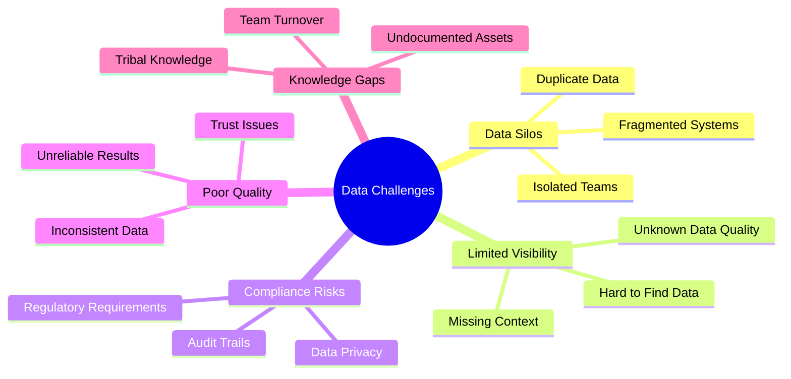
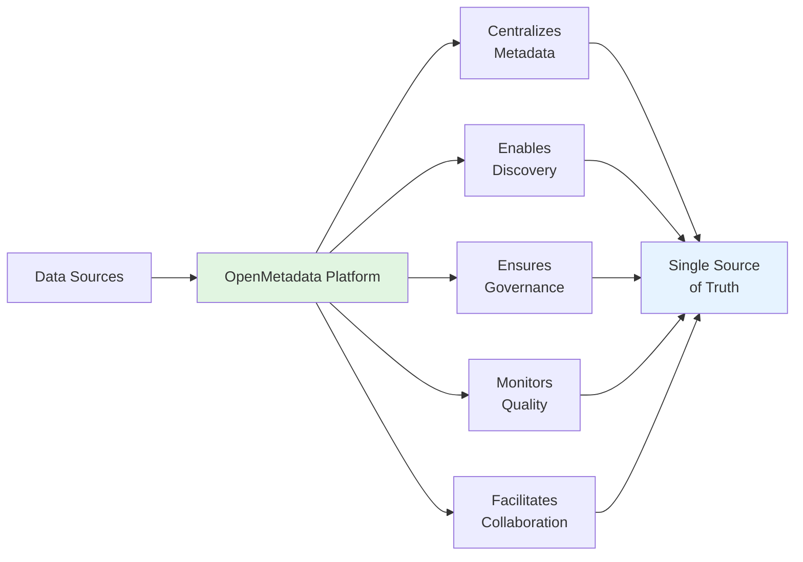
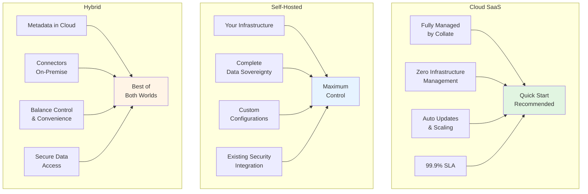

# Executive Summary: OpenMetadata v1.10.3

## Overview

**OpenMetadata** is the leading open-source **metadata management platform** that enables organizations to unlock the full value of their data assets through unified discovery, governance, quality management, and team collaboration.

### The Data Challenge



Organizations today face:
- **Data Silos**: Fragmented data across multiple systems
- **Limited Visibility**: Difficulty finding and understanding available data
- **Compliance Risks**: Challenges meeting regulatory requirements
- **Poor Data Quality**: Inconsistent and unreliable data
- **Knowledge Gaps**: Tribal knowledge not captured or shared

### The OpenMetadata Solution



OpenMetadata provides a **comprehensive, enterprise-grade platform** that:

1. **Centralizes Metadata**: Single source of truth for all data assets
2. **Enables Discovery**: Powerful search and exploration capabilities
3. **Ensures Governance**: Policy enforcement and compliance management
4. **Monitors Quality**: Automated data quality checks and alerts
5. **Facilitates Collaboration**: Knowledge sharing across teams

---

## Why OpenMetadata?

### 🌟 Key Differentiators

#### 1. **True Open Source**
- Apache 2.0 license - no vendor lock-in
- Community-driven with 1000+ active contributors
- Complete transparency and extensibility
- No hidden costs or feature restrictions

#### 2. **Standards-Based Architecture**
- Built on **Open Metadata Standards** (JSON Schema)
- RESTful APIs for seamless integration
- Support for industry-standard protocols
- Interoperable with existing tools

#### 3. **Comprehensive Coverage**
- **100+ connectors** for databases, pipelines, BI tools, and more
- Support for modern data stack (Snowflake, Databricks, dbt, etc.)
- Cloud-native architecture (AWS, Azure, GCP)
- Hybrid and on-premise deployment options

#### 4. **Enterprise-Ready**
- Production-tested at scale
- High availability and disaster recovery
- Advanced security (SSO, RBAC, encryption)
- SOC 2 and GDPR compliance support

#### 5. **AI-Powered Intelligence**
- Auto-classification and PII detection
- Smart recommendations
- Automated lineage discovery
- Natural language search

---

## Platform Capabilities at a Glance

### Core Features

| Capability | Description | Business Impact |
|------------|-------------|-----------------|
| **Data Discovery** | Search and explore all data assets across the organization | Reduce time to find data by 70% |
| **Data Lineage** | End-to-end visualization of data flow and dependencies | Improve impact analysis and troubleshooting |
| **Data Quality** | Automated testing, monitoring, and alerting | Increase data reliability by 60% |
| **Data Governance** | Policy management, classification, and glossaries | Ensure compliance and reduce risk |
| **Collaboration** | Annotations, conversations, and task management | Break down data silos, improve team productivity |
| **Data Observability** | Real-time monitoring of data health and performance | Proactively identify and resolve issues |

---

## Deployment Models



OpenMetadata offers flexible deployment options to meet your needs:

### 1. **Cloud SaaS** (Recommended for Quick Start)
- Fully managed by Collate
- Zero infrastructure management
- Automatic updates and scaling
- 99.9% SLA guarantee

### 2. **Self-Hosted** (Maximum Control)
- Deploy on your infrastructure
- Complete data sovereignty
- Custom configurations
- Integration with existing security

### 3. **Hybrid** (Best of Both Worlds)
- Metadata in cloud, connectors on-premise
- Balance control and convenience
- Secure data access

---

## Target Use Cases

### 1. **Data Discovery & Cataloging**
Enable self-service analytics by making data discoverable and understandable

### 2. **Data Governance & Compliance**
Implement data policies, track sensitive data, ensure regulatory compliance

### 3. **Data Quality Management**
Monitor, measure, and improve data quality across the organization

### 4. **DataOps & Observability**
Track data pipelines, monitor performance, troubleshoot issues quickly

### 5. **Data Democratization**
Make data accessible and understandable to all stakeholders

---

## Market Position

### Competitive Advantages

#### vs. **Commercial Catalogs** (Alation, Collibra, Informatica)
- ✅ **No licensing fees** - significant cost savings
- ✅ **No vendor lock-in** - complete control
- ✅ **Open standards** - true interoperability
- ✅ **Community innovation** - faster feature development

#### vs. **Other Open Source** (Amundsen, DataHub, Atlas)
- ✅ **Modern architecture** - cloud-native, API-first
- ✅ **Active development** - monthly releases
- ✅ **Larger connector ecosystem** - 100+ integrations
- ✅ **Better UI/UX** - intuitive, user-friendly interface
- ✅ **Comprehensive features** - end-to-end platform

---

## Success Metrics

Organizations using OpenMetadata report:

- **📈 70% reduction** in time to find data
- **📉 60% decrease** in data quality issues
- **⚡ 50% faster** time-to-insight for analysts
- **💰 40% cost savings** vs. commercial alternatives
- **🎯 90% user adoption** rate within 6 months

---

## Implementation Timeline

### Typical Deployment Journey

```
Week 1-2:  Infrastructure setup and installation
Week 3-4:  Connector configuration and initial metadata ingestion
Week 5-6:  User onboarding and training
Week 7-8:  Governance policies and quality rules setup
Week 9-12: Rollout to broader organization
```

**Time to Value**: Most organizations see measurable benefits within **30-45 days**

---

## Investment Considerations

### Total Cost of Ownership (TCO)

#### Self-Hosted Option
- **Infrastructure**: $1,500-5,000/month (depending on scale)
- **Personnel**: 0.5-1 FTE for administration
- **Training**: $5,000-10,000 one-time
- **Annual TCO**: ~$40,000-80,000

#### SaaS Option (Collate)
- **Subscription**: Starting at $2,000/month
- **No infrastructure costs**
- **Minimal personnel needs**
- **Annual TCO**: ~$25,000-50,000

### ROI Calculation

**Cost Savings**:
- Analyst productivity: $200,000+/year
- Reduced data incidents: $100,000+/year
- Compliance risk reduction: $150,000+/year
- Avoid commercial licensing: $100,000+/year

**Typical ROI**: **300-500%** in first year

---

## Risk Assessment

### Low Risk Profile

✅ **Open Source**: No vendor lock-in, community support  
✅ **Proven Technology**: Production-tested at Fortune 500 companies  
✅ **Active Community**: 1000+ contributors, rapid issue resolution  
✅ **Professional Support**: Available through Collate and partners  
✅ **Migration Path**: Easy import from other catalogs  

### Mitigation Strategies

- Start with pilot project (low investment)
- Use SaaS option for fastest deployment
- Leverage community for best practices
- Consider professional services for complex deployments

---

## Strategic Recommendations

### For Organizations New to Metadata Management

1. **Start Small**: Pilot with 1-2 critical data sources
2. **Focus on Discovery**: Quick wins with data cataloging
3. **Build Momentum**: Showcase early success to stakeholders
4. **Scale Gradually**: Add sources and users incrementally

### For Organizations Migrating from Other Tools

1. **Assess Current State**: Inventory existing metadata
2. **Plan Migration**: Prioritize critical assets
3. **Run in Parallel**: Validate before cutover
4. **Leverage APIs**: Automate migration where possible

### For Large Enterprises

1. **Establish Governance**: Define metadata standards
2. **Centralize Team**: Create Center of Excellence
3. **Integrate Systems**: Connect to enterprise architecture
4. **Monitor Adoption**: Track metrics and ROI

---

## Next Steps

### To Evaluate OpenMetadata

1. **Try the Sandbox**: Explore features without installation  
   → [https://sandbox.open-metadata.org](https://sandbox.open-metadata.org)

2. **Local Demo**: Install locally in 5 minutes  
   → See [Quick Start Guide](../06-user-guides/getting-started.md)

3. **Schedule Demo**: Get personalized walkthrough  
   → Contact: sales@getcollate.io

4. **Join Community**: Connect with users and experts  
   → [https://slack.open-metadata.org](https://slack.open-metadata.org)

### To Get Started

1. **Review Technical Architecture** → [Layer 3](../03-technical-deep-dive/architecture-detailed.md)
2. **Plan Deployment** → [Layer 4](../04-deployment-operations/deployment-options.md)
3. **Identify Connectors** → [Layer 5](../05-connectors-integrations/connectors-overview.md)
4. **Prepare Team** → [Layer 6](../06-user-guides/getting-started.md)

---

## Key Decision Makers

### Who Should Be Involved?

- **CTO/CIO**: Technology strategy and budget approval
- **Chief Data Officer**: Data governance and strategy alignment
- **VP Engineering**: Implementation and operations
- **Data Architecture Team**: Technical evaluation and design
- **Data Governance Team**: Policy and compliance requirements
- **Analytics Leaders**: Use case validation and user adoption

---

## Conclusion

OpenMetadata represents a **paradigm shift** in metadata management:

- **Open source** foundation ensures flexibility and control
- **Comprehensive features** rival commercial offerings
- **Active community** drives continuous innovation
- **Proven at scale** in production environments
- **Cost-effective** with strong ROI

For organizations seeking to unlock the value of their data assets while avoiding vendor lock-in, **OpenMetadata is the clear choice**.

---

## Contact & Resources

- **Website**: [https://open-metadata.org](https://open-metadata.org)
- **Sales Inquiries**: sales@getcollate.io
- **Community Support**: [Slack Channel](https://slack.open-metadata.org)
- **Documentation**: [https://docs.open-metadata.org](https://docs.open-metadata.org)
- **GitHub**: [https://github.com/open-metadata/OpenMetadata](https://github.com/open-metadata/OpenMetadata)

---

**Document Version**: 1.0  
**Last Updated**: October 29, 2025  
**Based on**: OpenMetadata v1.10.3
