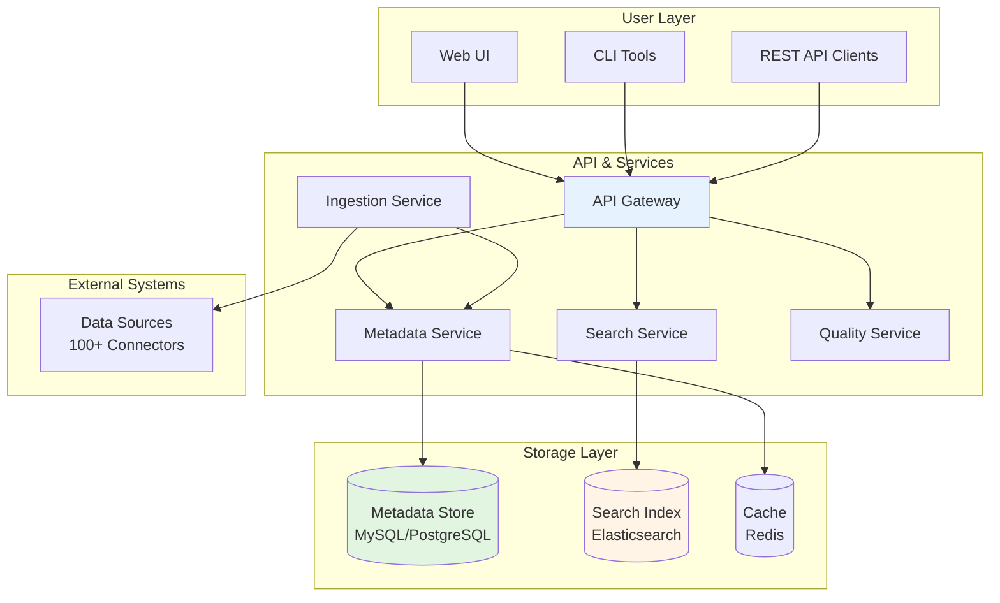
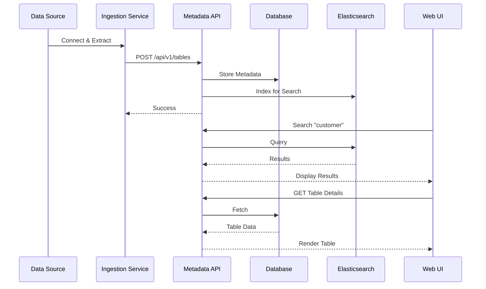
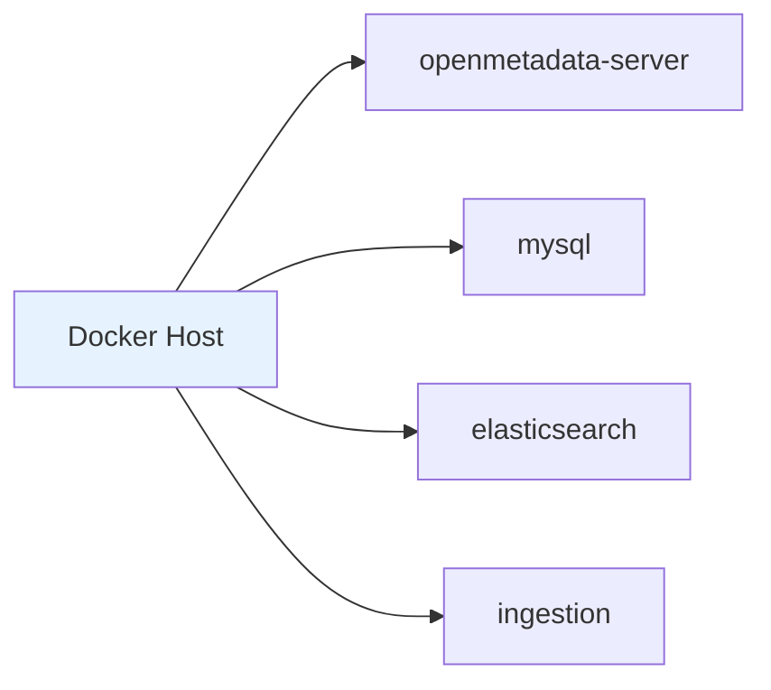
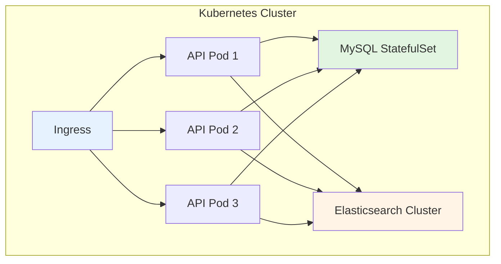
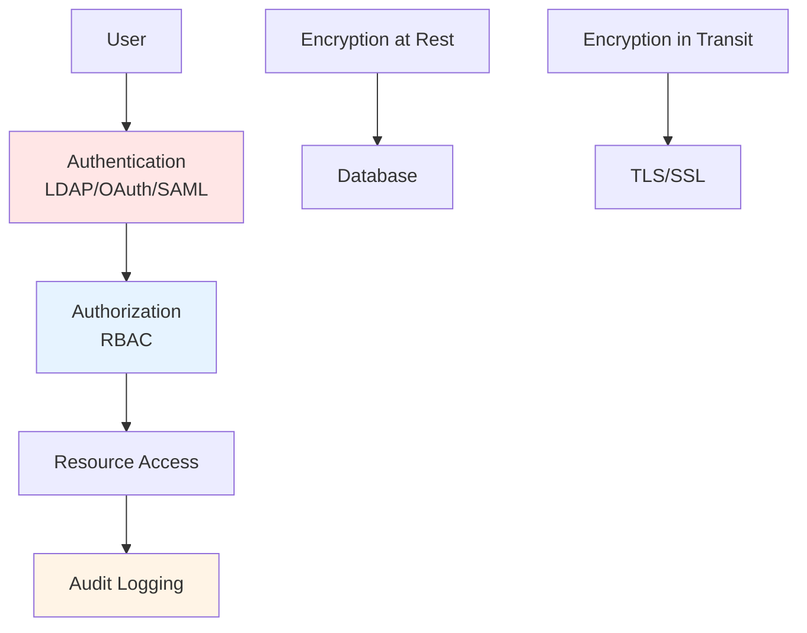
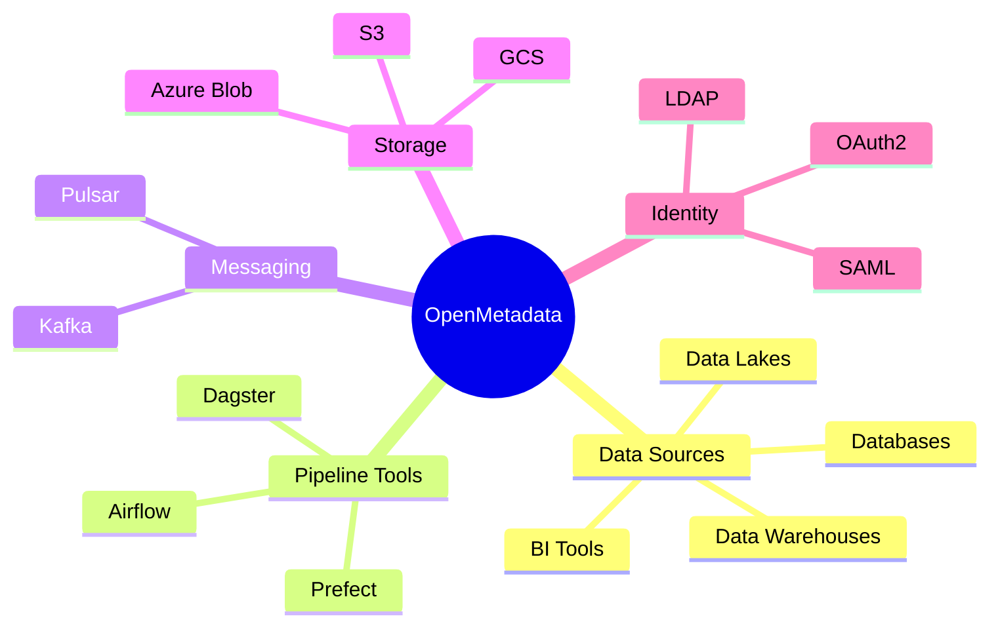

# OpenMetadata - Architecture Overview

## Introduction

OpenMetadata is built on a modern, cloud-native architecture designed for scalability, performance, and extensibility. This overview provides a high-level understanding of the system components and how they work together.

---

## High-Level Architecture

---

## Core Components

### 1. **Web UI (Frontend)**
- **Technology**: React + TypeScript
- **Purpose**: User interface for metadata management
- **Features**:
  - Data discovery and search
  - Metadata editing and enrichment
  - Lineage visualization
  - Data quality dashboards
  - Collaboration tools

### 2. **API Gateway**
- **Technology**: Spring Boot
- **Purpose**: Single entry point for all API requests
- **Responsibilities**:
  - Request routing
  - Authentication/authorization
  - Rate limiting
  - API versioning

### 3. **Metadata Service**
- **Technology**: Java Spring Boot
- **Purpose**: Core metadata management
- **Features**:
  - CRUD operations for entities
  - Relationship management
  - Version control
  - Event publishing
  - Schema validation

### 4. **Ingestion Framework**
- **Technology**: Python
- **Purpose**: Extract metadata from external sources
- **Components**:
  - 100+ source connectors
  - Processors (transformations, enrichment)
  - Sinks (write to OpenMetadata)
  - Workflow orchestration

### 5. **Search Service**
- **Technology**: Elasticsearch/OpenSearch
- **Purpose**: Fast metadata search and discovery
- **Features**:
  - Full-text search
  - Faceted filtering
  - Auto-suggestions
  - Relevance scoring

### 6. **Data Quality Service**
- **Purpose**: Data quality monitoring
- **Features**:
  - Test definitions
  - Automated test execution
  - Quality dashboards
  - Alerting

---

## Data Flow

---

## Deployment Models

### 1. **Docker Compose** (Development/Testing)

### 2. **Kubernetes** (Production)

### 3. **Cloud SaaS** (Managed)
- Fully managed by OpenMetadata
- No infrastructure management
- Automatic updates
- Enterprise support

---

## Security Architecture

**Security Features**:
- Multi-factor authentication
- Role-based access control
- Column-level security
- PII detection and masking
- Comprehensive audit trails
- Encryption at rest and in transit

---

## Scalability

### Horizontal Scaling
- **API Servers**: Scale to N instances
- **Elasticsearch**: Add more nodes
- **MySQL**: Primary-replica replication
- **Caching**: Redis cluster mode

### Performance Optimization
- Multi-level caching (Redis, application, CDN)
- Database indexing and partitioning
- Elasticsearch sharding
- Connection pooling

---

## Integration Points

---

## Technology Stack

| Layer | Technology | Purpose |
|-------|-----------|---------|
| **Frontend** | React, TypeScript | User interface |
| **Backend** | Spring Boot, Java | API server |
| **Ingestion** | Python | Metadata extraction |
| **Database** | MySQL/PostgreSQL | Metadata storage |
| **Search** | Elasticsearch | Search and indexing |
| **Cache** | Redis | Performance |
| **Container** | Docker | Packaging |
| **Orchestration** | Kubernetes | Deployment |

---

## Key Design Principles

### 1. **API-First**
All functionality accessible via REST API

### 2. **Cloud-Native**
Built for modern cloud infrastructure

### 3. **Extensible**
Plugin architecture for custom connectors

### 4. **Standards-Based**
Uses industry standards (OpenAPI, JSON Schema)

### 5. **Open Source**
Apache 2.0 license, community-driven

---

## Next Steps

📖 **For Detailed Architecture**: See [Detailed Architecture](../03-technical-deep-dive/architecture-detailed.md)

🚀 **For Deployment**: See [Deployment Options](../04-deployment-operations/deployment-options.md)

🔒 **For Security**: See [Security & Compliance](../03-technical-deep-dive/security-compliance.md)

---

**Last Updated**: October 29, 2025  
**OpenMetadata Version**: 1.10.3
