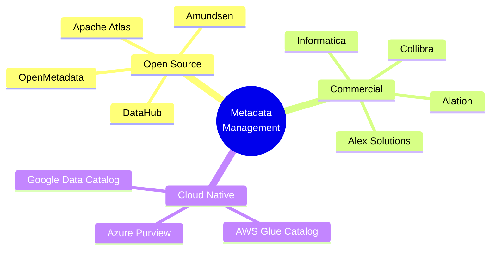
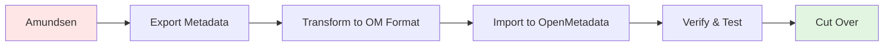
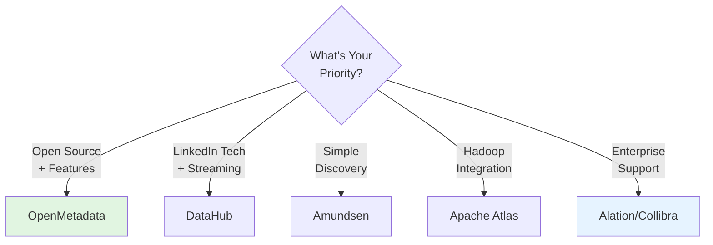

# OpenMetadata vs Alternatives - Comparison Guide

## Executive Summary

OpenMetadata stands out in the metadata management landscape through its comprehensive feature set, open-source nature, and modern architecture. This guide provides objective comparisons with alternative solutions.

---

## Market Landscape

---

## Feature Comparison Matrix

| Feature | OpenMetadata | DataHub | Amundsen | Apache Atlas | Alation | Collibra |
|---------|--------------|---------|----------|--------------|---------|----------|
| **Open Source** | ✅ Apache 2.0 | ✅ Apache 2.0 | ✅ Apache 2.0 | ✅ Apache 2.0 | ❌ Commercial | ❌ Commercial |
| **Data Discovery** | ✅ Excellent | ✅ Excellent | ✅ Good | ⚠️ Basic | ✅ Excellent | ✅ Excellent |
| **Data Lineage** | ✅ Column-level | ✅ Column-level | ⚠️ Table-level | ✅ Table-level | ✅ Column-level | ✅ Column-level |
| **Data Quality** | ✅ Built-in | ✅ Via Great Expectations | ❌ Limited | ❌ No | ✅ Built-in | ✅ Built-in |
| **Data Governance** | ✅ Comprehensive | ✅ Good | ⚠️ Basic | ✅ Good | ✅ Excellent | ✅ Excellent |
| **Collaboration** | ✅ Conversations, Tasks | ✅ Basic | ✅ Basic | ❌ Limited | ✅ Advanced | ✅ Advanced |
| **100+ Connectors** | ✅ Yes | ✅ Yes | ⚠️ 30+ | ⚠️ 40+ | ✅ Yes | ✅ Yes |
| **Auto-Classification** | ✅ PII Detection | ✅ Yes | ⚠️ Limited | ⚠️ Limited | ✅ ML-based | ✅ ML-based |
| **REST API** | ✅ Complete | ✅ Complete | ⚠️ Limited | ✅ Good | ✅ Complete | ✅ Complete |
| **UI/UX** | ✅ Modern React | ✅ Modern React | ⚠️ Dated | ⚠️ Basic | ✅ Polished | ✅ Polished |
| **Cloud SaaS** | ✅ Available | ✅ Available | ❌ No | ❌ No | ✅ Primary | ✅ Primary |
| **Self-Hosted** | ✅ Docker/K8s | ✅ Docker/K8s | ✅ Docker/K8s | ✅ Docker/K8s | ⚠️ Limited | ⚠️ Enterprise |
| **Pricing** | 🆓 Free + Enterprise | 🆓 Free + Enterprise | 🆓 Free | 🆓 Free | 💰 $$$$ | 💰 $$$$$ |
| **Support** | Community + Enterprise | Community + Enterprise | Community | Community | Enterprise | Enterprise |

---

## Detailed Comparisons

### 1. OpenMetadata vs DataHub (LinkedIn)

**Similarities:**
- Both are open-source (Apache 2.0)
- Modern architectures
- Strong lineage capabilities
- Active communities

**OpenMetadata Advantages:**
- ✅ Better out-of-the-box UI/UX
- ✅ Built-in data quality testing
- ✅ Native collaboration features
- ✅ Simpler deployment
- ✅ More comprehensive documentation

**DataHub Advantages:**
- ✅ Earlier market entry (more mature)
- ✅ Backed by LinkedIn engineering
- ✅ Strong streaming metadata updates

**Best Use Case for OpenMetadata:**
- Teams wanting a complete, batteries-included solution
- Organizations prioritizing ease of deployment
- Companies needing built-in data quality

**Best Use Case for DataHub:**
- Large-scale enterprises with complex requirements
- Organizations with strong DataOps practices
- Teams with Kafka infrastructure

---

### 2. OpenMetadata vs Amundsen (Lyft)

**Similarities:**
- Open-source solutions
- Focus on data discovery
- Python-based ingestion

**OpenMetadata Advantages:**
- ✅ Column-level lineage (vs table-level)
- ✅ Built-in data quality
- ✅ Better governance features
- ✅ More connectors (100+ vs 30+)
- ✅ Active development
- ✅ Modern UI

**Amundsen Advantages:**
- ✅ Simpler architecture
- ✅ Lightweight deployment
- ✅ Strong search capabilities

**Best Use Case for OpenMetadata:**
- Organizations needing comprehensive metadata management
- Teams requiring advanced lineage and quality
- Growing metadata needs

**Best Use Case for Amundsen:**
- Small to medium teams
- Primary focus on data discovery
- Simpler deployment requirements

---

### 3. OpenMetadata vs Apache Atlas

**Similarities:**
- Open-source solutions
- Support for governance
- Metadata lineage

**OpenMetadata Advantages:**
- ✅ Modern, intuitive UI
- ✅ 100+ connectors (vs 40+)
- ✅ Built-in data quality
- ✅ Better collaboration features
- ✅ Easier deployment
- ✅ Active development

**Apache Atlas Advantages:**
- ✅ Deep Hadoop ecosystem integration
- ✅ Mature project (since 2015)
- ✅ Apache Software Foundation backing

**Best Use Case for OpenMetadata:**
- Modern data stacks (cloud data warehouses, etc.)
- Organizations moving away from Hadoop
- Teams wanting better UI/UX

**Best Use Case for Atlas:**
- Hadoop-centric environments
- Organizations heavily invested in Apache ecosystem
- Existing Atlas deployments

---

### 4. OpenMetadata vs Commercial Solutions

#### vs Alation

**OpenMetadata Advantages:**
- ✅ Open source (no vendor lock-in)
- ✅ Free to use
- ✅ Community-driven innovation
- ✅ Full API access
- ✅ Self-hosted option

**Alation Advantages:**
- ✅ Enterprise-grade support
- ✅ Advanced ML features
- ✅ Mature governance workflows
- ✅ White-glove implementation

**Cost Comparison:**
- **OpenMetadata**: Free (open source) + optional enterprise support
- **Alation**: $100K - $500K+ annually

#### vs Collibra

**OpenMetadata Advantages:**
- ✅ Modern technical architecture
- ✅ Better developer experience
- ✅ No licensing costs
- ✅ Faster deployment

**Collibra Advantages:**
- ✅ Strongest governance features
- ✅ Enterprise workflow automation
- ✅ Regulatory compliance focus
- ✅ Extensive consulting services

**Cost Comparison:**
- **OpenMetadata**: Free + optional support
- **Collibra**: $150K - $1M+ annually

---

## Cloud Provider Solutions

### AWS Glue Data Catalog

**OpenMetadata Advantages:**
- ✅ Multi-cloud and on-premises
- ✅ Richer collaboration features
- ✅ Better UI for data discovery
- ✅ More comprehensive lineage

**Glue Advantages:**
- ✅ Native AWS integration
- ✅ Serverless
- ✅ Pay-per-use pricing

### Azure Purview (now Microsoft Purview)

**OpenMetadata Advantages:**
- ✅ Open source and portable
- ✅ No cloud vendor lock-in
- ✅ More flexible deployment

**Purview Advantages:**
- ✅ Deep Azure integration
- ✅ Microsoft ecosystem integration
- ✅ Managed service

### Google Data Catalog

**OpenMetadata Advantages:**
- ✅ Multi-cloud support
- ✅ Richer feature set
- ✅ Better lineage visualization

**Data Catalog Advantages:**
- ✅ Native GCP integration
- ✅ Serverless
- ✅ Integrated with BigQuery

---

## Migration Paths

### From Amundsen to OpenMetadata

**Migration Effort**: 2-4 weeks
**Complexity**: Medium

### From Apache Atlas to OpenMetadata

**Migration Effort**: 4-8 weeks
**Complexity**: High (due to Hadoop-specific metadata)

### From DataHub to OpenMetadata

**Migration Effort**: 3-6 weeks
**Complexity**: Medium (similar data models)

---

## Decision Framework

### Choose OpenMetadata If:

✅ You want a **free, open-source** solution  
✅ You need **100+ connectors** out of the box  
✅ You require **built-in data quality** testing  
✅ You value **modern UI/UX**  
✅ You want **column-level lineage**  
✅ You need **comprehensive documentation**  
✅ You prefer **active development** and community  
✅ You want **flexible deployment** (Docker, K8s, SaaS)

### Choose DataHub If:

✅ You need **LinkedIn-proven** technology  
✅ You have **complex streaming** requirements  
✅ You prefer **earlier maturity**  
✅ You have **Kafka infrastructure**

### Choose Commercial If:

✅ You require **white-glove implementation**  
✅ You need **24/7 enterprise support**  
✅ You have **complex compliance requirements**  
✅ You have **budget for licensing** ($100K+ annually)

---

## Total Cost of Ownership (TCO)

### 5-Year TCO Comparison (100-person organization)

| Solution | Licensing | Implementation | Support | Infrastructure | Total |
|----------|-----------|----------------|---------|----------------|-------|
| **OpenMetadata** | $0 | $50K | $0-$50K | $30K | **$80K-$130K** |
| **DataHub** | $0 | $75K | $0-$50K | $30K | **$105K-$155K** |
| **Alation** | $500K | $150K | $100K | $20K | **$770K** |
| **Collibra** | $750K | $200K | $150K | $20K | **$1.12M** |

*Note: Costs are estimates and vary by organization size and requirements*

---

## Feature Roadmap Comparison

### OpenMetadata (2025-2026)
- ✅ Enhanced AI/ML metadata
- ✅ Advanced data quality rules
- ✅ Improved collaboration tools
- ✅ Multi-tenancy support
- ✅ Advanced cost tracking

### DataHub
- Similar roadmap focus
- Stronger streaming capabilities
- Enhanced observability

### Commercial Solutions
- More enterprise governance features
- Stronger compliance tools
- Advanced ML/AI capabilities

---

## Summary

**Bottom Line**: OpenMetadata offers the best balance of features, ease of use, and cost for most organizations, especially those building modern data stacks.

---

## Next Steps

1. **Try OpenMetadata**: [Getting Started Guide](../06-user-guides/getting-started.md)
2. **See Features**: [Feature Overview](./features.md)
3. **Plan Deployment**: [Deployment Options](../04-deployment-operations/deployment-options.md)

---

**Last Updated**: October 29, 2025  
**OpenMetadata Version**: 1.10.3
