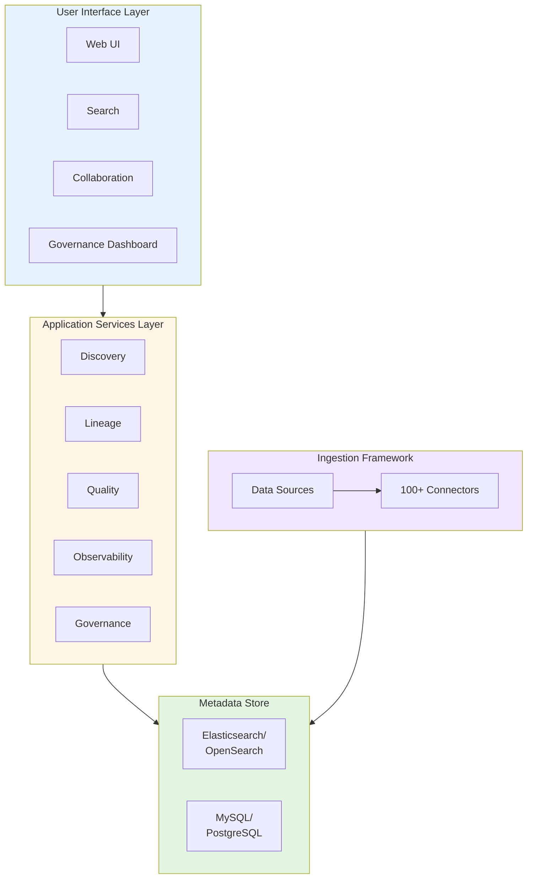
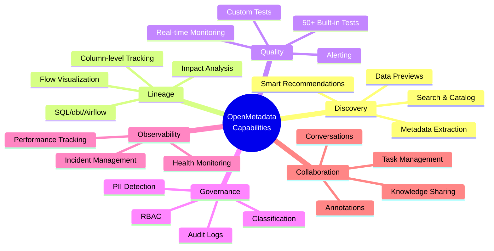

# OpenMetadata Product Introduction

## What is OpenMetadata?

**OpenMetadata** is an all-in-one **open-source metadata platform** that provides a unified solution for data discovery, governance, quality, observability, and collaboration. It serves as the central nervous system for your data ecosystem, connecting people, processes, and technology around data.

---

## The Platform at a Glance

### Core Purpose

OpenMetadata helps organizations:
- 🔍 **Discover** data assets quickly and easily
- 📊 **Understand** data context, quality, and lineage
- 🛡️ **Govern** data with policies and standards
- 📈 **Monitor** data health and performance
- 🤝 **Collaborate** across teams around data

### Platform Philosophy

OpenMetadata is built on three foundational principles:

1. **Open Standards**
   - Based on JSON Schema specifications
   - RESTful API-first architecture
   - No proprietary lock-in

2. **Unified Platform**
   - Single solution for all metadata needs
   - Integrated features, not bolt-ons
   - Consistent user experience

3. **Community-Driven**
   - Transparent development
   - Open governance model
   - Collaborative innovation

---

## Product Architecture

### High-Level Components



### Key Technology Stack

- **Backend**: Java (Spring Boot)
- **Frontend**: React + TypeScript
- **Metadata Store**: MySQL/PostgreSQL + Elasticsearch/OpenSearch
- **APIs**: RESTful, OpenAPI 3.0
- **Ingestion**: Python-based framework
- **Deployment**: Docker, Kubernetes, Bare Metal

---

## Core Capabilities



### 1. **Data Discovery & Catalog** 🔍

**What it does**: Central repository for all data assets

**Key Features**:
- Automated metadata extraction from 100+ sources
- Powerful full-text search with filters
- Smart recommendations and related assets
- Rich data previews and samples
- Custom properties and tags

**User Benefit**: Find any data asset in seconds, not hours

**Example**: "Where is customer email data stored?"
→ Search returns all tables/columns with customer emails across databases

---

### 2. **Data Lineage** 🔗

**What it does**: Visualize data flow and dependencies

**Key Features**:
- Automated lineage extraction (SQL, dbt, Airflow)
- Column-level lineage tracking
- Interactive lineage graphs
- Impact analysis for changes
- Forward and backward tracing

**User Benefit**: Understand data origins and impacts

**Example**: "If I change this table, what breaks?"
→ See all downstream dashboards, reports, and pipelines affected

---

### 3. **Data Quality** ✅

**What it does**: Monitor and ensure data reliability

**Key Features**:
- 50+ built-in quality tests
- Custom test definitions
- Automated test execution
- Real-time quality dashboards
- Alerting and notifications
- Historical trending

**User Benefit**: Trust your data with confidence

**Example**: "Is customer_count accurate?"
→ Automated tests verify count against source daily

---

### 4. **Data Governance** 🛡️

**What it does**: Implement policies and compliance

**Key Features**:
- Data classification and tagging
- Automated PII/PHI detection
- Role-based access control
- Policy enforcement
- Business glossary
- Audit logs and compliance reports

**User Benefit**: Meet regulatory requirements easily

**Example**: "Where is all PII stored?"
→ Auto-classification identifies and tags all PII across systems

---

### 5. **Data Observability** 📈

**What it does**: Monitor data health proactively

**Key Features**:
- Data profiling and statistics
- Anomaly detection
- Usage tracking and patterns
- Schema change monitoring
- Pipeline health monitoring
- Custom metrics and KPIs

**User Benefit**: Catch issues before they impact users

**Example**: "Did yesterday's data load complete?"
→ Real-time dashboard shows load status and any issues

---

### 6. **Collaboration** 🤝

**What it does**: Enable team knowledge sharing

**Key Features**:
- Conversations and discussions
- @mentions and notifications
- Task management
- Announcements
- Activity feeds
- Team ownership

**User Benefit**: Break down data silos

**Example**: "Who knows about this data?"
→ See owner, experts, and relevant discussions

---

## Platform Differentiation

### vs. Traditional Data Catalogs

| Aspect | Traditional Catalogs | OpenMetadata |
|--------|---------------------|--------------|
| **Scope** | Discovery only | End-to-end platform |
| **Quality** | Limited/Separate tool | Built-in comprehensive |
| **Lineage** | Basic table-level | Column-level, multi-hop |
| **Governance** | Limited automation | AI-powered classification |
| **Collaboration** | Minimal | Rich social features |
| **Observability** | Not included | Integrated monitoring |
| **Cost** | High licensing | Open source |
| **Customization** | Restricted | Fully extensible |

### vs. Pure Data Quality Tools

OpenMetadata includes quality **plus**:
- ✅ Complete data context and lineage
- ✅ Integrated discovery and governance
- ✅ Collaboration features
- ✅ Single platform, not multiple tools

### vs. Data Observability-Only Tools

OpenMetadata includes observability **plus**:
- ✅ Full data catalog and discovery
- ✅ Governance and compliance
- ✅ Quality testing framework
- ✅ Comprehensive, not just monitoring

---

## Deployment Flexibility

### Cloud SaaS (Collate)
- ✅ Fully managed
- ✅ Zero infrastructure
- ✅ Automatic updates
- ✅ 99.9% SLA
- 💰 Starting $2,000/month

### Self-Hosted
- ✅ Complete control
- ✅ Data sovereignty
- ✅ Custom configurations
- ✅ Any cloud or on-premise
- 💰 Infrastructure costs only

### Hybrid
- ✅ Metadata in cloud
- ✅ Connectors on-premise
- ✅ Secure data access
- 💰 Flexible pricing

---

## Ecosystem Integration

### Data Sources (100+ Connectors)

**Databases**: PostgreSQL, MySQL, Oracle, SQL Server, MongoDB, etc.  
**Data Warehouses**: Snowflake, BigQuery, Redshift, Databricks, etc.  
**Pipelines**: Airflow, dbt, Dagster, Fivetran, Airbyte, etc.  
**BI Tools**: Tableau, Power BI, Looker, Metabase, etc.  
**Cloud Storage**: S3, GCS, Azure Blob, etc.  
**ML Platforms**: MLflow, SageMaker, etc.

### Tool Integrations

- **Authentication**: Okta, Auth0, LDAP, SAML
- **Notifications**: Slack, MS Teams, PagerDuty
- **Ticketing**: Jira, ServiceNow
- **Version Control**: GitHub, GitLab, Bitbucket
- **Orchestration**: Airflow (native), Kubernetes

---

## User Personas

### Data Analyst 👤
**Needs**: Find data quickly, understand quality, collaborate
**Uses**: Search, lineage, quality metrics, conversations
**Benefit**: 70% time savings in data discovery

### Data Engineer 👩‍💻
**Needs**: Document pipelines, monitor health, troubleshoot issues
**Uses**: Lineage, observability, quality tests, impact analysis
**Benefit**: 80% faster issue resolution

### Data Steward 👨‍💼
**Needs**: Implement governance, ensure compliance, manage policies
**Uses**: Classification, policies, glossary, audit logs
**Benefit**: Automated compliance, reduced risk

### Business User 📊
**Needs**: Self-service data access, understand metrics
**Uses**: Search, glossary, documentation, sample data
**Benefit**: Empowered self-service analytics

### Data Architect 🏗️
**Needs**: Understand landscape, plan changes, manage complexity
**Uses**: Lineage, impact analysis, metadata APIs
**Benefit**: Better architecture decisions

---

## Technical Specifications

### System Requirements

**Minimum** (Development/Testing):
- CPU: 4 cores
- RAM: 16 GB
- Storage: 50 GB
- OS: Linux, macOS, Windows

**Recommended** (Production):
- CPU: 8+ cores
- RAM: 32+ GB
- Storage: 200+ GB SSD
- OS: Linux (Ubuntu, RHEL)

### Scalability

- **Data Sources**: Tested with 1000+ sources
- **Metadata Objects**: Millions of assets
- **Users**: 10,000+ concurrent users
- **Queries**: 1000s per second

### Performance

- **Search Response**: < 100ms (p95)
- **Lineage Query**: < 500ms (p95)
- **UI Load Time**: < 2s (p95)
- **API Response**: < 200ms (p95)

---

## Security & Compliance

### Authentication
- SSO (SAML, OAuth 2.0, OIDC)
- LDAP/Active Directory
- Basic Auth
- API Keys/JWT

### Authorization
- Role-Based Access Control (RBAC)
- Team-based permissions
- Fine-grained policies
- Row-level security

### Data Protection
- Encryption at rest
- Encryption in transit (TLS)
- Secrets management
- PII masking

### Compliance
- GDPR ready
- HIPAA compatible
- SOC 2 Type II (SaaS)
- ISO 27001 aligned

---

## Release Cadence

### Regular Updates
- **Major Releases**: Quarterly (x.0.0)
- **Minor Releases**: Monthly (x.x.0)
- **Patch Releases**: As needed (x.x.x)

### Support Policy
- **Latest Version**: Full support
- **N-1 Version**: Security updates
- **N-2 Version**: Critical fixes only
- **Older Versions**: Community support

### Current Version
**v1.10.3** (October 22, 2025)
- Production-ready
- Long-term support
- Recommended for new deployments

---

## Licensing & Costs

### Open Source (Apache 2.0)
- ✅ Free to use, modify, distribute
- ✅ Commercial use allowed
- ✅ No attribution required
- ✅ Patent grant included

### SaaS Pricing (Collate)
- **Starter**: $2,000/month
- **Professional**: $5,000/month
- **Enterprise**: Custom pricing
- **Trial**: 30 days free

### Support Options
- **Community**: Free (Slack, GitHub)
- **Professional**: Included with SaaS
- **Enterprise**: SLA-backed support

---

## Getting Started

### 5-Minute Quick Start

1. **Try Sandbox** (No Installation)
   ```
   https://sandbox.open-metadata.org
   ```

2. **Local Docker** (5 minutes)
   ```bash
   git clone https://github.com/open-metadata/OpenMetadata
   cd OpenMetadata
   docker compose up -d
   ```

3. **Cloud Trial** (Instant)
   ```
   https://getcollate.io/trial
   ```

### Learning Path

**Week 1**: Explore features in sandbox  
**Week 2**: Deploy locally, connect 2-3 sources  
**Week 3**: Set up quality tests and governance  
**Week 4**: Roll out to team, gather feedback  

---

## Community & Support

### Get Help
- 💬 **Slack**: 1000+ active members
- 📚 **Documentation**: Comprehensive guides
- 🎥 **Videos**: Tutorials and webinars
- 📧 **Email**: support@open-metadata.org

### Contribute
- 🐛 Report bugs on GitHub
- 💡 Request features
- 🔧 Submit pull requests
- 📝 Improve documentation

### Events
- Weekly community calls
- Monthly webinars
- Quarterly meetups
- Annual conference

---

## Success Metrics

Organizations using OpenMetadata report:

📊 **Usage**
- 90% user adoption rate
- 1000s of searches per day
- 80% self-service data access

⏱️ **Efficiency**
- 70% faster data discovery
- 50% reduction in data requests
- 60% fewer quality incidents

💰 **Value**
- $200K+ annual savings per 100 users
- 300-500% ROI in year 1
- 2-4 month payback period

---

## Roadmap Highlights

### Recent Additions (v1.10.x)
- ✅ Databricks pipeline support
- ✅ Configurable custom properties
- ✅ Enhanced search settings

### Coming Soon (v1.11+)
- 🔜 Advanced AI recommendations
- 🔜 Enhanced data contracts
- 🔜 Improved performance at scale
- 🔜 Additional connectors

[View Full Roadmap](https://github.com/open-metadata/OpenMetadata/projects)

---

## Conclusion

OpenMetadata is a **comprehensive, enterprise-grade platform** that:

✅ Unifies discovery, quality, governance, and observability  
✅ Supports 100+ data sources out of the box  
✅ Scales to enterprise requirements  
✅ Provides flexibility through open source  
✅ Delivers rapid time to value  

**Perfect for**: Organizations of any size seeking to maximize data value while maintaining control and minimizing costs.

---

## Next Steps

1. **Explore Features** → [Feature Details](./features.md)
2. **Review Architecture** → [Architecture Overview](./architecture.md)
3. **Compare Alternatives** → [Comparison Guide](./comparison.md)
4. **Try It Out** → [Getting Started](../06-user-guides/getting-started.md)

---

**Document Version**: 1.0  
**Last Updated**: October 29, 2025  
**Product Version**: OpenMetadata v1.10.3
