# OpenMetadata - Detailed System Architecture

## Overview

OpenMetadata is built on a modern, cloud-native architecture designed for scalability, extensibility, and performance. This document provides an in-depth look at the technical architecture, components, and design decisions.

---

## High-Level Architecture

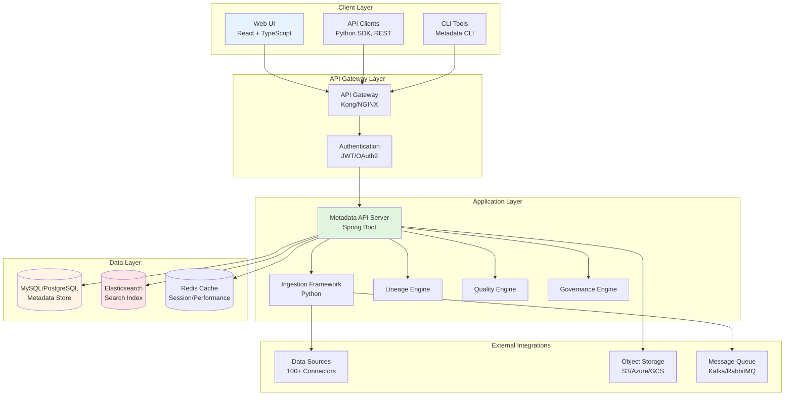

---

## Core Components

### 1. **Metadata API Server**

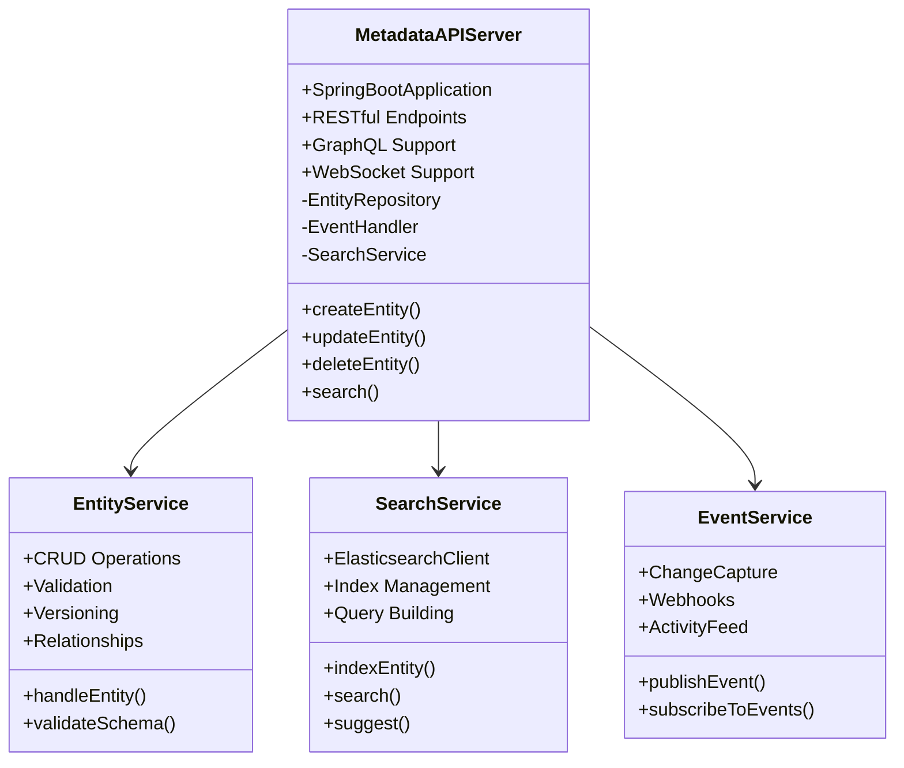

**Technology Stack**:
- **Framework**: Spring Boot 2.7+
- **Language**: Java 11+
- **API Standard**: OpenAPI 3.0
- **Authentication**: JWT, OAuth2, SAML
- **Port**: 8585 (default)

**Key Responsibilities**:
- RESTful API endpoints for all metadata operations
- Entity lifecycle management (CRUD)
- Schema validation using JSON Schema
- Event publishing for change notifications
- Access control and authorization
- Caching for performance optimization

---

### 2. **Metadata Store (MySQL/PostgreSQL)**

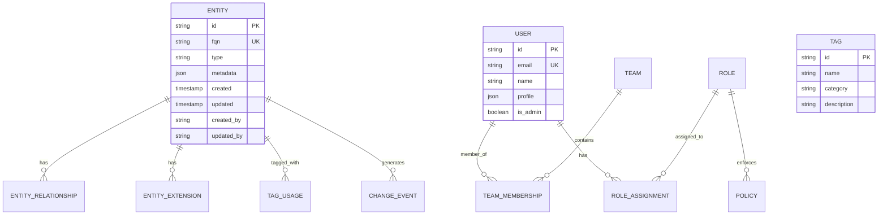

**Schema Design**:
- **Tables**: 50+ core tables
- **Indexes**: Optimized for FQN lookups, searches, and joins
- **Partitioning**: By entity type and date
- **Replication**: Master-slave for read scaling

**Key Tables**:
- `entity` - Core metadata entities
- `entity_relationship` - Entity connections
- `entity_extension` - Custom properties
- `tag_usage` - Tagging relationships
- `user`, `team`, `role` - Access control
- `change_event` - Audit trail

---

### 3. **Search Engine (Elasticsearch/OpenSearch)**

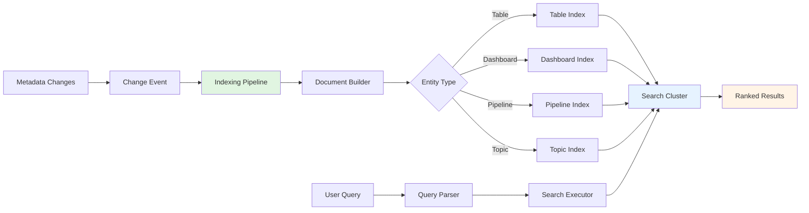

**Index Strategy**:
- **Separate indices** per entity type (table, dashboard, pipeline, etc.)
- **Sharding**: Configurable based on data volume
- **Replication**: 1 replica minimum for HA
- **Refresh interval**: 1 second for near real-time search

**Features**:
- Full-text search with relevance scoring
- Fuzzy matching for typos
- Faceted search and filtering
- Auto-suggestions and completion
- Aggregations for analytics

---

## Ingestion Framework

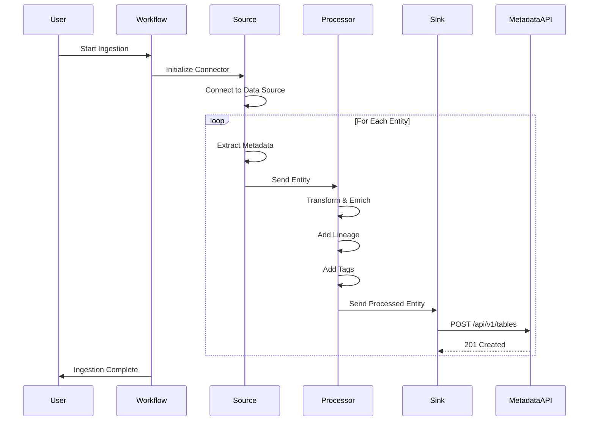

**Components**:

1. **Source Connectors** (100+)
   - Database: MySQL, PostgreSQL, Oracle, SQL Server, etc.
   - Data Warehouse: Snowflake, BigQuery, Redshift, etc.
   - BI Tools: Tableau, PowerBI, Looker, etc.
   - Pipeline: Airflow, Dagster, Prefect, etc.
   - Messaging: Kafka, Pulsar, RabbitMQ, etc.

2. **Processors**
   - Schema extraction
   - Lineage parsing (SQL, dbt)
   - PII detection
   - Tag propagation
   - Custom transformations

3. **Sink**
   - Metadata API client
   - Batch operations
   - Error handling
   - Retry logic

---

## Data Lineage Architecture

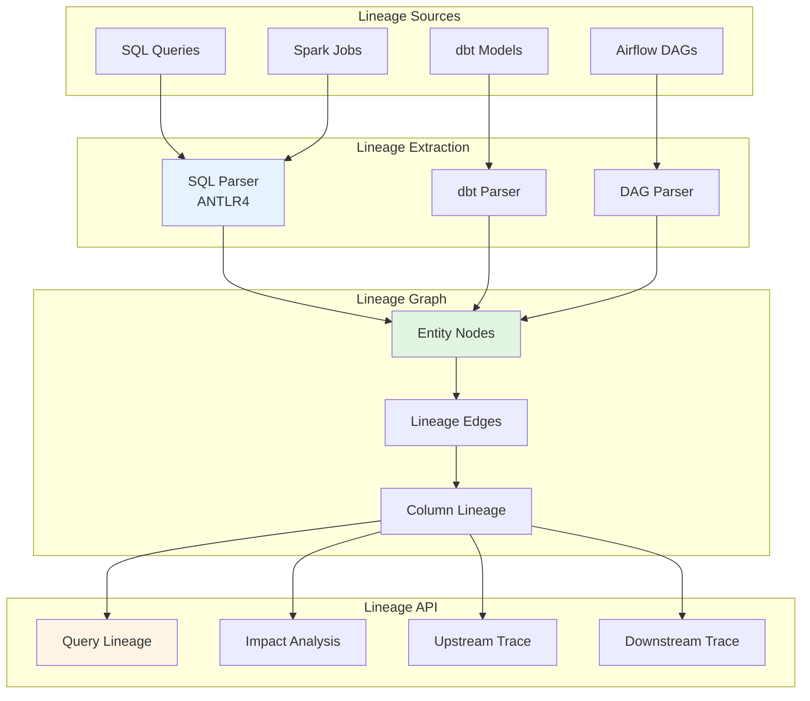

**Lineage Types**:
- **Table-level**: Source → Target relationships
- **Column-level**: Column → Column transformations
- **Pipeline-level**: Task dependencies
- **Automated**: Extracted from SQL, dbt, Airflow
- **Manual**: User-defined lineage

---

## Data Quality Framework

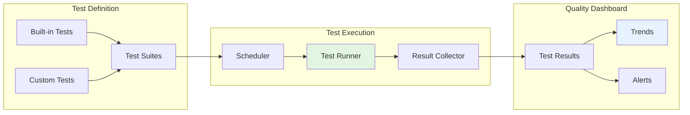

**Test Types**:
- **Schema Tests**: Column presence, data types
- **Integrity Tests**: Unique, not null, foreign keys
- **Volume Tests**: Row count, freshness
- **Custom SQL Tests**: Business logic validation
- **Profiling Tests**: Statistical anomalies

**Execution**:
- **Scheduled**: Cron-based execution
- **On-demand**: Manual trigger
- **Event-driven**: On data changes
- **Distributed**: Parallel execution

---

## Security Architecture

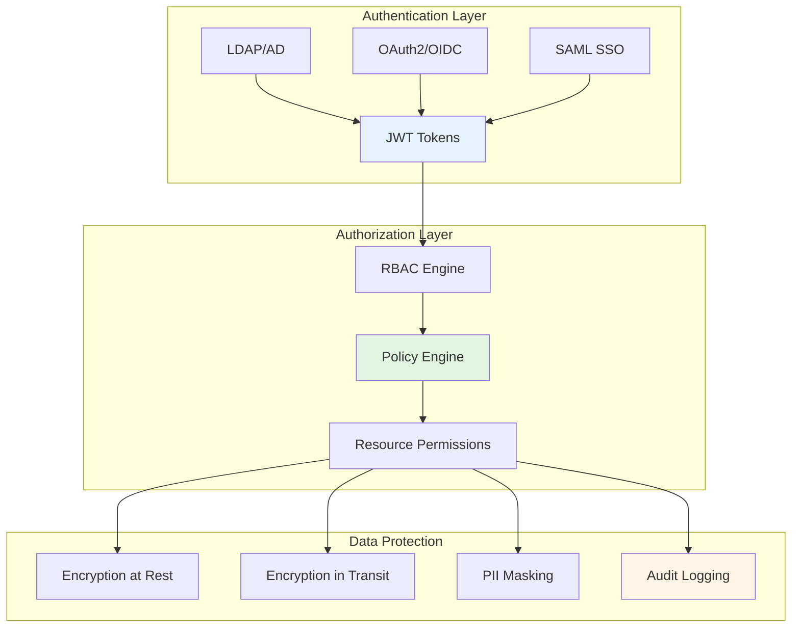

**Security Features**:
- **Multi-factor authentication**
- **Fine-grained RBAC** (Role-Based Access Control)
- **Attribute-based policies**
- **Column-level masking**
- **Comprehensive audit trails**
- **TLS 1.3** for transport encryption
- **AES-256** for data at rest

---

## Deployment Architecture

### Docker Deployment

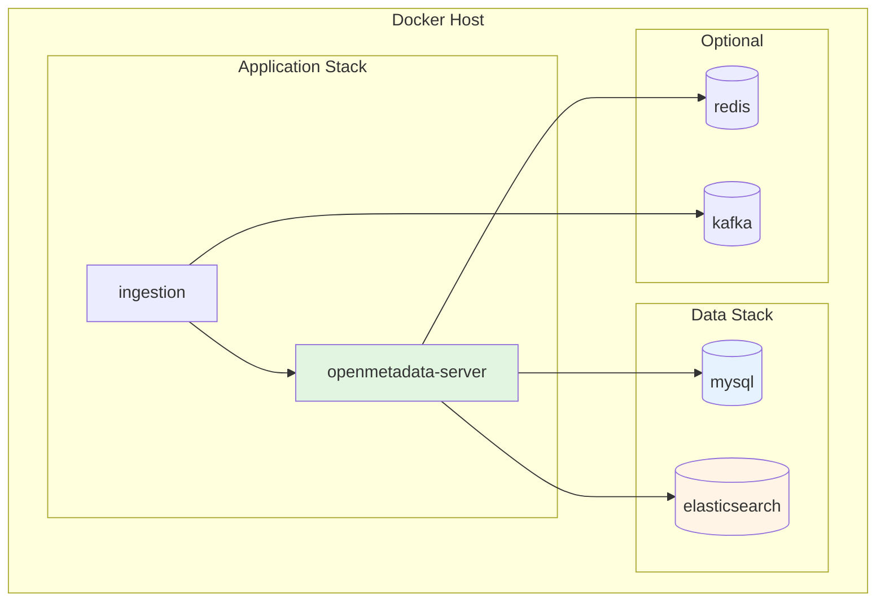

### Kubernetes Deployment

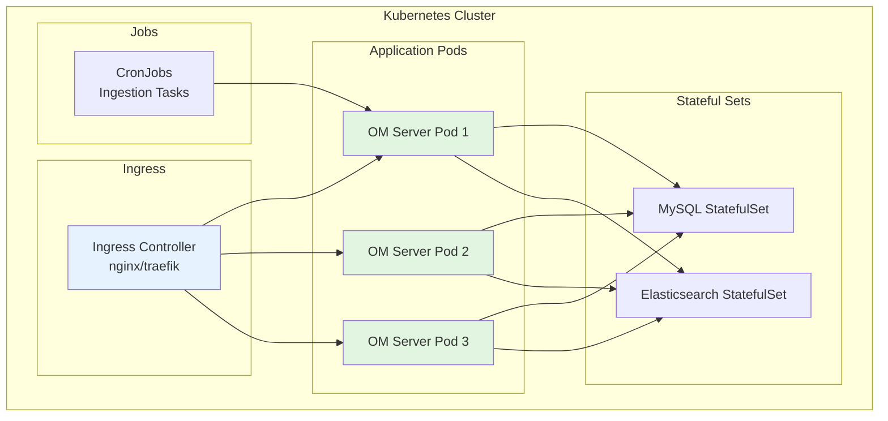

**Kubernetes Resources**:
- **Deployments**: API server (3+ replicas)
- **StatefulSets**: MySQL, Elasticsearch
- **Services**: LoadBalancer/ClusterIP
- **ConfigMaps**: Configuration
- **Secrets**: Credentials
- **PersistentVolumes**: Data storage
- **CronJobs**: Scheduled ingestion

---

## Scalability & Performance

### Horizontal Scaling

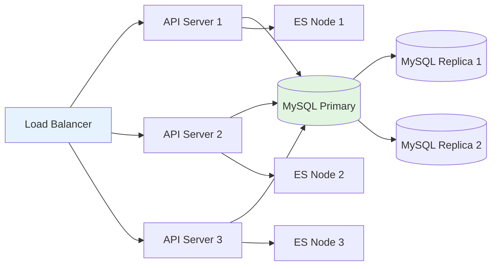

**Scaling Strategy**:
- **API Server**: Stateless, scale to N instances
- **MySQL**: Primary-replica, read replicas for scaling
- **Elasticsearch**: Shard distribution, scale nodes
- **Redis**: Cluster mode for caching
- **Ingestion**: Parallel workers

### Performance Optimization

**Caching Layers**:
1. **Application Cache** (Redis)
   - User sessions
   - Frequently accessed entities
   - Search results
   - TTL: 1-60 minutes

2. **Database Query Cache**
   - Prepared statements
   - Connection pooling

3. **CDN Cache** (CloudFront/CloudFlare)
   - Static assets
   - UI resources

**Database Optimization**:
- **Indexes** on FQN, type, timestamps
- **Partitioning** by date/type
- **Query optimization** with EXPLAIN
- **Connection pooling** (HikariCP)

**Search Optimization**:
- **Index optimization** for query patterns
- **Aggregation caching**
- **Query result pagination**

---

## High Availability

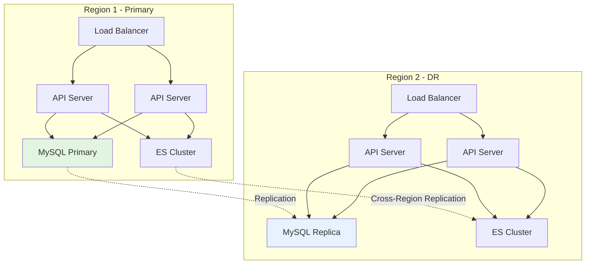

**HA Features**:
- **Multi-region deployment**
- **Active-passive failover**
- **Database replication**
- **Elasticsearch cross-region replication**
- **Health checks and auto-recovery**
- **Backup and restore**

---

## Monitoring & Observability

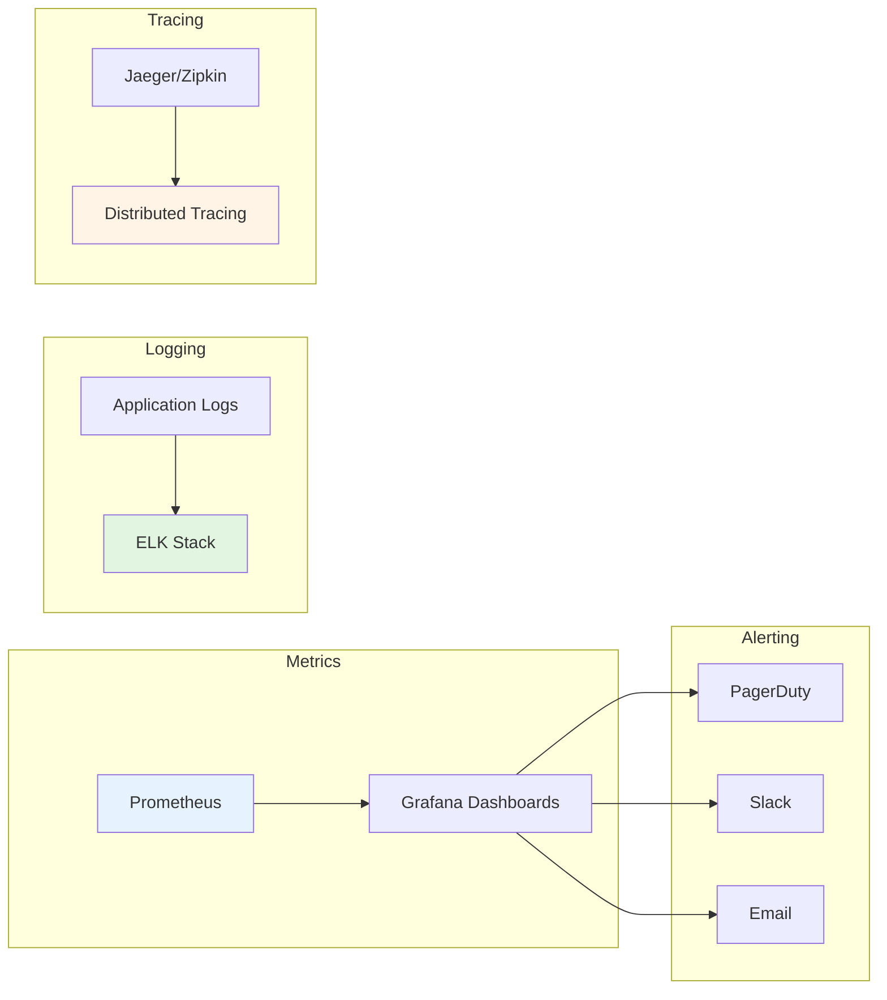

**Monitoring Stack**:
- **Metrics**: Prometheus + Grafana
- **Logging**: ELK (Elasticsearch, Logstash, Kibana)
- **Tracing**: Jaeger or Zipkin
- **Alerting**: PagerDuty, Slack, Email

**Key Metrics**:
- API response times
- Database query performance
- Search latency
- Ingestion throughput
- Error rates
- Resource utilization

---

## Technology Stack Summary

| Component | Technology | Version |
|-----------|-----------|---------|
| **Backend** | Java Spring Boot | 2.7+ |
| **Frontend** | React + TypeScript | 18+ |
| **Database** | MySQL / PostgreSQL | 8+ / 14+ |
| **Search** | Elasticsearch / OpenSearch | 7.10+ / 1.3+ |
| **Cache** | Redis | 6+ |
| **Message Queue** | Kafka (optional) | 3+ |
| **Ingestion** | Python | 3.8+ |
| **Container** | Docker | 20+ |
| **Orchestration** | Kubernetes | 1.23+ |
| **Monitoring** | Prometheus + Grafana | Latest |
| **API Gateway** | Kong / NGINX | Latest |

---

## Design Principles

### 1. **API-First Architecture**
- Everything accessible via REST API
- OpenAPI 3.0 specification
- Versioned APIs for backwards compatibility

### 2. **Cloud-Native Design**
- Containerized deployment
- Horizontal scalability
- Resilience and fault tolerance

### 3. **Standards-Based**
- JSON Schema for metadata models
- OpenAPI for API specification
- OAuth2/OIDC for authentication

### 4. **Extensibility**
- Plugin architecture for connectors
- Custom entity types
- Extensible workflow engine

### 5. **Performance**
- Caching at multiple layers
- Async processing for heavy operations
- Efficient indexing and search

---

## Security Considerations

### Network Security
- **TLS/SSL** for all communications
- **VPC** isolation in cloud
- **Firewall rules** for access control
- **Private endpoints** for databases

### Application Security
- **Input validation** on all endpoints
- **SQL injection prevention**
- **XSS protection**
- **CSRF tokens**
- **Rate limiting**

### Data Security
- **Encryption at rest** (AES-256)
- **Encryption in transit** (TLS 1.3)
- **PII detection and masking**
- **Audit logging**
- **Data retention policies**

---

## Best Practices

### Deployment
✅ Use managed services for MySQL and Elasticsearch  
✅ Enable auto-scaling for API servers  
✅ Set up monitoring and alerting  
✅ Configure regular backups  
✅ Use infrastructure as code (Terraform/Helm)

### Performance
✅ Enable Redis caching  
✅ Optimize database indexes  
✅ Use CDN for static assets  
✅ Configure connection pooling  
✅ Monitor and tune JVM settings

### Security
✅ Enable HTTPS/TLS everywhere  
✅ Use strong authentication (MFA)  
✅ Implement least-privilege access  
✅ Regular security audits  
✅ Keep dependencies updated

---

## References

- **Official Documentation**: https://docs.open-metadata.org/deployment
- **Architecture Guide**: https://docs.open-metadata.org/developers/architecture
- **GitHub**: https://github.com/open-metadata/OpenMetadata
- **Community Slack**: https://slack.open-metadata.org/

---

**Last Updated**: October 29, 2025  
**OpenMetadata Version**: 1.10.3
