# OpenMetadata - Metadata Model & Schema

## Overview

OpenMetadata's metadata model is the foundation of the platform. It defines the structure, relationships, and properties of all metadata entities. This document provides a comprehensive guide to the metadata model, schema definitions, and best practices.

---

## Core Metadata Model

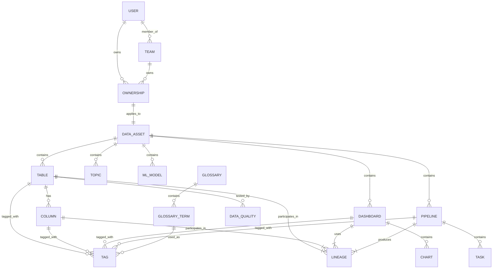

---

## Entity Hierarchy

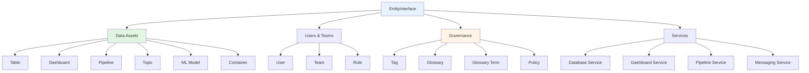

---

## Entity Types

### 1. **Data Assets**

#### Table Entity

```json
{
  "id": "uuid",
  "name": "customer_orders",
  "fullyQualifiedName": "snowflake.sales_db.public.customer_orders",
  "displayName": "Customer Orders",
  "description": "Contains all customer order transactions",
  "tableType": "Regular",
  "columns": [
    {
      "name": "order_id",
      "dataType": "BIGINT",
      "dataTypeDisplay": "bigint",
      "description": "Unique order identifier",
      "constraint": "PRIMARY_KEY",
      "tags": []
    },
    {
      "name": "customer_email",
      "dataType": "VARCHAR",
      "dataLength": 255,
      "description": "Customer email address",
      "tags": [
        {
          "tagFQN": "PII.Email",
          "source": "Classification"
        }
      ]
    }
  ],
  "database": {
    "id": "database-uuid",
    "type": "database",
    "name": "sales_db",
    "fullyQualifiedName": "snowflake.sales_db"
  },
  "databaseSchema": {
    "id": "schema-uuid",
    "type": "databaseSchema",
    "name": "public"
  },
  "service": {
    "id": "service-uuid",
    "type": "databaseService",
    "name": "snowflake"
  },
  "owner": {
    "id": "user-uuid",
    "type": "user",
    "name": "john.doe"
  },
  "tags": [
    {
      "tagFQN": "Tier.Tier1",
      "source": "Classification"
    }
  ],
  "dataModel": {
    "modelType": "DBT",
    "description": "dbt model definition"
  },
  "version": 1.2,
  "updatedAt": 1698624000000,
  "updatedBy": "admin"
}
```

#### Dashboard Entity

```json
{
  "id": "uuid",
  "name": "sales_overview",
  "fullyQualifiedName": "tableau.sales_analytics.sales_overview",
  "displayName": "Sales Overview Dashboard",
  "description": "Executive dashboard showing sales metrics",
  "dashboardType": "Dashboard",
  "dashboardUrl": "https://tableau.company.com/sales_overview",
  "charts": [
    {
      "id": "chart-uuid",
      "type": "chart",
      "name": "revenue_by_region",
      "chartType": "Bar"
    }
  ],
  "service": {
    "id": "service-uuid",
    "type": "dashboardService",
    "name": "tableau"
  },
  "owner": {
    "id": "team-uuid",
    "type": "team",
    "name": "analytics_team"
  },
  "tags": [],
  "version": 1.0
}
```

#### Pipeline Entity

```json
{
  "id": "uuid",
  "name": "daily_etl_pipeline",
  "fullyQualifiedName": "airflow.prod.daily_etl_pipeline",
  "displayName": "Daily ETL Pipeline",
  "description": "Processes daily sales data from sources to warehouse",
  "pipelineType": "ETL",
  "pipelineUrl": "https://airflow.company.com/daily_etl",
  "tasks": [
    {
      "name": "extract_sales_data",
      "displayName": "Extract Sales Data",
      "taskType": "SQL",
      "downstreamTasks": ["transform_sales_data"]
    },
    {
      "name": "transform_sales_data",
      "displayName": "Transform Sales Data",
      "taskType": "Python",
      "downstreamTasks": ["load_to_warehouse"]
    },
    {
      "name": "load_to_warehouse",
      "displayName": "Load to Warehouse",
      "taskType": "SQL",
      "downstreamTasks": []
    }
  ],
  "service": {
    "id": "service-uuid",
    "type": "pipelineService",
    "name": "airflow"
  },
  "owner": {
    "id": "team-uuid",
    "type": "team",
    "name": "data_engineering"
  }
}
```

---

### 2. **Governance Entities**

#### Tag Category & Tags

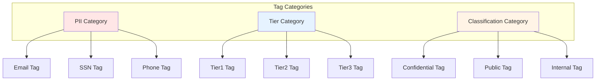

**Tag Structure**:
```json
{
  "id": "uuid",
  "name": "PII",
  "displayName": "Personally Identifiable Information",
  "description": "Tags for identifying PII data",
  "categoryType": "Classification",
  "children": [
    {
      "id": "tag-uuid",
      "name": "Email",
      "displayName": "Email Address",
      "description": "Email address field",
      "style": {
        "color": "#FF0000",
        "iconURL": "email-icon.svg"
      }
    },
    {
      "id": "tag-uuid-2",
      "name": "SSN",
      "displayName": "Social Security Number",
      "description": "US Social Security Number"
    }
  ]
}
```

#### Glossary & Terms

```json
{
  "id": "uuid",
  "name": "business_glossary",
  "displayName": "Business Glossary",
  "description": "Company-wide business terms",
  "owner": {
    "id": "team-uuid",
    "type": "team",
    "name": "data_governance"
  },
  "terms": [
    {
      "id": "term-uuid",
      "name": "customer_lifetime_value",
      "displayName": "Customer Lifetime Value (CLV)",
      "description": "Total revenue expected from a customer over their lifetime",
      "synonyms": ["CLV", "LTV", "Lifetime Value"],
      "relatedTerms": [
        {
          "id": "related-term-uuid",
          "name": "customer_acquisition_cost"
        }
      ],
      "references": [
        {
          "name": "CLV Calculation Guide",
          "endpoint": "https://wiki.company.com/clv"
        }
      ],
      "tags": [
        {
          "tagFQN": "Tier.Tier1"
        }
      ]
    }
  ]
}
```

---

### 3. **User & Team Entities**

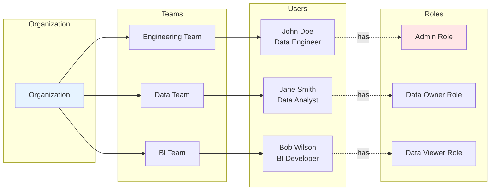

**User Schema**:
```json
{
  "id": "uuid",
  "name": "john.doe",
  "email": "john.doe@company.com",
  "displayName": "John Doe",
  "description": "Senior Data Engineer",
  "isAdmin": false,
  "isBot": false,
  "profile": {
    "images": {
      "image": "profile-pic-url"
    }
  },
  "teams": [
    {
      "id": "team-uuid",
      "type": "team",
      "name": "data_engineering"
    }
  ],
  "roles": [
    {
      "id": "role-uuid",
      "type": "role",
      "name": "DataOwner"
    }
  ],
  "inheritedRoles": [
    {
      "id": "role-uuid-2",
      "type": "role",
      "name": "DataViewer"
    }
  ]
}
```

**Team Schema**:
```json
{
  "id": "uuid",
  "name": "data_engineering",
  "displayName": "Data Engineering Team",
  "description": "Team responsible for data pipelines",
  "teamType": "Department",
  "parents": [
    {
      "id": "parent-team-uuid",
      "type": "team",
      "name": "engineering"
    }
  ],
  "users": [
    {
      "id": "user-uuid",
      "type": "user",
      "name": "john.doe"
    }
  ],
  "defaultRoles": [
    {
      "id": "role-uuid",
      "type": "role",
      "name": "DataEngineer"
    }
  ],
  "owns": [
    {
      "id": "table-uuid",
      "type": "table",
      "name": "customer_orders"
    }
  ]
}
```

---

## Relationships

### Entity Relationships

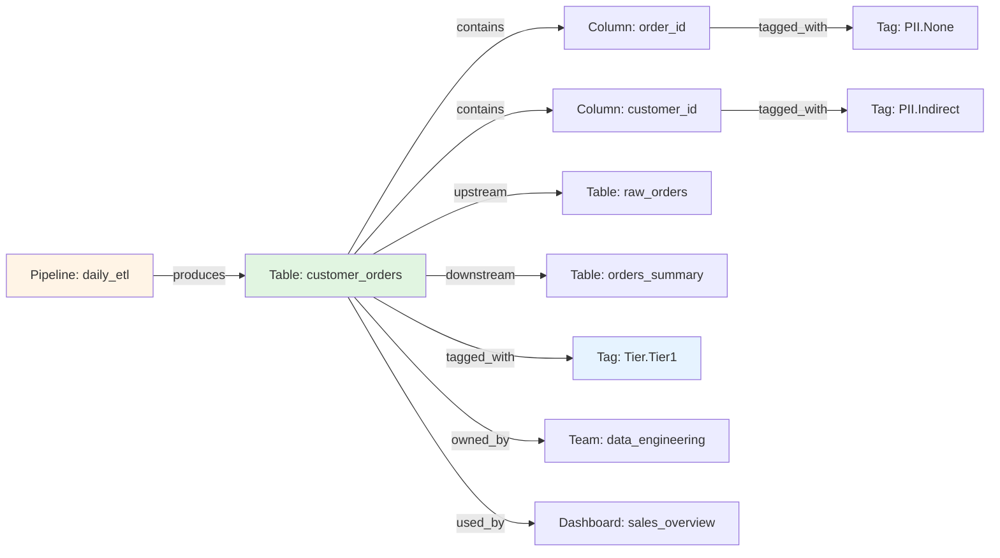

### Lineage Relationships

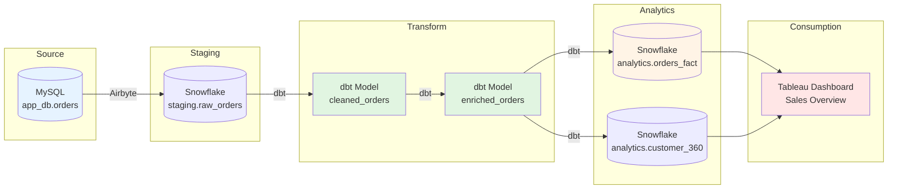

---

## Schema Definitions

### JSON Schema Structure

All entities follow JSON Schema Draft-07 standard:

```json
{
  "$schema": "http://json-schema.org/draft-07/schema#",
  "$id": "https://open-metadata.org/schema/entity/data/table.json",
  "title": "Table",
  "description": "A table entity represents a structured dataset",
  "type": "object",
  "properties": {
    "id": {
      "description": "Unique identifier",
      "$ref": "../../type/basic.json#/definitions/uuid"
    },
    "name": {
      "description": "Name of the table",
      "$ref": "../../type/basic.json#/definitions/entityName"
    },
    "fullyQualifiedName": {
      "description": "Fully qualified name",
      "type": "string"
    },
    "columns": {
      "description": "Columns in this table",
      "type": "array",
      "items": {
        "$ref": "#/definitions/column"
      }
    }
  },
  "required": ["id", "name", "columns"],
  "additionalProperties": false
}
```

### Custom Properties

OpenMetadata supports custom properties via **Entity Extensions**:

```json
{
  "entityType": "table",
  "customProperties": [
    {
      "name": "dataRetentionDays",
      "description": "Number of days data is retained",
      "propertyType": {
        "id": "integer",
        "type": "integer"
      }
    },
    {
      "name": "costCenter",
      "description": "Cost center for billing",
      "propertyType": {
        "id": "string",
        "type": "string"
      }
    },
    {
      "name": "isRegulatoryData",
      "description": "Subject to regulatory requirements",
      "propertyType": {
        "id": "boolean",
        "type": "boolean"
      }
    }
  ]
}
```

**Usage**:
```json
{
  "id": "table-uuid",
  "name": "customer_orders",
  "extension": {
    "dataRetentionDays": 2555,
    "costCenter": "CC-1234",
    "isRegulatoryData": true
  }
}
```

---

## Data Types

### Column Data Types

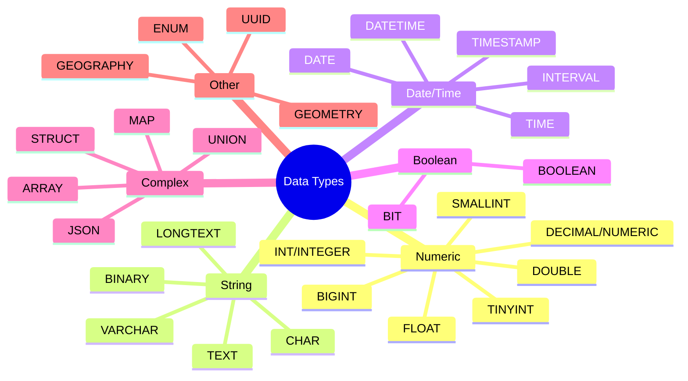

### Type Mappings

| Generic Type | MySQL | PostgreSQL | Snowflake | BigQuery |
|--------------|-------|------------|-----------|----------|
| **String** | VARCHAR | VARCHAR | VARCHAR | STRING |
| **Integer** | INT | INTEGER | NUMBER | INT64 |
| **BigInt** | BIGINT | BIGINT | NUMBER | INT64 |
| **Float** | FLOAT | REAL | FLOAT | FLOAT64 |
| **Decimal** | DECIMAL | NUMERIC | NUMBER | NUMERIC |
| **Boolean** | BOOLEAN | BOOLEAN | BOOLEAN | BOOL |
| **Date** | DATE | DATE | DATE | DATE |
| **Timestamp** | TIMESTAMP | TIMESTAMP | TIMESTAMP_NTZ | TIMESTAMP |
| **JSON** | JSON | JSONB | VARIANT | JSON |
| **Array** | - | ARRAY | ARRAY | ARRAY |

---

## Versioning

### Entity Versioning

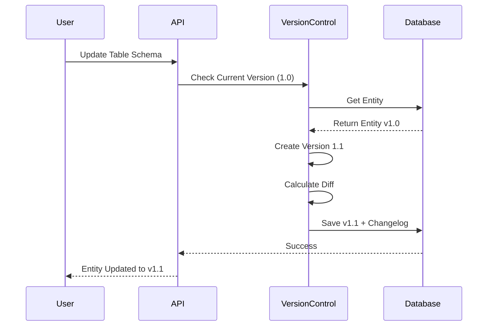

**Version Format**: `major.minor`
- **Major version**: Breaking changes (e.g., column deletion)
- **Minor version**: Non-breaking changes (e.g., add column, update description)

**Changelog**:
```json
{
  "entityType": "table",
  "entityId": "uuid",
  "version": 1.1,
  "previousVersion": 1.0,
  "changeDescription": {
    "fieldsAdded": [
      {
        "name": "columns",
        "newValue": {
          "name": "created_at",
          "dataType": "TIMESTAMP"
        }
      }
    ],
    "fieldsUpdated": [
      {
        "name": "description",
        "oldValue": "Customer orders",
        "newValue": "Customer orders with timestamps"
      }
    ],
    "fieldsDeleted": []
  },
  "updatedAt": 1698624000000,
  "updatedBy": "admin"
}
```

---

## Best Practices

### Naming Conventions

✅ **Fully Qualified Names (FQN)**:
```
service.database.schema.table
service.database.schema.table.column
```

Examples:
- `snowflake.sales_db.public.customer_orders`
- `snowflake.sales_db.public.customer_orders.order_id`
- `tableau.sales_analytics.sales_overview`

✅ **Entity Names**:
- Use lowercase with underscores
- Be descriptive and consistent
- Avoid abbreviations unless standard

❌ **Avoid**:
- Special characters (except underscore)
- Spaces in names
- Reserved keywords

### Description Guidelines

✅ **Good Descriptions**:
```markdown
Customer orders table containing all e-commerce transactions.
Includes order details, customer information, and payment status.
Updated in real-time via CDC from MySQL production database.
```

❌ **Poor Descriptions**:
```markdown
orders table
```

### Tagging Strategy

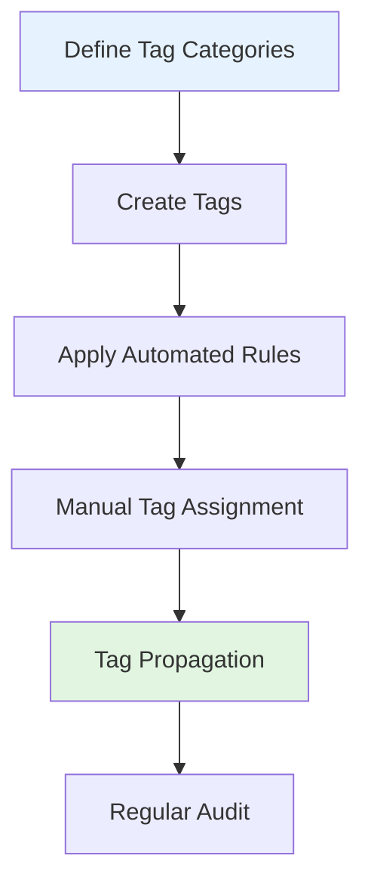

**Tag Categories**:
1. **Data Sensitivity**: PII, Confidential, Public
2. **Data Tier**: Tier1, Tier2, Tier3
3. **Domain**: Finance, Marketing, Sales, HR
4. **Environment**: Production, Staging, Development
5. **Compliance**: GDPR, HIPAA, SOC2

### Ownership Model

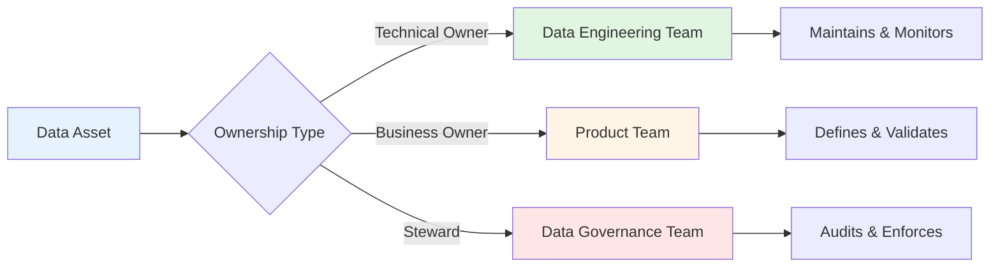

---

## Advanced Concepts

### Custom Entity Types

Create custom entity types by extending base schemas:

```json
{
  "$schema": "http://json-schema.org/draft-07/schema#",
  "$id": "https://company.com/schema/entity/customDataProduct.json",
  "title": "Data Product",
  "description": "Custom entity for data products",
  "type": "object",
  "javaType": "org.openmetadata.schema.entity.data.DataProduct",
  "javaInterfaces": ["org.openmetadata.schema.EntityInterface"],
  "properties": {
    "id": { "$ref": "../../type/basic.json#/definitions/uuid" },
    "name": { "$ref": "../../type/basic.json#/definitions/entityName" },
    "productType": {
      "type": "string",
      "enum": ["API", "Dataset", "Report", "ML_Model"]
    },
    "tables": {
      "type": "array",
      "items": { "$ref": "../../type/entityReference.json" }
    },
    "sla": {
      "type": "object",
      "properties": {
        "availabilityTarget": { "type": "number" },
        "freshnessTarget": { "type": "string" }
      }
    }
  },
  "required": ["id", "name", "productType"]
}
```

### Event-Driven Updates

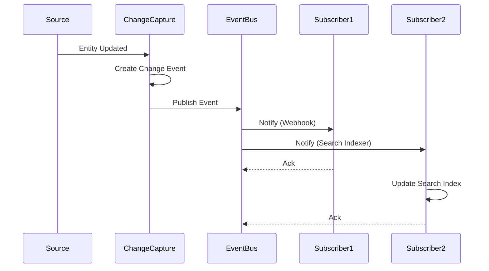

**Event Payload**:
```json
{
  "eventId": "uuid",
  "eventType": "entityUpdated",
  "entityType": "table",
  "entityId": "entity-uuid",
  "entityFQN": "snowflake.sales_db.public.customer_orders",
  "previousVersion": 1.0,
  "currentVersion": 1.1,
  "changeDescription": {
    "fieldsAdded": [...],
    "fieldsUpdated": [...],
    "fieldsDeleted": [...]
  },
  "timestamp": 1698624000000,
  "userName": "admin"
}
```

---

## API Examples

### Create Table Entity

```python
from metadata.generated.schema.entity.data.table import Table
from metadata.generated.schema.type.entityReference import EntityReference

# Create table entity
table = Table(
    name="customer_orders",
    fullyQualifiedName="snowflake.sales_db.public.customer_orders",
    description="Customer orders table",
    columns=[
        Column(
            name="order_id",
            dataType="BIGINT",
            description="Unique order identifier",
            constraint="PRIMARY_KEY"
        ),
        Column(
            name="customer_email",
            dataType="VARCHAR",
            dataLength=255,
            description="Customer email",
            tags=[TagLabel(tagFQN="PII.Email")]
        )
    ],
    database=EntityReference(id="db-uuid", type="database"),
    databaseSchema=EntityReference(id="schema-uuid", type="databaseSchema"),
    service=EntityReference(id="service-uuid", type="databaseService")
)

# Create via API
metadata.create_or_update(table)
```

### Query with Relationships

```python
# Get table with all relationships
table = metadata.get_by_name(
    entity=Table,
    fqn="snowflake.sales_db.public.customer_orders",
    fields=["columns", "tags", "owner", "database", "usageSummary", "dataModel"]
)

# Access relationships
print(f"Database: {table.database.name}")
print(f"Owner: {table.owner.name}")
print(f"Tags: {[tag.tagFQN for tag in table.tags]}")
```

---

## References

- **Schema Repository**: https://github.com/open-metadata/OpenMetadata/tree/main/openmetadata-spec/src/main/resources/json/schema
- **API Documentation**: https://docs.open-metadata.org/sdk/python
- **JSON Schema**: https://json-schema.org/

---

**Last Updated**: October 29, 2025  
**OpenMetadata Version**: 1.10.3
