# OpenMetadata - Security & Compliance

## Overview

OpenMetadata provides enterprise-grade security features to protect metadata, control access, and ensure compliance with regulatory requirements. This document covers authentication, authorization, data protection, and compliance frameworks.

---

## Security Architecture

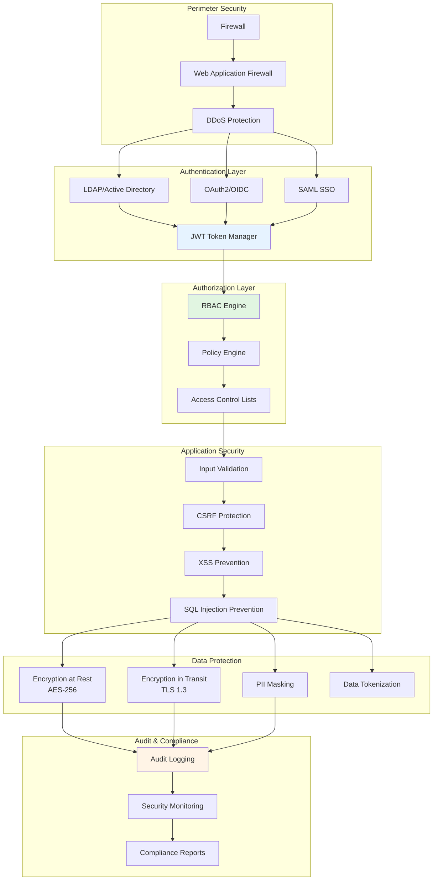

---

## Authentication

### 1. **Basic Authentication**

Simple username/password authentication for development.

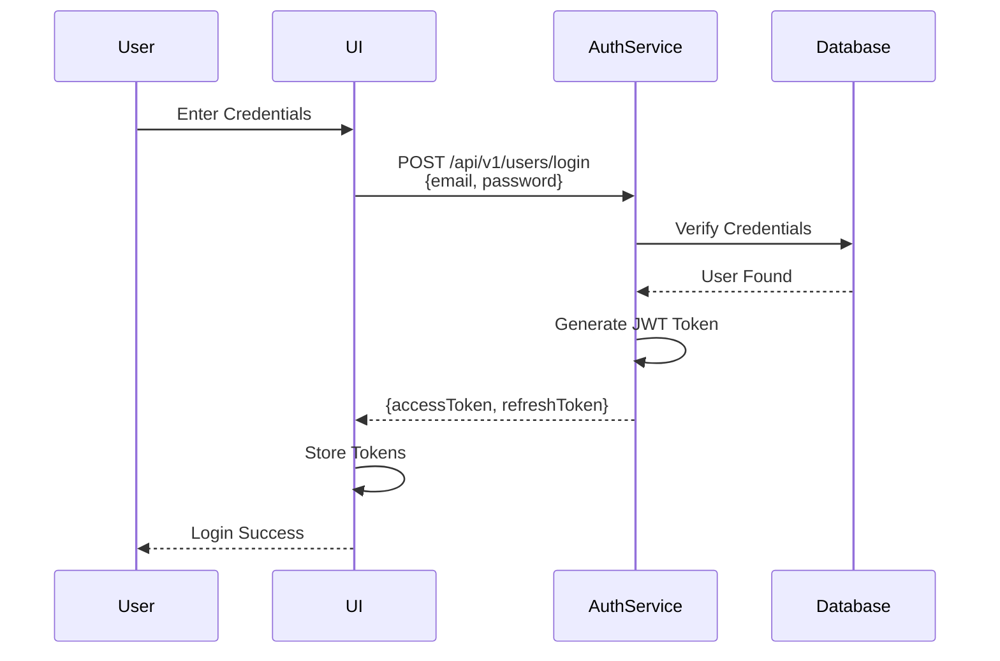

**Configuration**:
```yaml
authenticationConfiguration:
  provider: "basic"
  publicKeyUrls:
    - "http://localhost:8585/api/v1/system/config/jwks"
  authority: "https://accounts.google.com"
  clientId: "your-client-id"
  callbackUrl: "http://localhost:8585/callback"
```

---

### 2. **LDAP / Active Directory**

Enterprise directory integration.

```yaml
authenticationConfiguration:
  provider: "ldap"
  ldapConfiguration:
    host: "ldap.company.com"
    port: 389
    dnAdminPrincipal: "cn=admin,dc=company,dc=com"
    dnAdminPassword: "admin_password"
    userBaseDN: "ou=users,dc=company,dc=com"
    mailAttributeName: "mail"
```

**User Mapping**:
```
LDAP Attribute → OpenMetadata Field
- cn → name
- mail → email
- memberOf → teams
- title → description
```

---

### 3. **OAuth 2.0 / OIDC**

Support for external identity providers.

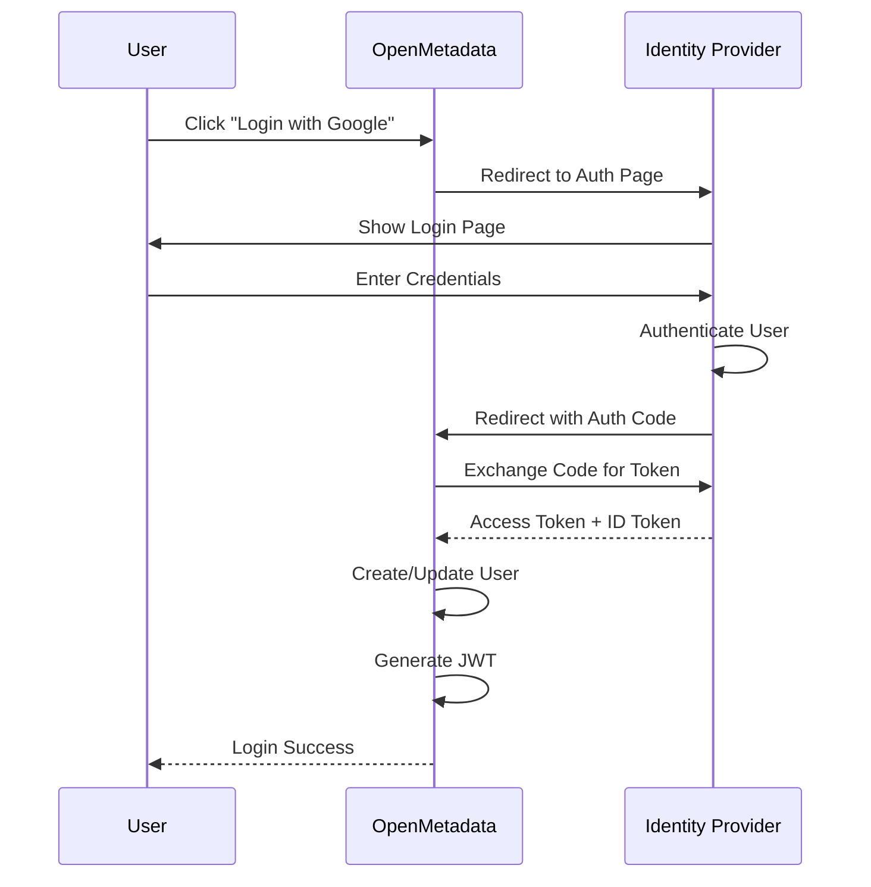

**Google OAuth Configuration**:
```yaml
authenticationConfiguration:
  provider: "google"
  publicKeyUrls:
    - "https://www.googleapis.com/oauth2/v3/certs"
  authority: "https://accounts.google.com"
  clientId: "your-google-client-id.apps.googleusercontent.com"
  callbackUrl: "http://localhost:8585/callback"
```

**Okta OIDC Configuration**:
```yaml
authenticationConfiguration:
  provider: "okta"
  publicKeyUrls:
    - "https://your-domain.okta.com/oauth2/v1/keys"
  authority: "https://your-domain.okta.com"
  clientId: "your-okta-client-id"
  callbackUrl: "http://localhost:8585/callback"
  scope: "openid email profile groups"
```

**Azure AD Configuration**:
```yaml
authenticationConfiguration:
  provider: "azure"
  publicKeyUrls:
    - "https://login.microsoftonline.com/common/discovery/v2.0/keys"
  authority: "https://login.microsoftonline.com/{tenant-id}"
  clientId: "your-azure-client-id"
  callbackUrl: "http://localhost:8585/callback"
```

---

### 4. **SAML 2.0 SSO**

Enterprise single sign-on.

```yaml
authenticationConfiguration:
  provider: "saml"
  samlConfiguration:
    idp:
      entityId: "https://idp.company.com"
      ssoLoginUrl: "https://idp.company.com/sso/login"
      x509Certificate: "MIIDXTCCAkWgAwIBAgIJ..."
    sp:
      entityId: "https://openmetadata.company.com"
      acs: "https://openmetadata.company.com/api/v1/saml/acs"
      callback: "https://openmetadata.company.com/saml/callback"
```

---

### 5. **JWT Token Management**

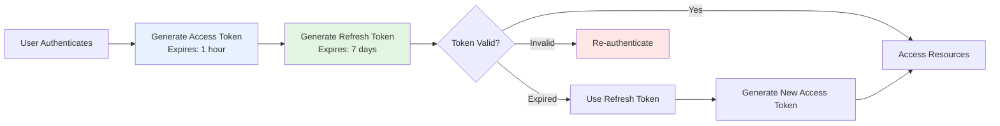

**Token Structure**:
```json
{
  "header": {
    "alg": "RS256",
    "typ": "JWT",
    "kid": "key-id"
  },
  "payload": {
    "sub": "user-uuid",
    "email": "john.doe@company.com",
    "isAdmin": false,
    "iss": "https://openmetadata.company.com",
    "aud": "openmetadata",
    "exp": 1698624000,
    "iat": 1698620400
  },
  "signature": "..."
}
```

---

## Authorization

### 1. **Role-Based Access Control (RBAC)**

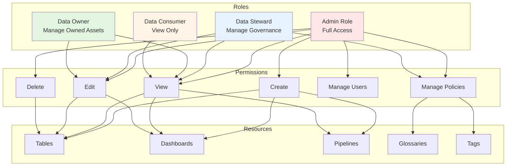

**Built-in Roles**:

| Role | Permissions | Use Case |
|------|-------------|----------|
| **Admin** | Full access to all resources | System administrators |
| **Data Steward** | Manage governance, policies, tags | Governance team |
| **Data Owner** | Manage owned data assets | Asset owners |
| **Data Consumer** | View metadata, search | Analysts, engineers |

**Custom Role Example**:
```json
{
  "name": "DataEngineer",
  "displayName": "Data Engineer",
  "description": "Role for data engineering team",
  "policies": [
    {
      "name": "PipelineManagement",
      "policyType": "AccessControl",
      "rules": [
        {
          "name": "ManagePipelines",
          "resources": ["pipeline"],
          "operations": ["Create", "ViewAll", "EditAll", "Delete"],
          "effect": "allow"
        }
      ]
    }
  ]
}
```

---

### 2. **Attribute-Based Access Control (ABAC)**

Policy-based access control using attributes.

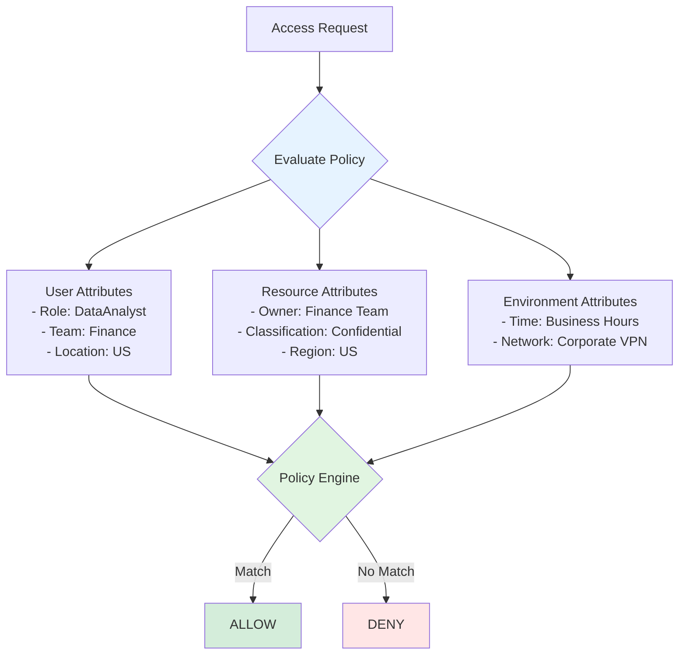

**Policy Example**:
```json
{
  "name": "FinanceDataAccessPolicy",
  "description": "Finance team can access finance data",
  "policyType": "AccessControl",
  "rules": [
    {
      "name": "FinanceTeamAccess",
      "resources": ["table"],
      "resourceCondition": "resource.owner.name == 'finance_team'",
      "operations": ["ViewAll"],
      "userCondition": "user.teams.contains('finance_team')",
      "effect": "allow"
    }
  ]
}
```

**Condition Expressions**:
```python
# User-based conditions
user.isAdmin == true
user.teams.contains('data_engineering')
user.email.endsWith('@company.com')

# Resource-based conditions
resource.tags.contains('PII.Sensitive')
resource.owner.id == user.id
resource.database.name == 'finance_db'

# Environment-based conditions
currentTime.hour >= 9 && currentTime.hour <= 18
request.ipAddress.startsWith('10.0.')
```

---

### 3. **Column-Level Security**

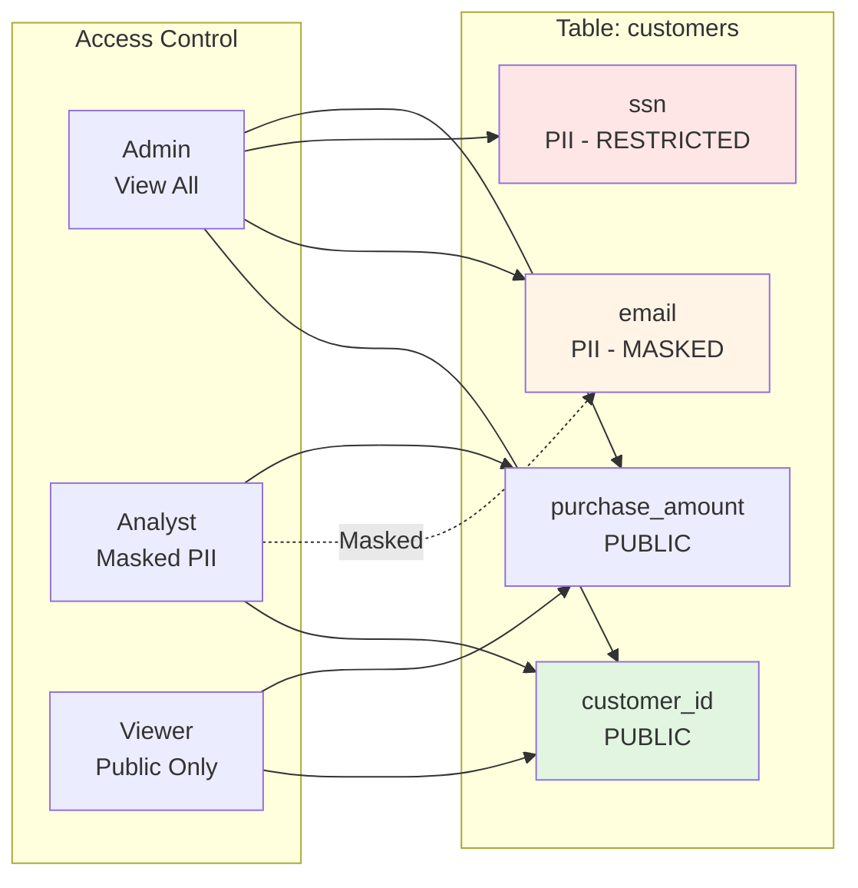

**Masking Rules**:
```json
{
  "name": "EmailMaskingRule",
  "description": "Mask email addresses for non-admin users",
  "maskingExpressions": [
    {
      "name": "EmailMask",
      "expression": "MASK_EMAIL(column)",
      "columnNames": ["email", "contact_email"]
    }
  ],
  "condition": "user.role != 'Admin'"
}
```

**Masking Functions**:
- `MASK_EMAIL`: john.doe@company.com → j***@company.com
- `MASK_PHONE`: +1-555-1234 → +1-***-1234
- `MASK_SSN`: 123-45-6789 → ***-**-6789
- `MASK_CREDIT_CARD`: 1234-5678-9012-3456 → ****-****-****-3456
- `NULLIFY`: Returns NULL
- `HASH`: Returns hash value

---

## Data Protection

### 1. **Encryption at Rest**

```yaml
# MySQL/PostgreSQL Encryption
database:
  encryption:
    enabled: true
    algorithm: "AES-256"
    keyManagement: "AWS-KMS"  # or Azure Key Vault, GCP KMS
    keyId: "arn:aws:kms:region:account:key/key-id"
```

### 2. **Encryption in Transit**

```yaml
# TLS Configuration
server:
  ssl:
    enabled: true
    protocol: "TLSv1.3"
    ciphers:
      - "TLS_AES_128_GCM_SHA256"
      - "TLS_AES_256_GCM_SHA384"
      - "TLS_CHACHA20_POLY1305_SHA256"
    certificatePath: "/path/to/cert.pem"
    keyPath: "/path/to/key.pem"
```

### 3. **PII Detection & Classification**

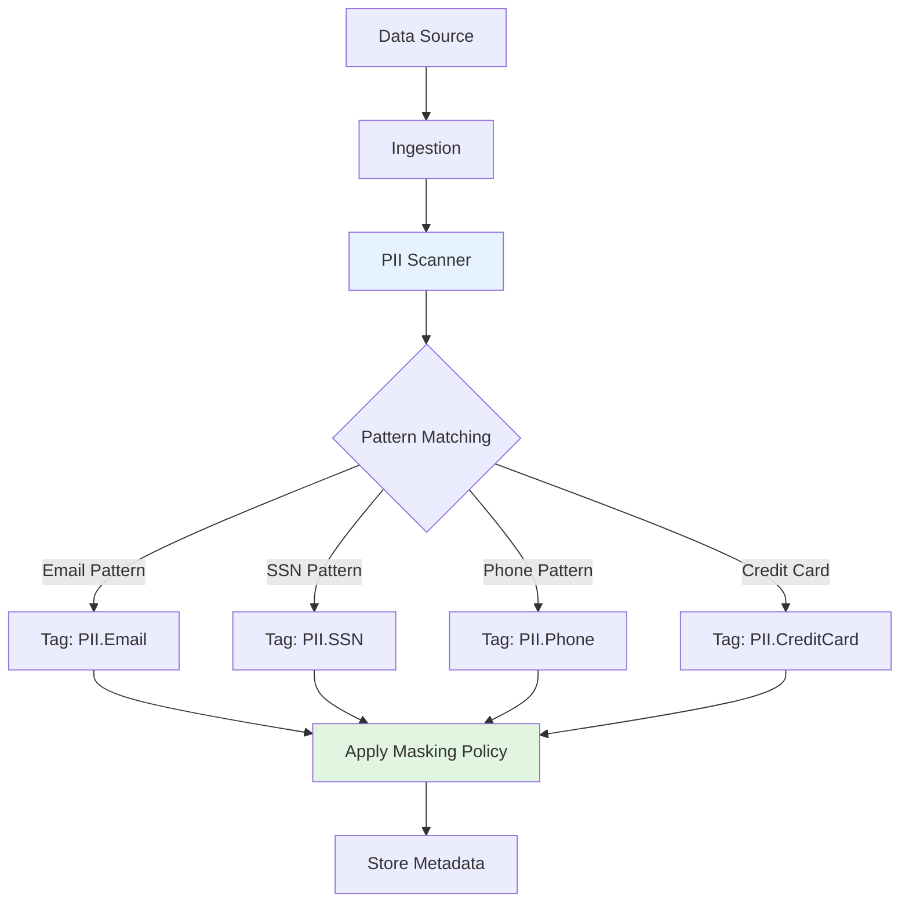

**PII Detection Rules**:
```python
PII_PATTERNS = {
    "EMAIL": r"[a-zA-Z0-9._%+-]+@[a-zA-Z0-9.-]+\.[a-zA-Z]{2,}",
    "SSN": r"\d{3}-\d{2}-\d{4}",
    "PHONE": r"\+?1?\d{9,15}",
    "CREDIT_CARD": r"\d{4}[- ]?\d{4}[- ]?\d{4}[- ]?\d{4}",
    "IP_ADDRESS": r"\d{1,3}\.\d{1,3}\.\d{1,3}\.\d{1,3}"
}
```

**Auto-Tagging**:
```json
{
  "piiClassification": {
    "enabled": true,
    "confidence": 0.8,
    "autoTag": true,
    "patterns": [
      {
        "name": "email",
        "regex": "[a-zA-Z0-9._%+-]+@[a-zA-Z0-9.-]+\\.[a-zA-Z]{2,}",
        "tag": "PII.Email"
      },
      {
        "name": "ssn",
        "regex": "\\d{3}-\\d{2}-\\d{4}",
        "tag": "PII.SSN"
      }
    ]
  }
}
```

---

## Audit & Compliance

### 1. **Audit Logging**

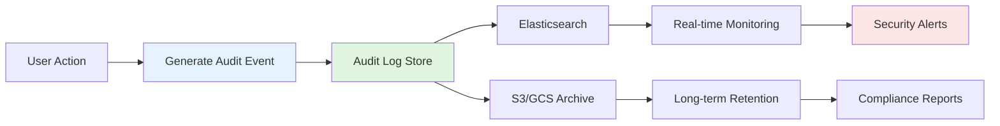

**Audit Event Structure**:
```json
{
  "eventId": "uuid",
  "eventType": "entityUpdated",
  "entityType": "table",
  "entityId": "table-uuid",
  "entityFQN": "snowflake.sales_db.public.customer_orders",
  "userName": "john.doe",
  "userEmail": "john.doe@company.com",
  "timestamp": 1698624000000,
  "ipAddress": "192.168.1.100",
  "userAgent": "Mozilla/5.0...",
  "action": "UPDATE",
  "changeDescription": {
    "fieldsUpdated": [
      {
        "name": "description",
        "oldValue": "Customer orders",
        "newValue": "Customer orders table"
      }
    ]
  },
  "result": "SUCCESS"
}
```

**Audited Events**:
- User login/logout
- Entity CRUD operations
- Permission changes
- Policy updates
- Data access
- Failed access attempts
- Configuration changes

### 2. **Compliance Frameworks**

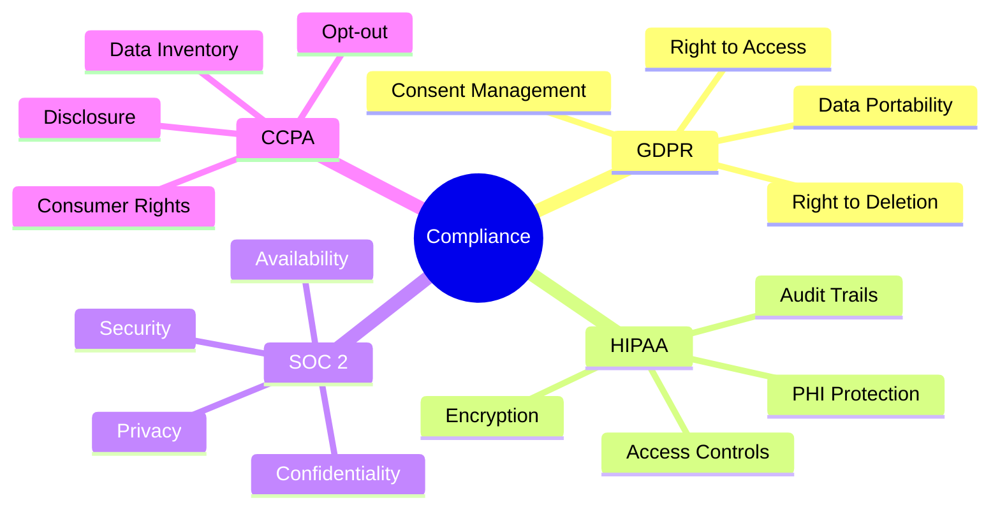

#### GDPR Compliance

**Features**:
- ✅ Data inventory and classification
- ✅ PII identification and tagging
- ✅ Access control and audit logs
- ✅ Data lineage tracking
- ✅ Right to be forgotten (delete operations)
- ✅ Consent management

**Implementation**:
```python
# Find all PII data
tables_with_pii = metadata.search_entities(
    entity_type=Table,
    query="tags:PII.*"
)

# Track data lineage for GDPR requests
lineage = metadata.get_lineage(
    entity=Table,
    fqn="customer_data.users",
    downstream_depth=5
)

# Delete user data (Right to be forgotten)
def gdpr_delete_user(user_email):
    # Find all tables with user data
    tables = find_tables_with_email(user_email)
    
    # Generate deletion SQL
    for table in tables:
        sql = f"DELETE FROM {table.fqn} WHERE email = '{user_email}'"
        execute_sql(sql)
        
        # Log deletion
        audit_log(f"GDPR deletion: {user_email} from {table.fqn}")
```

#### HIPAA Compliance

**Features**:
- ✅ PHI (Protected Health Information) identification
- ✅ Encryption at rest and in transit
- ✅ Access controls and audit trails
- ✅ Data retention policies
- ✅ Incident response

**PHI Tagging**:
```json
{
  "tagCategory": "PHI",
  "tags": [
    "PHI.PatientName",
    "PHI.MedicalRecord",
    "PHI.DateOfBirth",
    "PHI.SSN",
    "PHI.Diagnosis",
    "PHI.Treatment"
  ]
}
```

---

## Security Best Practices

### 1. **Network Security**

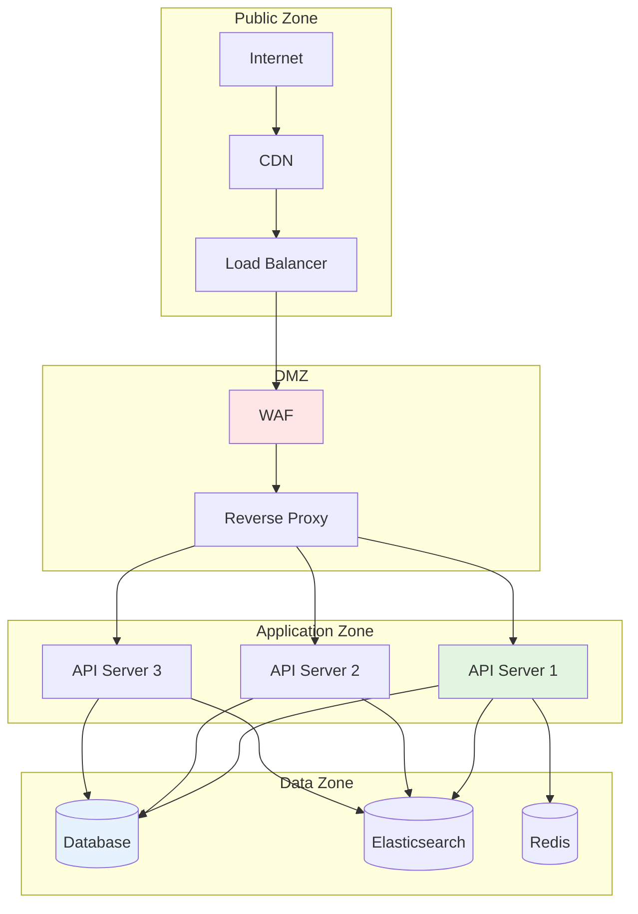

**Security Checklist**:
- ✅ Use VPC/VNet isolation
- ✅ Configure firewall rules
- ✅ Enable DDoS protection
- ✅ Use private endpoints for databases
- ✅ Implement WAF rules
- ✅ Regular security scanning

### 2. **Application Security**

```yaml
# Security Headers
server:
  securityHeaders:
    - "Strict-Transport-Security: max-age=31536000; includeSubDomains"
    - "X-Content-Type-Options: nosniff"
    - "X-Frame-Options: DENY"
    - "X-XSS-Protection: 1; mode=block"
    - "Content-Security-Policy: default-src 'self'"
```

**Security Measures**:
- ✅ Input validation on all endpoints
- ✅ SQL injection prevention (parameterized queries)
- ✅ XSS protection (output encoding)
- ✅ CSRF tokens
- ✅ Rate limiting
- ✅ Dependency scanning
- ✅ Regular security updates

### 3. **Access Control**

**Principle of Least Privilege**:
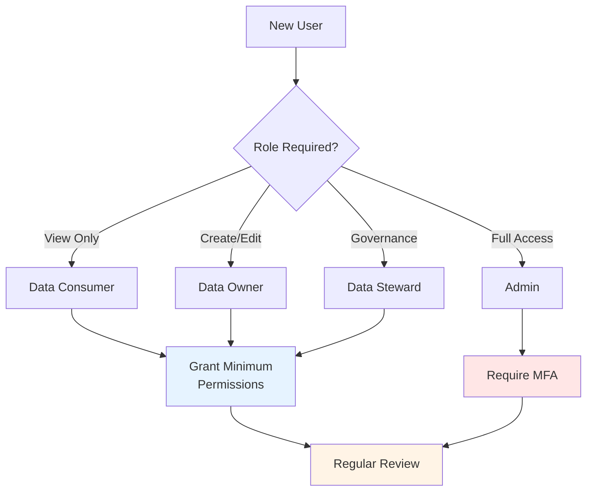

**Best Practices**:
- ✅ Principle of least privilege
- ✅ Regular access reviews
- ✅ Automated access provisioning
- ✅ Multi-factor authentication
- ✅ Session timeout policies
- ✅ Remove inactive accounts

### 4. **Secrets Management**

```yaml
# Using External Secrets Manager
secretsManager:
  provider: "aws-secrets-manager"  # or azure-key-vault, gcp-secret-manager
  region: "us-east-1"
  secrets:
    - name: "openmetadata/db-password"
      key: "database.password"
    - name: "openmetadata/jwt-secret"
      key: "jwt.secret"
```

**Secrets Best Practices**:
- ✅ Never store secrets in code
- ✅ Use secrets manager (AWS Secrets Manager, Azure Key Vault, etc.)
- ✅ Rotate secrets regularly
- ✅ Encrypt secrets at rest
- ✅ Audit secret access
- ✅ Use short-lived credentials

---

## Security Monitoring

### 1. **Security Metrics**

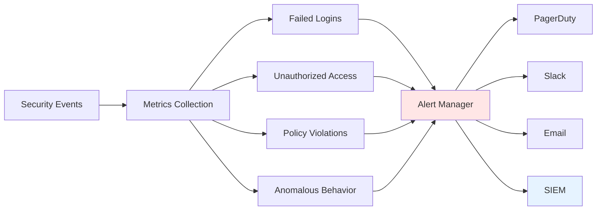

**Key Metrics**:
- Failed authentication attempts
- Unauthorized access attempts
- Policy violations
- Data access patterns
- Privilege escalation attempts
- Anomalous user behavior

### 2. **Incident Response**

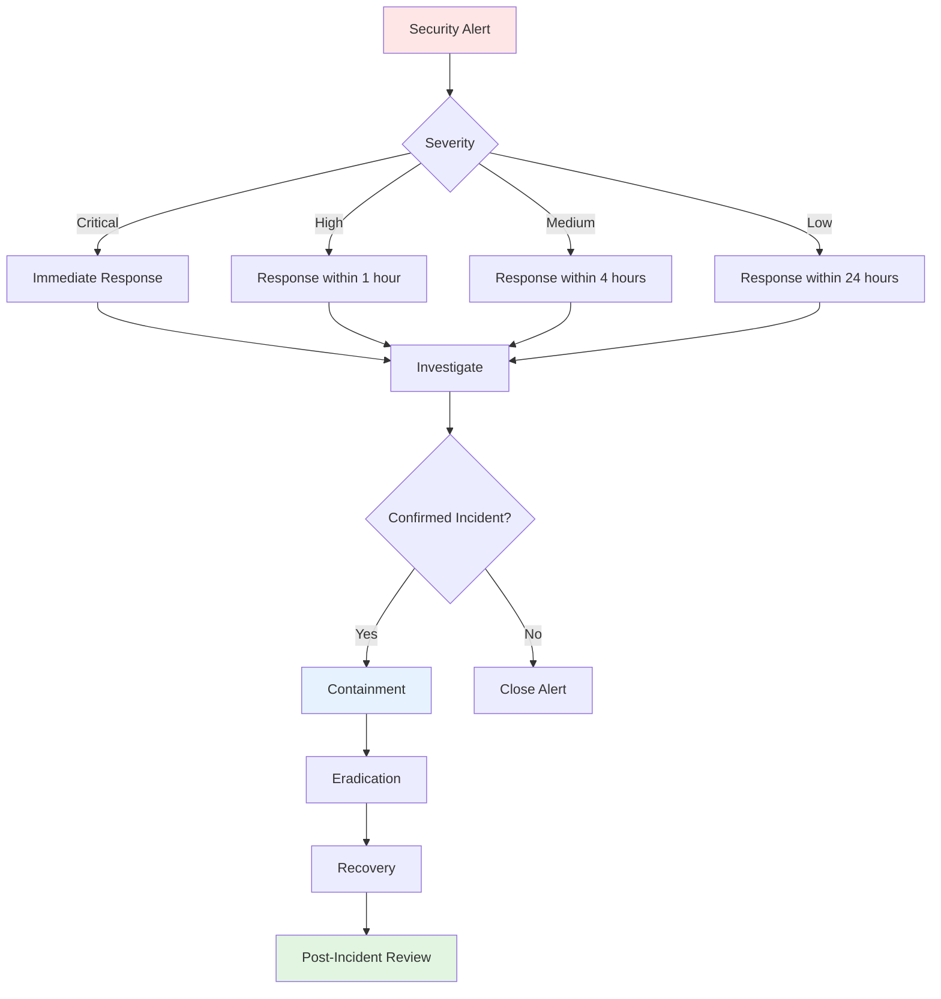

---

## References

- **Security Guide**: https://docs.open-metadata.org/v1.10.x/deployment/security
- **RBAC Documentation**: https://docs.open-metadata.org/v1.10.x/deployment/security/enable-security
- **Compliance**: https://docs.open-metadata.org/v1.10.x/deployment/security/compliance

---

**Last Updated**: October 29, 2025  
**OpenMetadata Version**: 1.10.3
