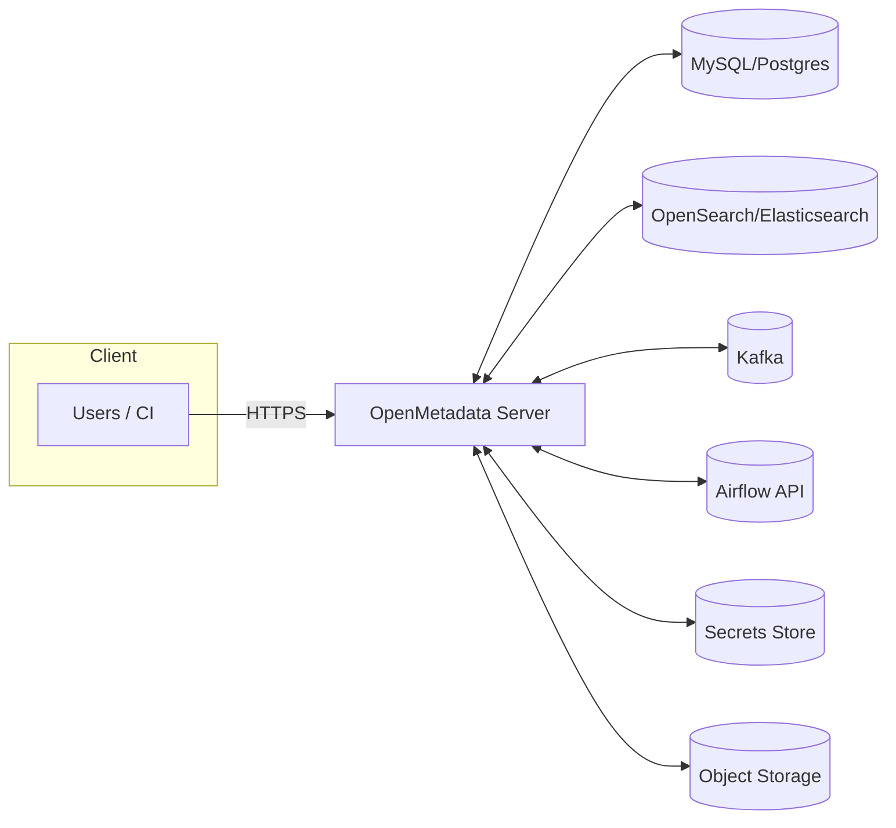
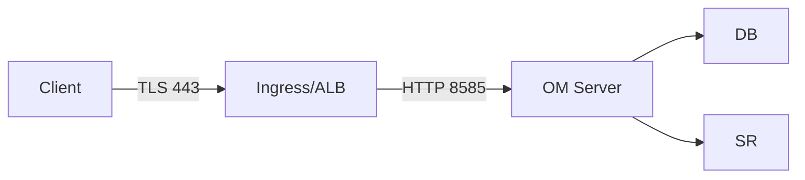
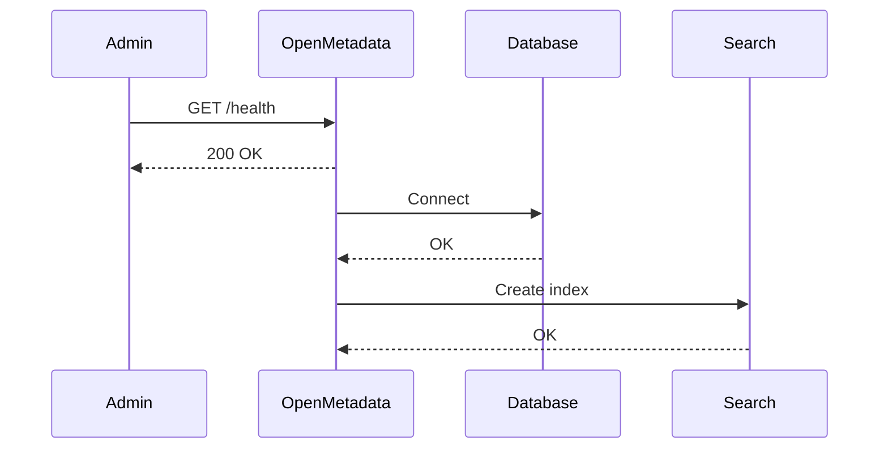

# OpenMetadata Configuration Guide (v1.10.3)

This guide explains how to configure OpenMetadata for development, staging, and production. It covers deployment modes (Docker Compose and Kubernetes/Helm), service dependencies (database, search, queue), authentication/authorization, secrets management, SSL/TLS, observability, and ingestion.

Audience: Platform/DevOps engineers and administrators.

Related docs:
- 04: [Deployment Options](./deployment-options.md)
- 04: [Infrastructure Requirements](./infrastructure-requirements.md)
- 04: [Monitoring & Maintenance](./monitoring-maintenance.md)
- 03: [Security & Compliance](../03-technical-deep-dive/security-compliance.md)
- 03: [APIs & Integration](../03-technical-deep-dive/apis-integration.md)
- 10: [Troubleshooting](../10-reference/troubleshooting.md) · [FAQ](../10-reference/faq.md)

Last updated: October 29, 2025

## Configuration overview

OpenMetadata consists of the following logical services:

- OpenMetadata Server (OM Server)
- Metadata Database (MySQL or PostgreSQL)
- Search (OpenSearch or Elasticsearch)
- Eventing (Kafka; optional but recommended for scale)
- Ingestion (Airflow-based and/or OM-native schedulers)
- UI (served by OM Server)
- Optional: Object storage for exports/backups (S3/Azure/GCS), Secrets store (Vault, KMS)



Configuration can be supplied via (precedence from lowest to highest):
1) Defaults baked into the distribution/Helm chart
2) YAML files (application.yaml / openmetadata.yaml / values.yaml)
3) Environment variables
4) External secrets injection (mounted files/templated env)

> Tip: Prefer environment variables for 12-factor portability; use external secret managers for credentials.

## Quick start matrix

| Scenario | Recommended | Where to configure |
|---|---|---|
| Local dev | Docker Compose | .env, docker-compose.override.yml, openmetadata.yaml |
| Staging/Prod | Kubernetes + Helm | values.yaml, sealed secrets/external secrets |
| Air-gapped | Helm + pre-provisioned images | values.yaml with imagePullSecrets |

## Core configuration keys

Below are the common settings you will configure regardless of deployment mode. The exact path/keys may vary slightly across Docker vs Helm, but the semantics are the same.

### 1) Server

- server.port: Port for OM Server (default 8585)
- server.baseUrl: Public URL (used for callbacks, emails, SSO)
- server.cors: Allowed origins/headers/methods
- server.ssl: Enable TLS if terminating at application layer

Example (YAML):

```yaml
server:
	port: 8585
	baseUrl: https://metadata.example.com
	cors:
		enabled: true
		allowedOrigins: ["https://portal.example.com"]
```

Environment variables (examples):

```
SERVER_PORT=8585
SERVER_BASEURL=https://metadata.example.com
```

### 2) Database

Supported: MySQL (default) or PostgreSQL.

Keys:
- database.type: mysql | postgres
- database.host, port, username, password
- database.databaseName
- database.sslMode (when applicable)

Example (YAML):

```yaml
database:
	type: mysql
	host: mysql.omd.svc.cluster.local
	port: 3306
	username: omuser
	password: ${DB_PASSWORD}
	databaseName: openmetadata_db
```

### 3) Search (Elasticsearch/OpenSearch)

Keys:
- search.type: elasticsearch | opensearch
- search.host, port, scheme
- search.username, password (if secured)
- search.indexPrefix (multi-environment isolation)

Example:

```yaml
search:
	type: opensearch
	host: opensearch.omd.svc.cluster.local
	port: 9200
	scheme: http
	indexPrefix: omd_prod_
```

### 4) Eventing (Kafka)

Keys:
- eventHandler.enabled: true|false
- kafka.bootstrapServers
- kafka.securityProtocol, saslMechanism, saslJaasConfig (if using SASL)
- topics.* (advanced)

Example:

```yaml
eventHandler:
	enabled: true
kafka:
	bootstrapServers: kafka.omd.svc.cluster.local:9092
	securityProtocol: PLAINTEXT
```

### 5) Authentication & SSO

OpenMetadata supports multiple auth providers and SSO options. Common patterns:

- auth.provider: basic | no-auth | google | okta | auth0 | azure | keycloak | saml | oidc
- auth.jwtTokens.enabled: true (for service/service)
- sso.{provider}.*: Provider-specific keys

OIDC (generic) example:

```yaml
auth:
	provider: oidc
oidc:
	clientId: ${OIDC_CLIENT_ID}
	clientSecret: ${OIDC_CLIENT_SECRET}
	discoveryUri: https://login.example.com/.well-known/openid-configuration
	scopes: ["openid","email","profile"]
	callbackUrl: https://metadata.example.com/callback
```

SAML example (excerpt):

```yaml
auth:
	provider: saml
saml:
	idpEntityId: https://idp.example.com/metadata
	ssoLoginUrl: https://idp.example.com/login
	idpX509Certificate: ${SAML_IDP_CERT}
	spEntityId: https://metadata.example.com/api/v1/saml/metadata
	callbackUrl: https://metadata.example.com/api/v1/saml/callback
```

RBAC/Authorization excerpt:

```yaml
authorization:
	enabled: true
	defaultRoles:
		- Data Consumer
		- Data Steward
```

### 6) Email & notifications

SMTP:

```yaml
email:
	enabled: true
	host: smtp.example.com
	port: 587
	username: ${SMTP_USER}
	password: ${SMTP_PASS}
	from: omd@metadata.example.com
	startTls: true
```

Outgoing notifications (examples):

```yaml
notifications:
	slack:
		enabled: true
		botToken: ${SLACK_BOT_TOKEN}
	msTeams:
		enabled: false
```

### 7) Ingestion (Airflow & OM-native)

You can orchestrate ingestion via:
1) Managed or self-hosted Airflow
2) OpenMetadata ingestion container with built-in schedulers

Airflow configuration:

```yaml
airflow:
	host: https://airflow.example.com
	username: airflow_user
	password: ${AIRFLOW_PASS}
	timeoutSeconds: 30
```

OM-native scheduler (excerpt):

```yaml
ingestionPipeline:
	enabled: true
	concurrency: 4
	defaultSchedule: "0 */6 * * *"
```

### 8) SSL/TLS & proxies

Typical production setups terminate TLS at an ingress or load balancer. If you terminate TLS at OM Server, enable SSL and provide certificates.

Ingress sketch:



App-level SSL example:

```yaml
server:
	ssl:
		enabled: true
		keyStorePath: /certs/keystore.p12
		keyStorePassword: ${KEYSTORE_PASSWORD}
```

### 9) Secrets management

Use environment variables injected by:
- HashiCorp Vault Agent Injector
- External Secrets Operator (Kubernetes)
- AWS Secrets Manager / Azure Key Vault / GCP Secret Manager

Env interpolation pattern:

```yaml
database:
	password: ${DB_PASSWORD}
```

Kubernetes example (ExternalSecret):

```yaml
apiVersion: external-secrets.io/v1beta1
kind: ExternalSecret
metadata:
	name: omd-secrets
spec:
	refreshInterval: 1h
	secretStoreRef:
		name: aws-store
		kind: ClusterSecretStore
	target:
		name: omd-env
	data:
		- secretKey: DB_PASSWORD
			remoteRef:
				key: prod/omd/database
				property: password
```

## Docker Compose configuration

Files:
- .env – overridable variables
- docker-compose.yml – base services
- docker-compose.override.yml – local tweaks (ports, volumes)
- openmetadata.yaml – application settings

Minimal .env (example):

```bash
SERVER_BASEURL=http://localhost:8585
DB_PASSWORD=omd
SMTP_USER=
SMTP_PASS=
```

Minimal openmetadata.yaml (example):

```yaml
server:
	baseUrl: ${SERVER_BASEURL}
database:
	type: mysql
	host: mysql
	port: 3306
	username: omuser
	password: ${DB_PASSWORD}
	databaseName: openmetadata_db
search:
	type: opensearch
	host: opensearch
	port: 9200
```

## Kubernetes & Helm configuration

Recommended for production. Configure via values.yaml.

values.yaml (minimal):

```yaml
server:
	baseUrl: https://metadata.example.com
database:
	external:
		type: mysql
		host: mysql.omd.svc.cluster.local
		port: 3306
		username: omuser
		passwordSecretRef: omd-env:DB_PASSWORD
		databaseName: openmetadata_db
search:
	external:
		type: opensearch
		host: opensearch.omd.svc.cluster.local
		port: 9200
ingress:
	enabled: true
	className: nginx
	hosts:
		- host: metadata.example.com
			paths: [/]
```

values.yaml (production sketch):

```yaml
replicaCount: 3
resources:
	requests:
		cpu: 500m
		memory: 1Gi
	limits:
		cpu: 2
		memory: 4Gi
podDisruptionBudget:
	enabled: true
	maxUnavailable: 1
nodeSelector: {}
affinity: {}
tolerations: []
autoscaling:
	enabled: true
	minReplicas: 3
	maxReplicas: 10
	targetCPUUtilizationPercentage: 70
envFromSecret: omd-env
```

## Observability

Enable logs, metrics, and traces to operate OM at scale.

```yaml
logging:
	level: INFO
	json: true
telemetry:
	openTelemetry:
		enabled: true
		exporter: otlp
		endpoint: http://otel-collector:4317
metrics:
	prometheus:
		enabled: true
```

Prometheus scrape example (ServiceMonitor):

```yaml
apiVersion: monitoring.coreos.com/v1
kind: ServiceMonitor
metadata:
	name: omd-sm
spec:
	selector:
		matchLabels:
			app.kubernetes.io/name: openmetadata
	endpoints:
		- port: http
			path: /actuator/prometheus
```

## Performance tuning

- JVM: -Xms512m -Xmx4g (adjust per resources)
- DB pool: maxPoolSize (e.g., 30–100)
- Search: index shard/replica based on data volume
- Kafka: topic partitions for higher throughput

## Validation checklist

After configuration, verify:

- Health: GET /api/v1/health
- DB connectivity: check logs; tables created on first run
- Search indices: confirm index creation/push
- Auth flow: login with IdP; ensure callback URL matches
- Email: send test email
- Ingestion: run sample pipeline (see 06: Getting Started)



## Troubleshooting pointers

- 401/SSO issues: Verify baseUrl, redirect URIs, clock skew with IdP.
- 5xx on boot: Cannot reach DB/Search – check service DNS/ports/credentials.
- Email not sent: SMTP port/TLS mismatch; verify credentials.
- Ingestion fails: Airflow credentials or network; see [Troubleshooting](../10-reference/troubleshooting.md).

## Complete examples

### Example 1 – Docker Compose openmetadata.yaml

```yaml
server:
	port: 8585
	baseUrl: http://localhost:8585
database:
	type: mysql
	host: mysql
	port: 3306
	username: omuser
	password: ${DB_PASSWORD}
	databaseName: openmetadata_db
search:
	type: opensearch
	host: opensearch
	port: 9200
auth:
	provider: no-auth
email:
	enabled: false
```

### Example 2 – Helm values.yaml (with OIDC)

```yaml
server:
	baseUrl: https://metadata.example.com
auth:
	provider: oidc
oidc:
	clientId: ${OIDC_CLIENT_ID}
	clientSecretSecretRef: omd-env:OIDC_CLIENT_SECRET
	discoveryUri: https://login.example.com/.well-known/openid-configuration
	callbackUrl: https://metadata.example.com/callback
database:
	external:
		type: postgres
		host: pg.omd.svc.cluster.local
		port: 5432
		username: omuser
		passwordSecretRef: omd-env:DB_PASSWORD
		databaseName: omd
search:
	external:
		type: elasticsearch
		host: es.omd.svc.cluster.local
		port: 9200
ingress:
	enabled: true
```

---

Next: See [Monitoring & Maintenance](./monitoring-maintenance.md) for runtime operations, backups, and upgrades.
