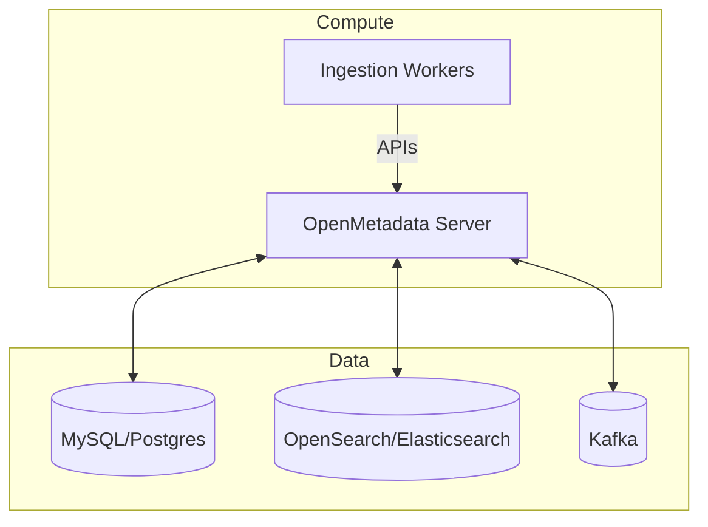
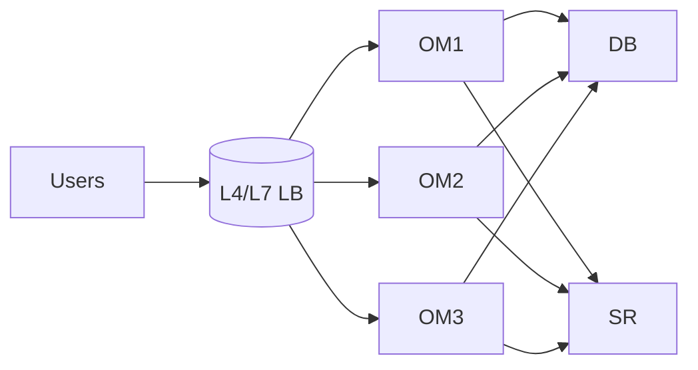

# OpenMetadata Infrastructure Requirements (v1.10.3)

This document defines the minimum and recommended infrastructure to run OpenMetadata reliably across environments. It covers supported platforms, dependency requirements (DB/Search/Queue), sizing, HA/DR, networking, and security baselines.

Related:
- 04: [Deployment Options](./deployment-options.md)
- 04: [Configuration Guide](./configuration-guide.md)
- 04: [Monitoring & Maintenance](./monitoring-maintenance.md)
- 03: [Security & Compliance](../03-technical-deep-dive/security-compliance.md)

Last updated: October 29, 2025

## Supported platforms

- OS (self-managed): Ubuntu 20.04+/22.04+, RHEL 8+, Amazon Linux 2+, Windows Server (for dev only)
- Container: Docker 24+, Kubernetes 1.25+ (managed or self-hosted)
- Ingress: NGINX Ingress, ALB, GKE Ingress, Traefik
- Databases: MySQL 8.0.x, PostgreSQL 13–16
- Search: OpenSearch 2.x, Elasticsearch 7.17/8.x
- Queue: Apache Kafka 2.8+/3.x (optional but recommended for scale)



## Baseline sizing

Small (POC/dev):
- OM Server: 2 vCPU, 4 GiB RAM
- DB: 2 vCPU, 4–8 GiB RAM, 50 GiB SSD
- Search: 2 vCPU, 4–8 GiB RAM, 50–100 GiB SSD
- Kafka: 1–2 vCPU, 2–4 GiB RAM (or use managed)

Medium (Teams 50–200 users, 10k–100k assets):
- OM Server: 4 vCPU, 8 GiB RAM (2–3 replicas for HA)
- DB: 4 vCPU, 16 GiB RAM, 200–500 GiB SSD, provisioned IOPS
- Search: 4 vCPU, 16 GiB RAM, 200–500 GiB SSD
- Kafka: 3 brokers, 2–4 vCPU, 8 GiB RAM, local SSD

Large (Enterprise 200+ users, 100k–1M assets):
- OM Server: 8 vCPU, 16–32 GiB RAM (3+ replicas)
- DB: 8–16 vCPU, 32–64 GiB RAM, 1–2 TiB SSD, high IOPS
- Search: 8–16 vCPU, 32–64 GiB RAM, 1–2 TiB SSD
- Kafka: 3–5 brokers, 4–8 vCPU, 16–32 GiB RAM

Storage guidance:
- Prefer NVMe/SSD. Ensure DB and Search have separate volumes and backup policies.
- Enable filesystem trim and mount options consistent with vendor best practices.

## Capacity planning

Key drivers: number of assets (tables, topics, dashboards), versions retained, lineage density, classification rules, and activity events.

Approximate formulas (order-of-magnitude):
- DB size (GiB) ≈ 0.001 × number_of_assets × versions_per_asset + 5
- Search size (GiB) ≈ 0.002 × number_of_assets × (avg_fields/50) × replicas
- CPU demand ∝ ingestion_concurrency + user_query_rate

Monitor real usage and adjust.

## High availability (HA)

Kubernetes:
- OM Server: min 3 replicas; configure readiness/liveness probes
- Use PodDisruptionBudgets and HorizontalPodAutoscaler
- DB: managed HA (e.g., RDS/Aurora, Cloud SQL) or self-managed primary/replica
- Search: multi-node cluster with 1 replica; shard strategy per index
- Kafka: 3+ brokers, min ISR=2

Docker Compose (dev only): not recommended for HA.



## Disaster recovery (DR)

RPO/RTO targets dictate strategy:
- Database: daily snapshots + PITR; cross-region replica if available
- Search: recreate from DB if necessary; or snapshot indices
- Config & Secrets: store IaC and secrets in versioned managers
- Backups: store in immutable bucket (S3/GCS/Azure Blob) with lifecycle policies

Test restores quarterly.

## Network & ports

Common ports (defaults):
- OM Server: 8585 (HTTP) / 443 (HTTPS via ingress)
- MySQL: 3306; PostgreSQL: 5432
- OpenSearch/Elasticsearch: 9200 (HTTP)
- Kafka: 9092 (PLAINTEXT), 9093+ (SASL/SSL variations)
- Airflow Web: 8080 (if used)

Recommendations:
- Place DB/Search/Kafka in private subnets; OM Server behind ingress
- Restrict inbound to LB/ingress only; use security groups/NSGs
- Egress allowlists to IdP, SMTP, and artifact registries

## Security baseline

- TLS in transit: terminate at ingress; mTLS inside cluster optional
- Secrets in manager (Vault/AWS SM/Azure KV/GCP SM); avoid secrets in Git
- RBAC: enable authorization and map IdP groups to roles
- OS hardening: CIS baselines for nodes; regular patching
- Image security: signed images, vulnerability scanning (Trivy/Grype)

## Kubernetes requirements

- Cluster: 3+ worker nodes; node pools sized for OM and data services
- StorageClass: SSD-backed; snapshot support for DB/Search volumes
- Ingress: NGINX/ALB with SSL policy and WAF if available
- Pod resources: set requests/limits; avoid overcommit for DB/Search
- Node affinity: pin stateful workloads to storage-optimized nodes

Example resource hints:

```yaml
resources:
	requests:
		cpu: 500m
		memory: 1Gi
	limits:
		cpu: 2
		memory: 4Gi
```

## External dependencies

- SMTP relay for notifications (TLS)
- Identity Provider for SSO (OIDC/SAML)
- Object storage for backups/exports
- DNS (public CNAMES) and certificates

## Compliance considerations

- Data residency for backups and logs
- Audit logs retention and access controls
- PII tagging and masking policies (see 07: Auto-Classification)

---

Next: Proceed to [Configuration Guide](./configuration-guide.md) to set values for your environment.
