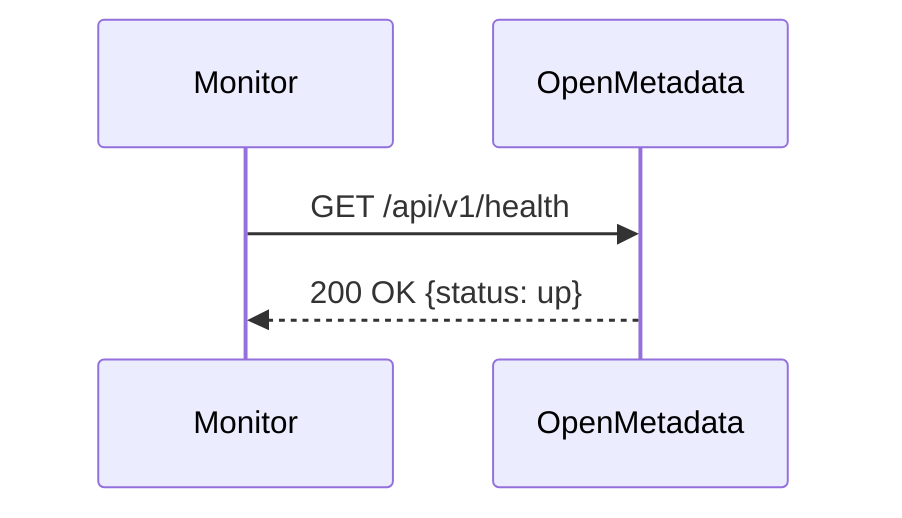
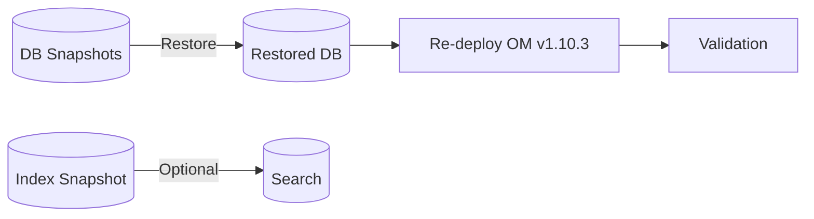
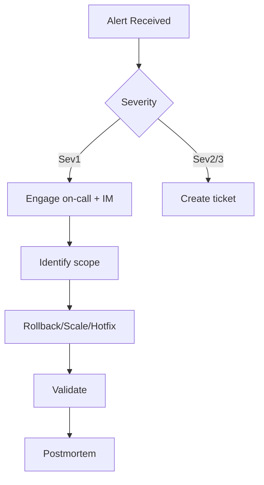

# OpenMetadata Monitoring & Maintenance (v1.10.3)

This guide describes how to observe, operate, and maintain OpenMetadata in production. It includes logs, metrics, traces, dashboards, alerting, backup/restore, upgrades, and routine operations.

Related:
- 04: [Configuration Guide](./configuration-guide.md)
- 04: [Deployment Options](./deployment-options.md)
- 10: [Troubleshooting](../10-reference/troubleshooting.md)

Last updated: October 29, 2025

## Health and diagnostics

- Liveness: /actuator/health/liveness
- Readiness: /actuator/health/readiness
- Basic health: /api/v1/health



Automate checks via Kubernetes Probes or external monitors (Pingdom, UptimeRobot).

## Logging

- Level: TRACE/DEBUG/INFO/WARN/ERROR (default INFO)
- Format: JSON recommended for ingestion into ELK/OpenSearch/Splunk
- Retention: follow org policy; rotate logs at container runtime (e.g., 7d)

Examples (values.yaml):

```yaml
logging:
	level: INFO
	json: true
``` 

Centralize logs with Filebeat/Fluent Bit/Vector sidecars shipping to your observability stack.

## Metrics

Expose Prometheus metrics at /actuator/prometheus.

Key metrics:
- http_server_requests_seconds_bucket (latency)
- jvm_memory_used_bytes (heap)
- db_pool_active_connections
- search_request_latency_seconds
- ingestion_jobs_running_total

Grafana dashboards: Build panels for latency, error rates, JVM memory, DB pool, search latency, ingestion status.

ServiceMonitor example:

```yaml
apiVersion: monitoring.coreos.com/v1
kind: ServiceMonitor
metadata:
	name: openmetadata
spec:
	selector:
		matchLabels:
			app.kubernetes.io/name: openmetadata
	endpoints:
		- port: http
			path: /actuator/prometheus
			interval: 30s
```

## Traces (OpenTelemetry)

Enable OTLP exporter to send traces to OTEL Collector and onward to Tempo/Jaeger/X-Ray/Cloud Trace.

```yaml
telemetry:
	openTelemetry:
		enabled: true
		exporter: otlp
		endpoint: http://otel-collector:4317
```

Trace critical transactions: login → search → entity fetch, ingestion job execution.

## Alerting

Set SLOs and alerts:
- Availability: 99.9% monthly
- Latency p95: < 500ms for read endpoints
- Error rate: < 1% 5xx
- Ingestion freshness: pipelines succeed within SLA windows

Alert sources:
- Prometheus alert rules (HTTP 5xx, JVM memory > 85%, DB pool saturation)
- Log error counts (rate-limited)
- Ingestion pipeline failures via Airflow or OM-native notifications

## Backups and restore

Backups:
- Database: daily snapshots + PITR; retain 14–35d
- Search: optional snapshots; can be rebuilt from DB when needed
- Config: backup values.yaml and secrets definitions in Git/IaC
- Export: periodic metadata export to object storage (optional)

Restore drill (high level):
1) Restore DB to desired timestamp
2) Recreate search indices or restore from snapshot
3) Redeploy OM Server with same version
4) Validate health and metrics



## Upgrades and patching

Recommended process (Kubernetes):
1) Read release notes (see 10: Release Notes)
2) Stage in non-prod; run smoke tests and ingestion
3) Take DB snapshot
4) Helm upgrade with image tag bump
5) Monitor health, logs, and migrations

Downgrade: restore DB snapshot and roll back image/tag.

Rolling restart:
```bash
kubectl rollout restart deploy/openmetadata
kubectl rollout status deploy/openmetadata -w
```

## Index management (Search)

- Curate shard/replica per index size
- Apply ILM policies for rollover and retention if using Elasticsearch/OpenSearch
- Monitor index refresh/merge times and heap usage

## Database maintenance

- Monitor connections, slow queries, buffer/cache hit ratios
- Apply minor version patches during maintenance windows
- Verify backups/PITR windows and restore permissions

## Ingestion operations

- Airflow: monitor DAG runs, task durations, and failures
- OM-native: verify scheduler concurrency and backlog
- Alert on failed pipelines and prolonged durations

## Routine tasks checklist

Daily:
- Review health dashboard (availability, latency, errors)
- Check ingestion pipeline status
- Inspect error logs for spikes

Weekly:
- Validate backups and snapshot success
- Review search index growth
- Tune JVM/DB pool if thresholds are exceeded

Monthly/Quarterly:
- DR restore test
- Upgrade to latest patch release
- Rotate secrets/certs as per policy

## Incident response (example playbook)



Artifacts:
- Runbook links and dashboards in a shared portal
- Postmortems within 3–5 business days

---

Next: Review [Troubleshooting](../10-reference/troubleshooting.md) for deeper diagnostics and common issues.
