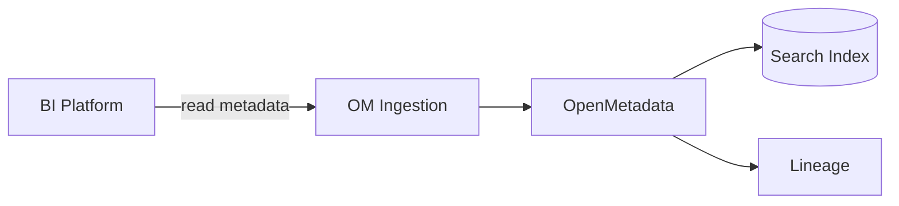

# BI & Analytics Connectors (v1.10.3)

Ingest dashboards, charts, datasets, owners, and lineage from your BI tools into OpenMetadata.

Related: [Connectors Overview](./connectors-overview.md) · [Data Lineage](../../07-advanced-topics/data-lineage.md)

Last updated: October 29, 2025

## Supported BI platforms

- Tableau, Power BI, Looker, Apache Superset, Metabase



## Permissions and auth

- Tableau: Personal Access Token (Server + Site)
- Power BI: Azure AD App (client id/secret), workspace read permissions
- Looker: API3 key/secret with read-only model
- Superset/Metabase: admin or read API token

Store secrets in your secret manager; inject as env vars.

## Examples

### Tableau

```yaml
source:
	type: tableau
	serviceName: tableau_prod
	serviceConnection:
		config:
			type: Tableau
			hostPort: https://tableau.example.com
			siteName: MySite
			tokenName: ${TABLEAU_TOKEN_NAME}
			tokenValue: ${TABLEAU_TOKEN_VALUE}
sink:
	type: metadata-rest
workflowConfig:
	openMetadataServerConfig:
		hostPort: https://metadata.example.com
```

### Power BI

```yaml
source:
	type: powerbi
	serviceName: pbi_prod
	serviceConnection:
		config:
			type: PowerBI
			tenantId: ${AZ_TENANT}
			clientId: ${AZ_CLIENT_ID}
			clientSecret: ${AZ_CLIENT_SECRET}
			authorityURL: https://login.microsoftonline.com
			scopes: ["https://analysis.windows.net/powerbi/api/.default"]
sink:
	type: metadata-rest
workflowConfig:
	openMetadataServerConfig:
		hostPort: https://metadata.example.com
```

### Looker

```yaml
source:
	type: looker
	serviceName: looker_prod
	serviceConnection:
		config:
			type: Looker
			hostPort: https://looker.example.com
			clientId: ${LOOKER_CLIENT_ID}
			clientSecret: ${LOOKER_CLIENT_SECRET}
			apiVersion: 4.0
sink:
	type: metadata-rest
workflowConfig:
	openMetadataServerConfig:
		hostPort: https://metadata.example.com
```

## What gets ingested

- Workspaces/projects, dashboards, charts/looks, datasets, owners
- Usage stats (where available)
- Lineage between BI datasets and warehouse tables (when mapped)

## Best practices

- Align service names across BI and DW connectors to resolve lineage
- Schedule ingestion hourly for active BI environments
- Apply ownership and domain tags to BI datasets for governance

## Validation

- Compare dashboard counts vs. BI admin UI
- Check dataset-table lineage appears in the Lineage tab
- Confirm owners and tags are visible in search facets

## Troubleshooting

- 401/403: token scopes/permissions incorrect
- Missing dashboards: filter/scope too narrow; expand project/workspace list
- Lineage gaps: ensure consistent naming and dw connector is present

---

Next: Build lineage end-to-end with [Database Connectors](./database-connectors.md) and [Pipeline Connectors](./pipeline-connectors.md).
