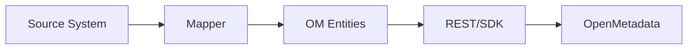

# Custom Connector Development (v1.10.3)

Build a connector to ingest metadata from a system not yet supported natively.

Related: [APIs & Integration](../../03-technical-deep-dive/apis-integration.md) · [Pipeline Connectors](./pipeline-connectors.md)

Last updated: October 29, 2025

## Design goals



- Minimal, testable code
- Idempotent: reruns don’t duplicate entities
- Fault-tolerant with retries/backoff

## Entities to map

- Services (create once)
- Datasets/tables/dashboards/pipelines
- Owners, tags, glossary terms
- Lineage edges

## Quickstart (Python ingestion framework)

1) Scaffold a source plugin

```bash
pip install openmetadata-ingestion
openmetadata-ingestion scaffold source mysource
```

2) Implement the Source class

```python
from metadata.ingestion.api.source import Source
from metadata.ingestion.api.models import Either, WorkflowContext

class MySource(Source):
		def __init__(self, config, metadata):
				super().__init__()
				self.config = config
				self.metadata = metadata

		def prepare(self):
				# connect to APIs
				...

		def next_record(self) -> Either:
				# yield CreateTableRequest / CreateDashboardRequest / ...
				for obj in self._list_objects():
						yield self._to_request(obj)
```

3) Emit lineage

```python
from metadata.generated.schema.api.lineage.addLineage import AddLineageRequest

edge = AddLineageRequest(edge={
	"fromEntity": {"type": "table", "fullyQualifiedName": "src.db.schema.table"},
	"toEntity":   {"type": "table", "fullyQualifiedName": "tgt.db.schema.table"}
})
self.metadata.add_lineage(edge)
```

4) Run via YAML workflow

```yaml
source:
	type: mysource
	serviceName: my_service
	serviceConnection:
		config:
			type: MySource
			apiKey: ${MYSOURCE_KEY}
sink:
	type: metadata-rest
workflowConfig:
	openMetadataServerConfig:
		hostPort: https://metadata.example.com
```

## REST-first alternative

- For simple systems, call OM REST APIs directly to create services/entities and lineage
- Use upsert patterns and retrieve-by-FQN to avoid duplicates

## Testing & validation

- Unit-test mappers with fixture payloads
- Dry-run workflows and compare entity counts
- Validate lineage visually in the UI

## Operational concerns

- Secrets via env or secret manager
- Rate limits: throttle and cache
- Observability: metrics/logs for success/fail counts

## Troubleshooting

- 409 conflicts: fetch latest entity version then retry PATCH
- Duplicates: ensure consistent FQNs and use get-or-create
- Timeouts: backoff and smaller batch sizes

---

Next: See [APIs & Integration](../../03-technical-deep-dive/apis-integration.md) for entity schemas and examples.
