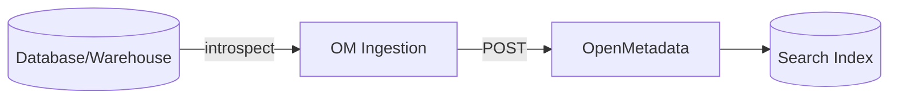

# Database Connectors (v1.10.3)

Use database connectors to ingest metadata, lineage, and profiles from relational and cloud data warehouses into OpenMetadata.

Related: [Connectors Overview](./connectors-overview.md) · [APIs & Integration](../../03-technical-deep-dive/apis-integration.md) · [Troubleshooting](../../10-reference/troubleshooting.md)

Last updated: October 29, 2025

## Supported systems

- Relational: MySQL, PostgreSQL, SQL Server, Oracle
- Cloud DW: Snowflake, BigQuery, Redshift, Databricks SQL
- Others: ClickHouse, MariaDB

> Note: Availability depends on your OM version and images. Ensure the ingestion container includes the desired connector extras (e.g., snowflake, bigquery).

## Prerequisites

- Network: OM ingestion workers can reach database endpoints (VPC peering, private link, or VPN)
- Credentials: service user with read-only access to information schema and metadata tables
- SSL/TLS: enable when accessing over public networks; validate certs
- For cloud DW: configure IAM roles/keys (e.g., Snowflake key pair, GCP service account, AWS IAM)

## Permissions (minimum)

- List databases/schemas/tables/views
- Read column metadata (types, comments)
- Optionally execute lightweight profiling queries (COUNT(*), min/max/avg)

Snowflake example:
- USAGE on database/schema
- SELECT on INFORMATION_SCHEMA tables

## Connection configuration

Common parameters:
- host, port
- username/password or OAuth/key pair
- database, warehouse, role (platform-specific)
- SSL mode (prefer verify-full where possible)

### Example: Snowflake

```yaml
source:
	type: snowflake
	serviceName: snowflake_prod
	serviceConnection:
		config:
			type: Snowflake
			account: abc-xy123
			warehouse: COMPUTE_WH
			database: PROD
			role: METADATA_READER
			username: OM_INGEST
			privateKeyPath: /secrets/snowflake_key.p8
sink:
	type: metadata-rest
workflowConfig:
	openMetadataServerConfig:
		hostPort: https://metadata.example.com
```

### Example: BigQuery

```yaml
source:
	type: bigquery
	serviceName: bigquery_prod
	serviceConnection:
		config:
			type: BigQuery
			projectId: my-project
			credentials: ${GCP_CREDENTIALS_JSON}
sink:
	type: metadata-rest
workflowConfig:
	openMetadataServerConfig:
		hostPort: https://metadata.example.com
```

### Example: PostgreSQL

```yaml
source:
	type: postgres
	serviceName: pg_analytics
	serviceConnection:
		config:
			type: Postgres
			hostPort: pg.prod.internal:5432
			username: om_reader
			password: ${PG_PASS}
			database: analytics
			sslMode: require
sink:
	type: metadata-rest
workflowConfig:
	openMetadataServerConfig:
		hostPort: https://metadata.example.com
```

## What gets ingested

- Databases, schemas, tables, views
- Columns (name, type, description), constraints
- Owners, tags, glossaries (via OM mappings)
- Lineage (via query logs/ETL or Snowflake access history when supported)
- Data profiling (optional): row counts, nulls, distincts, statistics



## Scheduling and performance

- Full crawl: nightly or weekly for large warehouses
- Incremental: enable usage/query log based lineage where available
- Concurrency: adjust ingestion workers based on DB limits
- Backoff/retries: tune to avoid throttling

## Private connectivity

- Use VPC peering/PrivateLink (AWS), Private Service Connect (GCP), Private Endpoints (Azure)
- Avoid egress to public internet for production metadata flows
- Restrict allowed IPs and enforce TLS

## Validations

- Test connection in UI or run workflow dry-run
- Check entity counts vs. expected
- Confirm owners, tags, and descriptions appear in UI

## Troubleshooting

- Auth failures: check keys/roles and clock skew
- Empty results: user lacks INFORMATION_SCHEMA access or filters too strict
- Timeouts: reduce parallelism, increase statement timeout
- SSL errors: import correct CA bundle and set appropriate sslMode

## Next steps

- Configure [Pipeline Connectors](./pipeline-connectors.md) for lineage
- Add [Data Quality Tests](../../06-user-guides/data-quality.md)
- Map business context with [Glossary/Tags](../../10-reference/glossary.md)
