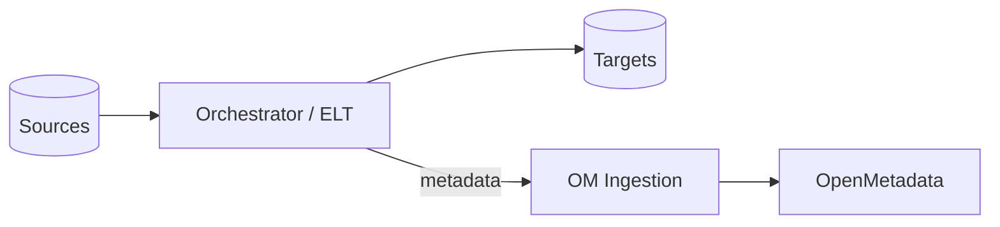

# Pipeline & ETL Connectors (v1.10.3)

Ingest pipeline metadata (DAGs, tasks, jobs, runs, owners, lineage) from orchestration and ELT tools into OpenMetadata.

Related: [Connectors Overview](./connectors-overview.md) · [APIs & Integration](../../03-technical-deep-dive/apis-integration.md) · [Troubleshooting](../../10-reference/troubleshooting.md)

Last updated: October 29, 2025

## Supported systems

- Orchestrators: Apache Airflow, Azure Data Factory (ADF), AWS Step Functions/Glue, GCP Cloud Composer (Airflow)
- ELT/Transformation: dbt, Fivetran, Matillion, Databricks Workflows

> Tip: For custom tools, use the Metadata REST APIs or build a simple connector that maps jobs and lineage to OM entities.

## What gets ingested

- Pipelines/DAGs, tasks/nodes, schedules
- Job runs with status and duration
- Owners, tags
- Lineage edges between sources and targets



## Airflow example

Use the Airflow connector to read DAGs and task metadata via Airflow REST API or DB.

```yaml
source:
	type: airflow
	serviceName: airflow_prod
	serviceConnection:
		config:
			type: Airflow
			hostPort: https://airflow.example.com
			username: om_reader
			password: ${AIRFLOW_PASS}
sink:
	type: metadata-rest
workflowConfig:
	openMetadataServerConfig:
		hostPort: https://metadata.example.com
```

Best practices:
- Ensure Airflow RBAC user can list DAGs and read task details
- If using Cloud Composer, prefer OAuth and private connectivity

## dbt example

Import dbt manifests for models, sources, tests, and exposures.

```yaml
source:
	type: dbt
	serviceName: dbt_prod
	sourceConfig:
		config:
			dbtFiles:
				- s3://analytics-dbt/artifacts/manifest.json
				- s3://analytics-dbt/artifacts/catalog.json
sink:
	type: metadata-rest
workflowConfig:
	openMetadataServerConfig:
		hostPort: https://metadata.example.com
```

Tips:
- Regenerate manifest.json on each dbt run
- Expose model → table lineage by aligning service names with your DW connector

## Fivetran example

```yaml
source:
	type: fivetran
	serviceName: fivetran_prod
	serviceConnection:
		config:
			type: Fivetran
			apiKey: ${FIVETRAN_KEY}
			apiSecret: ${FIVETRAN_SECRET}
sink:
	type: metadata-rest
workflowConfig:
	openMetadataServerConfig:
		hostPort: https://metadata.example.com
```

## Databricks Workflows example

```yaml
source:
	type: databricksPipeline
	serviceName: dbrx_wf
	serviceConnection:
		config:
			type: DatabricksPipeline
			hostPort: https://dbc-xyz.cloud.databricks.com
			personalAccessToken: ${DBRX_PAT}
sink:
	type: metadata-rest
workflowConfig:
	openMetadataServerConfig:
		hostPort: https://metadata.example.com
```

## Scheduling and freshness

- Ingest pipeline metadata at least hourly for active environments
- Align ingestion cadence with monitoring SLAs to detect failed jobs quickly

## Validations

- Check pipeline counts match the orchestrator
- Validate lineage edges appear between upstream sources and downstream tables
- Confirm run status and durations populate in UI

## Troubleshooting

- 401/403: ensure token scopes and RBAC permissions
- Missing lineage: misaligned service names between pipeline and database connectors
- Rate limiting: backoff intervals and fewer parallel API calls

## Next steps

- Add [Database Connectors](./database-connectors.md) for source/target systems
- Document [Data Lineage](../../07-advanced-topics/data-lineage.md) patterns
- Set alerts for failed pipelines in [Monitoring & Maintenance](../../04-deployment-operations/monitoring-maintenance.md)

**Contribute**: Help us improve this documentation! Visit [GitHub](https://github.com/Monsau/omd-documentation)
