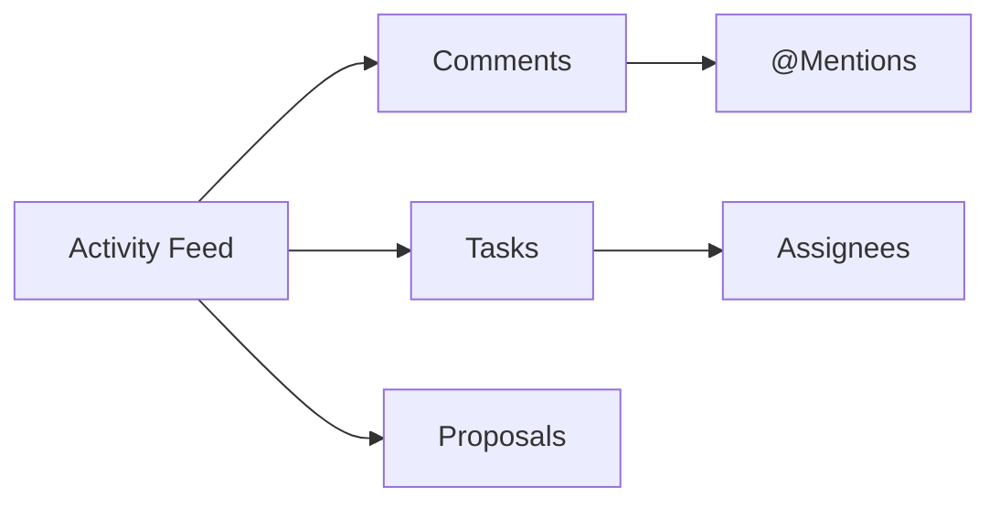
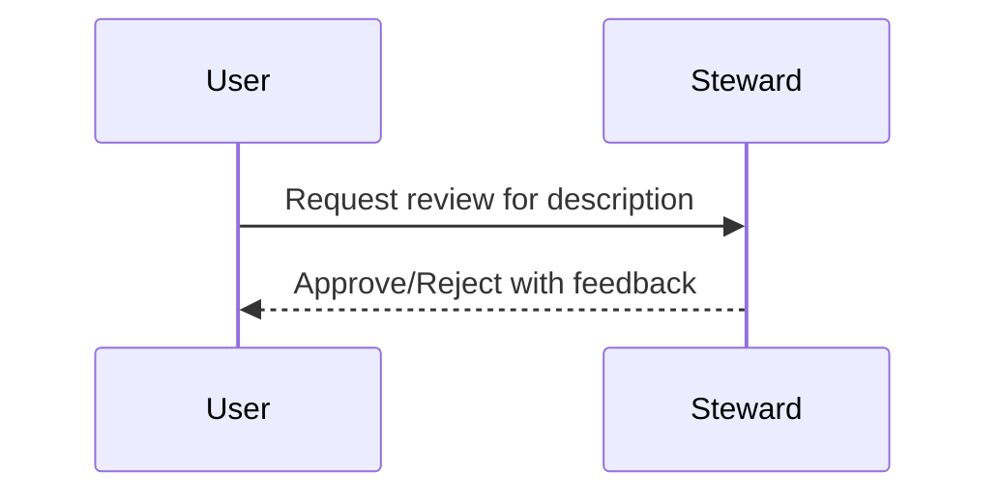

# Collaboration Guide (v1.10.3)

Use OpenMetadata to collaborate on data assets: comments, mentions, tasks, change proposals, and notifications.

Related: [Data Governance](./data-governance.md) · [Troubleshooting](../../10-reference/troubleshooting.md)

Last updated: October 29, 2025

## Collaboration model

Elements:
- Activity Feed: timeline of changes, comments, and events
- Comments & Mentions: discuss directly on entities, ping teammates
- Tasks: review/approve descriptions, owners, terms
- Change Proposals: suggest edits that require review

## Comment & mention

1) Open an entity → Activity tab
2) Add a comment; use @team or @user to notify
3) Threads keep context and are searchable

## Tasks & approvals

Create a task:
1) Click "Request Review" on an entity field (e.g., description)
2) Assign to a steward/owner; set due date
3) Approve/Reject with notes; audit trail recorded

## Change proposals

- Propose edits to descriptions, owners, tags, terms
- Reviewers compare diff and merge or decline

## Notifications

- Email/Slack integration for mentions, task updates, and failures
- Follow/Unfollow entities to control your noise

## Best practices

- Keep conversations on the entity to preserve context
- Use domains/owners to route work to the right people
- Define SLAs for reviews (e.g., 2 business days)

## Troubleshooting

- No notifications: check email/Slack config and follow status
- Tasks stuck: reassign or escalate to domain owner
- Missing history: ensure required fields are edited via UI/API to record feed events

---

Next: Govern contributions with [Data Governance](./data-governance.md) and ensure reliability with [Monitoring & Maintenance](../../04-deployment-operations/monitoring-maintenance.md).
