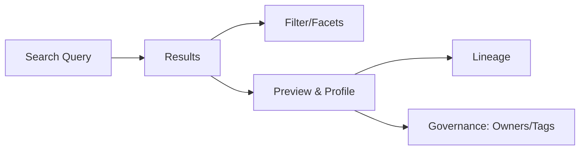
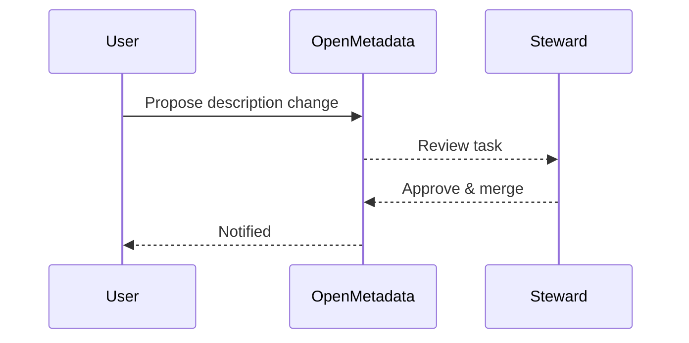

# Data Discovery Guide (v1.10.3)

Find, evaluate, and adopt trusted data with OpenMetadata search, filters, lineage, and governance context.

Related: [Getting Started](./getting-started.md) · [Data Governance](./data-governance.md)

Last updated: October 29, 2025

## Discovery flow

Steps:
1) Search by name, description, column, tag, or glossary term
2) Use facets: Service, Domain, Owner, Tag, Tier, Data Type
3) Open an entity → review description, owners, usage, profile stats
4) Check lineage and downstream consumers
5) Decide adoption: follow dataset and add to your workspace

## Search tips

- Use quotes for exact phrases: "customer churn"
- Filter by Domain or Tag to narrow to governed datasets
- Sort by Relevance or Most Used

## Dataset profile and preview

- Row count, null %, distincts, min/max/mean
- Sample values (if enabled)
- Column-level descriptions and tags

## Governance cues

- Owners: primary/secondary, escalation path
- Tags & Glossary terms: definitions and policies
- Tier/Criticality: interpret SLOs and support levels

## Popularity and usage

- Recent readers and frequently joined datasets (where available)
- Dashboards consuming the dataset

## Requesting improvements

- Propose description/tag updates → steward review
- Request ownership assignment
- Ask for data quality tests on critical columns

## Troubleshooting

- No results: check spelling; broaden filters; ensure ingestion ran recently
- Stale profile: rerun profiling or contact steward
- Missing lineage: verify pipeline/BI connectors are configured

---

Next: Improve trust with [Data Quality](./data-quality.md) and align vocabulary with [Data Governance](./data-governance.md).
