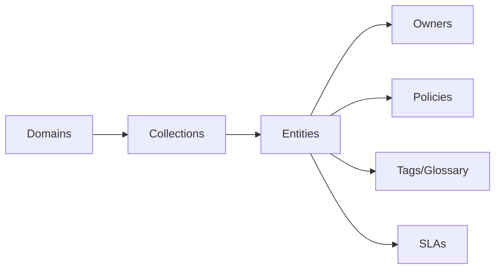
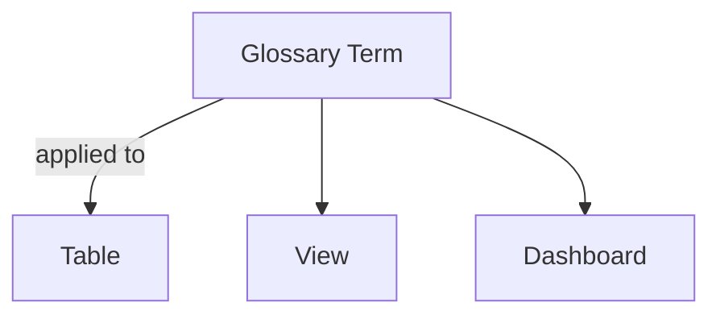
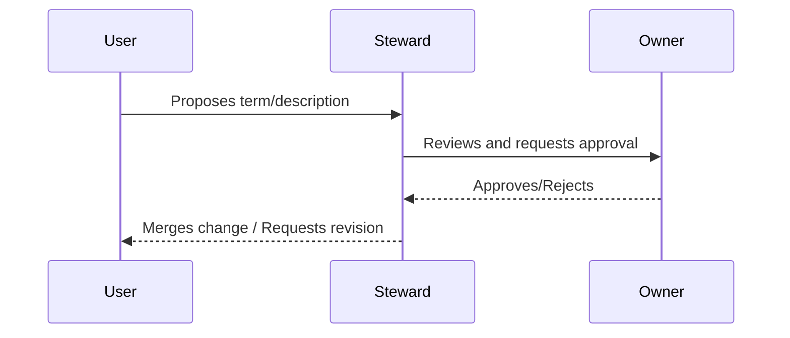

# Data Governance Guide (v1.10.3)

This guide shows how to use OpenMetadata to implement practical data governance: ownership, roles and responsibilities, policies, domains, glossary/tags, SLAs, and stewardship workflows.

Related: [Getting Started](./getting-started.md) · [Security & Compliance](../../03-technical-deep-dive/security-compliance.md) · [Glossary](../../10-reference/glossary.md)

Last updated: October 29, 2025

## Governance model

- Domains: logical boundaries (e.g., Finance, Marketing) to group data and assign accountability
- Collections: folders/groups to organize related assets
- Owners: teams or users (primary + secondary)
- Policies: rules for access, retention, quality
- Tags/Glossary: shared vocabulary and classification
- SLAs: expectations for freshness, quality, and response

## Ownership and responsibilities

Roles:
- Data Owner: accountable for a domain/collection; approves changes
- Data Steward: manages metadata quality and classifications
- Data Consumer: uses data subject to policies

Assign ownership:
1) Navigate to an entity (table/dashboard/topic)
2) Click Edit → Owners → select team/user
3) Save; ownership flows into search facets and lineage views

## Domains and collections

Create domains to reflect org structure. Within a domain, create collections for projects or functional groupings.

Best practices:
- Keep domain count manageable (< 20)
- Use naming conventions (domain-project-collection)
- Delegate ownership to domain stewards

## Glossary and tags

Use glossaries for business terms and tags for classification.

Steps:
1) Create a glossary → add terms (definition, owner, reviewers)
2) Define synonyms and related terms
3) Apply tags/terms to entities manually or automatically (via classification rules)

## Policies and access control

OpenMetadata supports role-based access control (RBAC) and policies.

- Map IdP groups to OM roles (e.g., Steward, Consumer)
- Create policies to restrict sensitive tags (e.g., PII) to specific roles
- Use attribute-based rules where supported

Example policy ideas:
- Only Stewards can edit descriptions on PII-tagged tables
- Data Owners can approve term additions in their domain

## Data quality and SLAs

Define SLAs for key datasets:
- Freshness: data updated by 8am UTC daily
- Completeness: null rate < 0.5%
- Distribution: values within expected ranges

Implement via tests:
1) Create tests (row count, null %, min/max) in OpenMetadata or via dbt/Great Expectations
2) Attach tests to entities and schedules
3) Configure alerts for failures (Slack/Email)

## Stewardship workflow

Common flows:
- Description updates → steward review
- Glossary term requests → owner approval
- Classification changes → security review for PII

## Reporting and audits

- Use search facets to list PII-tagged assets and verify ownership
- Export metadata for audit snapshots if required
- Track changes via activity feeds

## Getting value quickly

Week 1 checklist:
- Define 5–10 glossary terms
- Tag top 20 datasets
- Assign owners and stewards for 3 domains
- Add 2–3 quality tests per critical table

## Troubleshooting

- Missing owners: ensure users/teams are synced from SSO/SCIM or defined in OM
- Inconsistent tags: adopt a governance working group to standardize vocabulary
- Approval delays: automate notifications and define SLAs

---

Next: Implement [Data Quality](./data-quality.md) tests and set alerting in [Monitoring & Maintenance](../../04-deployment-operations/monitoring-maintenance.md).
