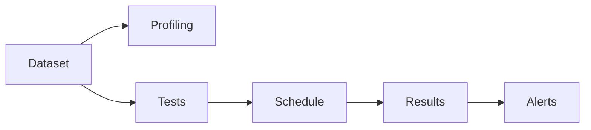
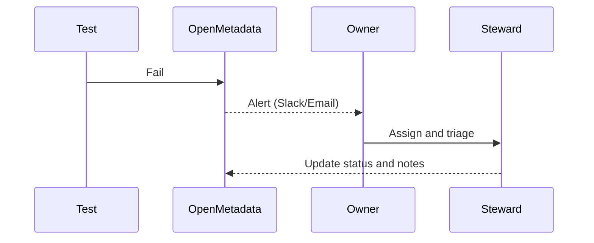

# Data Quality Guide (v1.10.3)

Use OpenMetadata to define, run, and monitor data quality tests across your datasets. This guide covers built-in tests, custom tests, scheduling, alerts, and integrations.

Related: [Data Governance](./data-governance.md) · [Troubleshooting](../../10-reference/troubleshooting.md)

Last updated: October 29, 2025

## Core concepts



- Profiling: compute statistics (row count, null %, min/max, distincts)
- Tests: assertions that must hold (nulls < 1%, values within ranges)
- Schedules: cron-based or event-based execution
- Results: pass/fail with evidence and timestamps
- Alerts: notifications to Slack/Email on failures

## Creating tests

From an entity page:
1) Click Tests → Add Test
2) Choose test type (null %, row count change, regex match, foreign key integrity)
3) Parameterize thresholds and severity
4) Save and schedule (e.g., hourly, daily)

Built-in tests include:
- Row count equals; Row count change within %
- Null % less than; Distinct % within range
- Min/Max within range; Mean within range
- Regex match for string columns
- Custom SQL query returns expected result

## Scheduling

Configure cadence:
- Critical datasets: hourly
- Standard datasets: daily
- Low-priority: weekly

Coordinate with pipeline schedules to validate post-load freshness.

## Alerts and waivers

- Alert channels: Slack, Email, Webhooks
- Deduplicate alerts within windows to avoid noise
- Waive a failing test temporarily with an expiration and reason

## Custom tests

Two approaches:
1) SQL-based: write a query that returns a count or boolean and assert on it
2) SDK-based: implement a Python test function in ingestion framework

SQL example (null % < 1):
```sql
SELECT (SUM(CASE WHEN col IS NULL THEN 1 ELSE 0 END)::decimal / COUNT(*)) < 0.01 AS ok
FROM schema.table;
```

YAML example:
```yaml
tests:
	- name: customer_email_not_null
		type: columnValuesToNotBeNull
		column: email
		severity: high
		schedule: "0 * * * *" # hourly
```

## Integrations

dbt: import test results alongside models
- Ensure dbt artifacts are ingested; OM will map tests where possible

Great Expectations (GE):
- Export GE results and map to OM tests
- Use expectations to seed OM test library

## Dashboards and reporting

- Build dashboards by severity, domain, and owner
- Track mean time to resolution (MTTR) for failed tests
- Report compliance against SLAs (e.g., failures/month <= threshold)

## Remediation workflows

For failures:
1) Notify owners and stewards
2) Create incident/ticket with context (lineage, upstream changes)
3) Roll back or hotfix pipeline if necessary
4) Document root cause and prevention



## Best practices

- Start with 2–3 tests per critical table
- Measure flakiness and tune thresholds
- Keep tests close to source systems to reduce drift
- Version control custom tests and review changes

## Troubleshooting

- Test never runs: schedule misconfigured or worker offline
- False positives: thresholds too tight; revise based on historical stats
- Missing results: check ingestion logs and retries

---

Next: Strengthen governance with [Data Governance](./data-governance.md) and set alerting in [Monitoring & Maintenance](../../04-deployment-operations/monitoring-maintenance.md).
