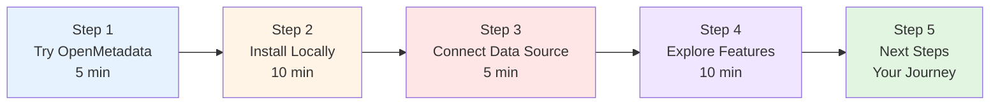
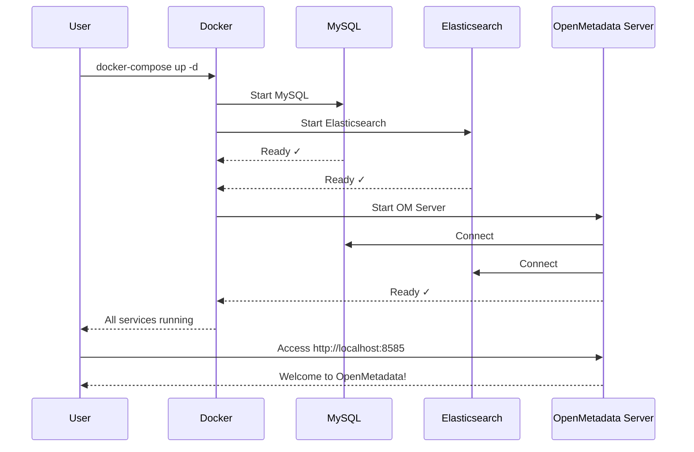

# Getting Started with OpenMetadata - Complete Guide

## Welcome to OpenMetadata! 🎉

This guide will take you from zero to productive in **30 minutes** or less.

---

## What You'll Learn



1. **Try OpenMetadata** (5 minutes) - Explore without installing
2. **Install Locally** (10 minutes) - Run on your machine
3. **Connect Your First Data Source** (5 minutes) - Add a database
4. **Explore Features** (10 minutes) - Discover, document, and collaborate
5. **Next Steps** - Continue your journey

---

## Step 1: Try OpenMetadata (No Installation)

### Option A: Use the Sandbox

Experience OpenMetadata with sample data immediately:

1. **Visit**: [https://sandbox.open-metadata.org](https://sandbox.open-metadata.org)
2. **Explore**:
   - Search for tables like "customer", "orders"
   - View data lineage
   - Check data quality results
   - Read conversations

**Perfect for**: Understanding capabilities before installing

---

### Option B: Watch a Quick Demo

**5-minute product tour**: [YouTube](https://www.youtube.com/c/OpenMetadataChannel)

**What you'll see**:
- Data discovery in action
- Lineage visualization
- Quality monitoring
- Governance features

---

## Step 2: Install OpenMetadata Locally

### Prerequisites

**Requirements**:
- **Docker**: Version 20.10+
- **Docker Compose**: Version v2.0+
- **RAM**: 16 GB minimum
- **Disk**: 20 GB free space
- **OS**: Linux, macOS, or Windows (with WSL2)

### Installation Steps

#### 1. Install Docker

**macOS**:
```bash
# Download Docker Desktop from https://www.docker.com/products/docker-desktop
# Install and start Docker Desktop
```

**Linux (Ubuntu/Debian)**:
```bash
# Install Docker
curl -fsSL https://get.docker.com -o get-docker.sh
sudo sh get-docker.sh

# Install Docker Compose
sudo curl -L "https://github.com/docker/compose/releases/latest/download/docker-compose-$(uname -s)-$(uname -m)" -o /usr/local/bin/docker-compose
sudo chmod +x /usr/local/bin/docker-compose

# Add your user to docker group
sudo usermod -aG docker $USER
newgrp docker

# Verify installation
docker --version
docker-compose --version
```

**Windows**:
```powershell
# Install Docker Desktop from https://www.docker.com/products/docker-desktop
# Make sure WSL2 is enabled
# Install and start Docker Desktop
```

#### 2. Download OpenMetadata

```bash
# Clone the repository
git clone https://github.com/open-metadata/OpenMetadata
cd OpenMetadata

# Checkout the latest stable release
git checkout 1.10.3-release

# Navigate to docker compose directory
cd docker/local-metadata
```

#### 3. Start OpenMetadata



```bash
# Start all services
docker-compose up -d

# Wait for services to be ready (2-3 minutes)
# You can watch the logs
docker-compose logs -f
```

**Services starting**:
- ✅ OpenMetadata Server
- ✅ MySQL Database
- ✅ Elasticsearch
- ✅ Ingestion Container (optional)

#### 4. Verify Installation

```bash
# Check running containers
docker-compose ps

# Should show 3-4 running containers
# openmetadata-server, mysql, elasticsearch, (ingestion)

# Test health endpoint
curl http://localhost:8585/healthcheck
# Should return: {"status":"healthy"}
```

#### 5. Access OpenMetadata

1. **Open browser**: http://localhost:8585
2. **Login credentials**:
   - **Username**: `admin`
   - **Password**: `admin`
3. **Change password**: Settings → Users → admin → Edit

**🎉 Congratulations! OpenMetadata is running!**

---

## Step 3: Connect Your First Data Source

Let's connect a database to start cataloging metadata.

### Option A: Use Sample Database (Easiest)

OpenMetadata includes sample data for testing:

1. **Navigate**: Settings → Databases → Add Database
2. **Select**: MySQL
3. **Service Name**: `mysql_sample`
4. **Connection Details**:
   - Host: `mysql`
   - Port: `3306`
   - Username: `openmetadata_user`
   - Password: `openmetadata_password`
   - Database: `openmetadata_db`
5. **Test Connection**: Click "Test Connection"
6. **Save**: Click "Save"

### Option B: Connect Your Database

#### PostgreSQL Example

1. **Navigate**: Settings → Databases → Add Database
2. **Select**: PostgreSQL
3. **Fill in details**:

```yaml
Service Name: postgres_prod
Host: your-postgres-host.example.com
Port: 5432
Username: readonly_user
Password: your_password
Database: your_database

# Optional: Advanced Config
SSL Mode: require
SSL CA Certificate: <paste certificate>
```

4. **Test Connection**: Verify it works
5. **Save Service**

#### Common Databases

**Snowflake**:
```yaml
Account: xy12345.us-east-1
Username: openmetadata_user
Password: your_password
Database: ANALYTICS
Warehouse: COMPUTE_WH
Role: OPENMETADATA_ROLE
```

**BigQuery**:
```yaml
Project ID: my-gcp-project
Credentials: <paste service account JSON>
Dataset: analytics
```

**MySQL**:
```yaml
Host: mysql.example.com
Port: 3306
Username: readonly_user
Password: your_password
Database: production
```

### Create Ingestion Pipeline

After adding the service, create an ingestion workflow:

1. **Click**: "Add Ingestion" button
2. **Configure**:
   - **Name**: `postgres_metadata_ingestion`
   - **Type**: Metadata
   - **Schema Filters**: 
     - Include: `public, analytics`
     - Exclude: `temp_*`
   - **Table Filters**:
     - Include: `.*`
     - Exclude: `test_*, tmp_*`
3. **Schedule**: 
   - Daily at 2:00 AM (or as needed)
   - Or click "Run Now" for immediate ingestion
4. **Save**

### Monitor Ingestion

1. **View Progress**: Settings → Applications → Ingestion
2. **Check Logs**: Click on pipeline → View Logs
3. **Wait**: First run takes a few minutes
4. **Verify**: Go to Data Assets → Tables

**🎉 Your data is now cataloged!**

---

## Step 4: Explore Features

### 4.1 Discover Data

#### Search for Tables

1. **Click search bar** or press `/`
2. **Type**: `customer`
3. **Filter by**:
   - Type: Tables
   - Service: postgres_prod
   - Tags: PII
4. **View results**: Click on any table

#### Explore Table Details

On a table page, you'll see:

- **Overview**: Description, owner, tags
- **Schema**: Columns with types and descriptions
- **Sample Data**: Preview of actual data
- **Profiler**: Statistics (count, nulls, unique values)
- **Lineage**: Upstream and downstream dependencies
- **Queries**: Top queries using this table
- **Activity**: Recent changes and updates

### 4.2 Add Documentation

Let's document a table:

1. **Find a table**: Search for `customers`
2. **Add Description**:
   - Click edit icon (✏️) next to description
   - Write: "Customer master table containing all active and inactive customers"
   - Click Save
3. **Document Columns**:
   - Click edit icon for column `customer_id`
   - Add: "Unique identifier for customer. Primary key."
   - Click Save
4. **Repeat** for important columns

### 4.3 Assign Ownership

Set who's responsible for data:

1. **On table page**: Click "Add Owner"
2. **Select owner**: Choose user or team
3. **Save**

**Benefits**:
- Clear accountability
- Easy to find experts
- Notifications to owners

### 4.4 Add Tags

Classify and organize data:

1. **On table page**: Click "Add Tag"
2. **Select tags**:
   - **Tier**: Gold (critical data)
   - **PII**: PersonalData.Email
   - **Domain**: Customer
3. **Save**

**Pre-built tag categories**:
- **Tier**: Gold, Silver, Bronze
- **PII**: Various sensitive data types
- **Domain**: Business areas

### 4.5 View Lineage

Understanding data flow:

1. **On table page**: Click "Lineage" tab
2. **Explore**:
   - **Upstream**: Where data comes from
   - **Downstream**: Where data goes to
   - **Multi-hop**: Follow entire chain
3. **Interactions**:
   - Click nodes to see details
   - Expand to see more levels
   - Follow specific columns

### 4.6 Set Up Data Quality

Create tests to monitor data quality:

1. **On table page**: Click "Profiler & Data Quality"
2. **Add Test**: Click "+ Add Test"
3. **Choose test type**:

**Example 1: Row Count Test**
```
Test: Table Row Count
Condition: Between
Min: 10000
Max: 1000000
```

**Example 2: Column Null Test**
```
Test: Column Values To Be Not Null
Column: email
```

**Example 3: Unique Values**
```
Test: Column Values To Be Unique
Column: customer_id
```

4. **Save and Run**: Click "Save & Run"
5. **View Results**: See pass/fail status

### 4.7 Create Business Glossary

Define business terms:

1. **Navigate**: Govern → Glossary
2. **Add Term**: Click "+ Add Term"
3. **Fill details**:
   - **Name**: Customer Lifetime Value (CLV)
   - **Description**: Total revenue expected from a customer over their entire relationship
   - **Synonyms**: LTV, Lifetime Value
   - **Related Terms**: Revenue, Customer Value
4. **Save**

**Link terms to assets**:
- Go to table/column
- Add glossary term
- Terms show in search results

### 4.8 Start a Conversation

Collaborate with team:

1. **On any asset page**: Scroll to "Activity Feeds & Tasks"
2. **Start conversation**: Click "+ Conversation"
3. **Write message**: 
   - "Is this table updated daily?"
   - @mention owner
4. **Post**

**Notification**: Owner receives notification

### 4.9 View Data Insights

Track metadata maturity:

1. **Navigate**: Insights
2. **View metrics**:
   - **Description Coverage**: % of assets documented
   - **Ownership Coverage**: % of assets with owners
   - **Tier Coverage**: % of assets classified
3. **Track progress** over time

---

## Step 5: Advanced Features (Optional)

### Enable Profiling

Schedule data profiling for statistics:

1. **Settings** → **Databases** → Select service
2. **Add Ingestion** → **Profiler**
3. **Configure**:
   - Include/exclude tables
   - Sampling method (row count or percentage)
   - Profile sample: 50% or 10000 rows
4. **Schedule**: Weekly
5. **Save and Run**

### Set Up Usage Ingestion

Track query patterns:

1. **Settings** → **Databases** → Select service
2. **Add Ingestion** → **Usage**
3. **Configure**: Duration (7, 30, or 90 days)
4. **Schedule**: Daily
5. **Save**

**Benefits**:
- See most-used tables
- Find unused assets
- Understand query patterns

### Configure Alerts

Get notified on important events:

1. **Settings** → **Notifications**
2. **Add Destination**: Slack, MS Teams, Email
3. **Configure webhook**: Add Slack webhook URL
4. **Create Alert**:
   - Trigger: Data Quality Test Failed
   - Severity: Critical
   - Destination: Slack #data-alerts
5. **Save**

### Implement Auto-Classification

Automatically detect PII:

1. **Settings** → **Applications**
2. **Find**: Auto Classification
3. **Configure**:
   - Enable: PII/Sensitive Data
   - Confidence threshold: 80%
   - Tag to apply: PII.Email, PII.SSN, etc.
4. **Schedule**: Weekly
5. **Run**

---

## Step 6: Integrate with Your Stack

### Connect to dbt

If you use dbt:

1. **Settings** → **Pipelines** → **Add Pipeline**
2. **Select**: dbt
3. **Choose method**:
   - **Cloud**: dbt Cloud API
   - **Local**: Path to dbt project
   - **S3/GCS**: Manifest.json location
4. **Configure and save**

**Benefits**:
- Sync dbt documentation
- Import dbt tests
- Show dbt lineage

### Connect to Airflow

Integrate with Airflow:

1. **Settings** → **Pipelines** → **Add Pipeline**
2. **Select**: Airflow
3. **Configure**:
   - Host: http://airflow.example.com:8080
   - Username: admin
   - Password: your_password
4. **Save and ingest**

**Benefits**:
- See DAG metadata
- Track pipeline health
- Understand data workflows

### Connect to Tableau

For BI tool integration:

1. **Settings** → **Dashboards** → **Add Dashboard**
2. **Select**: Tableau
3. **Configure**:
   - Server: https://tableau.example.com
   - API Version: 3.14
   - Username: openmetadata
   - Password: your_password
4. **Save and ingest**

**Benefits**:
- Catalog dashboards
- Track usage
- Show report lineage

---

## Best Practices for Success

### Week 1: Foundation
✅ Install and configure  
✅ Connect 2-3 high-value data sources  
✅ Document top 10 critical tables  
✅ Assign owners to key assets  
✅ Train core team (3-5 people)  

### Week 2: Expansion
✅ Add more data sources  
✅ Set up data quality tests  
✅ Create business glossary (20-30 terms)  
✅ Enable auto-classification  
✅ Integrate with Slack for notifications  

### Week 3: Governance
✅ Define tagging taxonomy  
✅ Implement classification policies  
✅ Set up lineage tracking  
✅ Enable usage tracking  
✅ Create governance policies  

### Week 4: Adoption
✅ Roll out to broader team  
✅ Conduct training sessions  
✅ Share success stories  
✅ Monitor adoption metrics  
✅ Gather feedback and iterate  

---

## Common Issues & Solutions

### Issue: Can't Access UI (localhost:8585)

**Solution**:
```bash
# Check if containers are running
docker-compose ps

# Check logs for errors
docker-compose logs openmetadata-server

# Restart containers
docker-compose restart

# If port 8585 is taken, change it in docker-compose.yml
```

### Issue: Database Connection Failed

**Solutions**:
- ✅ Verify credentials are correct
- ✅ Check hostname/IP is accessible
- ✅ Verify port is open (firewall/security group)
- ✅ For cloud databases, whitelist OpenMetadata IP
- ✅ Test connection outside OpenMetadata first

### Issue: Ingestion Failing

**Solutions**:
```bash
# Check ingestion logs
# In UI: Settings → Applications → Logs

# Verify service credentials
# Re-test connection

# Check filters (may be excluding everything)

# Increase timeout in advanced config
```

### Issue: Search Not Working

**Solutions**:
```bash
# Check Elasticsearch health
curl http://localhost:9200/_cluster/health

# Reindex data
# In UI: Settings → Applications → Reindex

# Or via API
curl -X PUT "http://localhost:8585/api/v1/search/reindex"
```

### Issue: Slow Performance

**Solutions**:
- Increase Docker resources (4+ CPU, 16+ GB RAM)
- Use SSD for Docker volumes
- Reduce profiling sample size
- Limit ingestion scope with filters
- Scale up deployment (Kubernetes)

---

## Getting Help

### Community Support (Free)

**Slack** (Recommended):
- Join: https://slack.open-metadata.org
- Channels: 
  - #general - General questions
  - #troubleshooting - Technical issues
  - #connectors - Connector help
  - #best-practices - Implementation advice

**GitHub**:
- Issues: Report bugs
- Discussions: Ask questions
- Docs: Contribute improvements

**Documentation**:
- Complete guides: https://docs.open-metadata.org
- Videos: YouTube channel
- Blog: Technical articles

### Professional Support (Paid)

**Collate** (SaaS Provider):
- Email: support@getcollate.io
- SLA-backed support
- Implementation services
- Training and consulting

---

## What's Next?

### Continue Learning

1. **Read Documentation**:
   - [Architecture Deep Dive](../03-technical-deep-dive/architecture-detailed.md)
   - [Data Quality Guide](./data-quality.md)
   - [Governance Guide](./data-governance.md)

2. **Watch Tutorials**:
   - YouTube channel
   - Community webinars
   - Office hours

3. **Join Community**:
   - Weekly community calls
   - Monthly meetups
   - Share your use case

### Expand Usage

1. **Add More Sources**:
   - All production databases
   - BI tools
   - Data pipelines
   - ML platforms

2. **Implement Governance**:
   - Data classification policies
   - Access controls
   - Compliance reporting

3. **Enable DataOps**:
   - Quality monitoring
   - Observability dashboards
   - Incident management

### Scale Deployment

When ready for production:

1. **Review**: [Production Requirements](../04-deployment-operations/infrastructure-requirements.md)
2. **Deploy**: [Kubernetes Guide](../04-deployment-operations/deployment-options.md)
3. **Secure**: [Security Guide](../03-technical-deep-dive/security-compliance.md)
4. **Monitor**: [Monitoring Guide](../04-deployment-operations/monitoring-maintenance.md)

---

## Success Checklist

After completing this guide, you should have:

✅ OpenMetadata installed and running  
✅ At least one data source connected  
✅ Metadata ingestion working  
✅ Basic understanding of discovery features  
✅ Tables documented with descriptions  
✅ Owners assigned to assets  
✅ Tags applied for classification  
✅ At least one data quality test created  
✅ Lineage visualization explored  
✅ Team members can log in and search  

---

## Feedback

How was this guide? Help us improve!

- **Good**: Star us on [GitHub](https://github.com/open-metadata/OpenMetadata)
- **Suggestions**: Open an issue or discussion
- **Questions**: Ask in Slack
- **Success Story**: Share in community!

---

## Summary

You've learned how to:

✅ **Try** OpenMetadata in sandbox  
✅ **Install** locally with Docker  
✅ **Connect** data sources  
✅ **Discover** and search assets  
✅ **Document** tables and columns  
✅ **Govern** with tags and ownership  
✅ **Monitor** with quality tests  
✅ **Collaborate** with conversations  
✅ **Track** lineage and usage  

**Welcome to the OpenMetadata community! 🚀**

---

**Document Version**: 1.0  
**Last Updated**: October 29, 2025  
**OpenMetadata Version**: 1.10.3

**Next Steps**: [Explore All Features](../02-product-overview/features.md)
