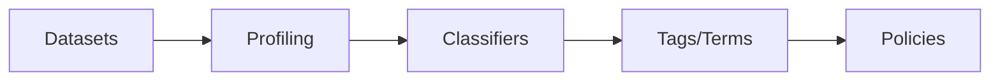
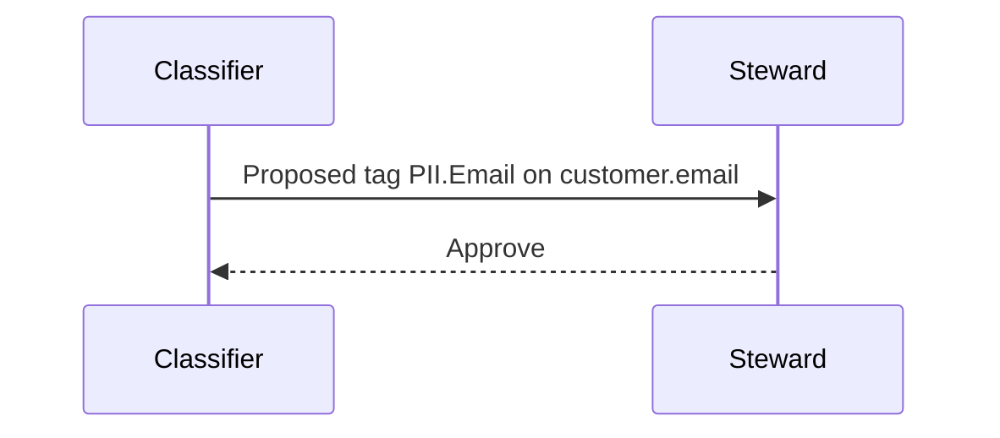

# Auto-Classification & PII Detection (v1.10.3)

Automatically classify sensitive data and apply tags/glossary terms to improve governance and access control.

Related: [Security & Compliance](../../03-technical-deep-dive/security-compliance.md) · [Data Governance](../../06-user-guides/data-governance.md)

Last updated: October 29, 2025

## Classification pipeline



Stages:
- Profiling computes sample stats
- Classifiers (rules/regex/ML) detect patterns (EMAIL, PHONE, SSN, IBAN, etc.)
- Tags/terms are applied to entities/columns
- Policies use tags for access control and approvals

## Methods

1) Rule-based/regex: fast, transparent, easy to maintain
2) Dictionary-based: matches against lists (e.g., country names)
3) ML-based: entity recognition (PII, secrets); needs evaluation and tuning

## Configuration

YAML excerpt for rule-based classifier:

```yaml
classifiers:
	- name: email_detector
		type: regex
		pattern: "^[A-Za-z0-9._%+-]+@[A-Za-z0-9.-]+\.[A-Za-z]{2,}$"
		applyTags: ["PII.Sensitive", "Contact.Email"]
	- name: phone_detector
		type: regex
		pattern: "^\+?[0-9][0-9\-\s]{7,}$"
		applyTags: ["PII.Sensitive", "Contact.Phone"]
```

Execution:
- Run as part of ingestion profiling or scheduled job
- Limit to sampled columns or opt-in datasets to reduce noise

## Review and approvals

Workflow:
1) New classification → pending review by steward
2) Steward approves/rejects and may edit tags
3) Activity feed logs the decision



## Policies and RBAC

- Create policies that restrict PII-tagged assets to specific roles
- Mask values in previews where supported
- Require approvals for tag removals on PII

## Quality & drift control

- Track precision/recall using sampling
- Use allow/deny lists to avoid false positives on technical columns
- Version rules and document changes

## Troubleshooting

- Too many false positives: tighten regex, add length/charset checks
- Missing detections: expand patterns or augment with ML
- Performance: restrict to top datasets and add timeouts

---

Next: Govern with [Policies](../../06-user-guides/data-governance.md) and audit in [Security & Compliance](../../03-technical-deep-dive/security-compliance.md).
