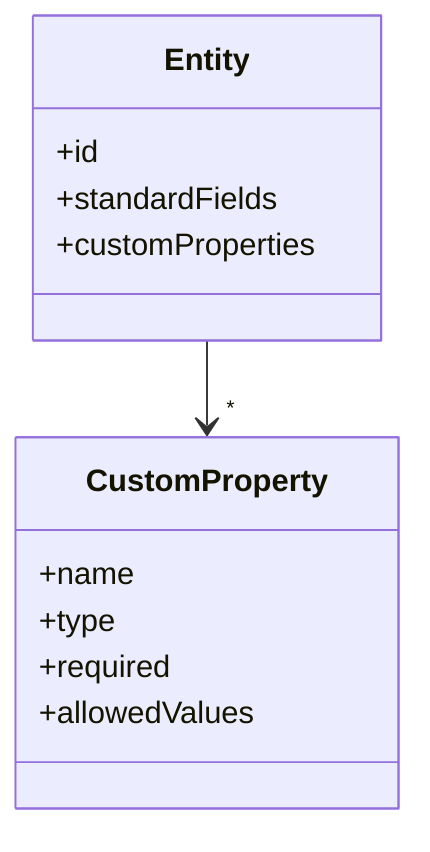

# Custom Properties & Extensions (v1.10.3)

Add organization-specific attributes to OpenMetadata entities in a governed, versioned way.

Related: [APIs & Integration](../../03-technical-deep-dive/apis-integration.md) · [Data Governance](../../06-user-guides/data-governance.md)

Last updated: October 29, 2025

## Model



Types: string, number, boolean, enum, url, userRef, teamRef, json.

Governance:
- Define property templates per entity type (Table, Dashboard, Pipeline, …)
- Specify required, default, and allowed values
- Assign ownership for who can edit

## Defining properties

YAML example:

```yaml
customProperties:
	- entityType: Table
		properties:
			- name: dataDomain
				type: enum
				allowedValues: [Finance, Sales, Marketing]
				required: true
			- name: retentionDays
				type: number
				required: false
			- name: ownerSlack
				type: url
```

## Applying properties

UI:
1) Open an entity → Custom Properties tab
2) Fill values respecting allowed types
3) Save; changes appear in activity feed and API

API (excerpt):

```http
PATCH /api/v1/tables/{id}
Content-Type: application/json-patch+json

[{"op":"add","path":"/customProperties/dataDomain","value":"Finance"}]
```

## Validation & lifecycle

- Values validated at API layer against templates
- Changes versioned; history visible in activity feed
- Deprecate properties by marking hidden or removing from template with migration plan

## Migration strategy

1) Create property template with default value
2) Backfill values via script/API for existing entities
3) Enforce required after adoption

## Best practices

- Keep property count lean; prioritize reporting needs
- Use enums for reporting consistency
- Document meaning and ownership for each property

## Troubleshooting

- Invalid value: not in allowed enum → adjust list or value
- Missing in UI: user lacks permission or template not attached to entity type
- API 409: concurrent update; retry with latest version

---

Next: Use properties in search facets and policies; see [Data Governance](../../06-user-guides/data-governance.md).
