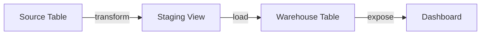

# Data Lineage (v1.10.3)

OpenMetadata builds end-to-end lineage across sources, pipelines, and targets. This guide covers lineage types, capture methods, editing, APIs, and troubleshooting.

Related: [Pipeline Connectors](../../05-connectors-integrations/pipeline-connectors.md) · [Database Connectors](../../05-connectors-integrations/database-connectors.md)

Last updated: October 29, 2025

## Concepts



- Table-level lineage: edges between datasets (tables, views, topics)
- Column-level lineage: fine-grained mapping between columns
- Pipeline lineage: edges linking jobs/tasks to datasets

## How lineage is captured

1) Query log parsing (warehouse audit logs) → derive edges from SQL
2) ETL/ELT manifests (dbt, Fivetran) → read declared dependencies
3) Orchestrator metadata (Airflow, Databricks) → connect tasks to inputs/outputs
4) Manual edits via UI or API

> For cloud DW like Snowflake/BigQuery, enable access history/audit logs to improve coverage.

## Viewing lineage

- Navigate to an entity → Lineage tab
- Zoom and traverse upstream/downstream
- Filter by edge types, services, or domains

## Editing lineage

Manual addition:
1) On Lineage tab → Add Node or Add Edge
2) Choose source and target entities
3) Optionally add pipeline context and description

Column-level example:
1) Select columns on both sides
2) Map transformations (e.g., concat, sum)

## API usage

Create lineage via REST:

```http
POST /api/v1/lineage/add
Content-Type: application/json

{
	"edge": {
		"fromEntity": {"id": "<uuid-from>", "type": "table"},
		"toEntity":   {"id": "<uuid-to>",   "type": "table"},
		"description": "Loaded nightly via Airflow DAG sales_load"
	}
}
```

SDKs: see [APIs & Integration](../../03-technical-deep-dive/apis-integration.md).

## dbt lineage

- Ensure dbt manifests are ingested
- Align service names with your warehouse connector for edge resolution
- Column-level lineage possible when dbt provides column dependencies

## Airflow lineage

- Enable lineage backend or annotate tasks with inputs/outputs
- Ingest Airflow metadata; OM links tasks to source/target datasets

## Validations

- Check edge counts around critical tables
- Confirm upstream changes ripple to downstream dashboards
- Validate ownership and domains are visible in lineage view

## Troubleshooting

- Missing edges: logs/manifests not ingested or service names mismatched
- Duplicated edges: multiple sources of lineage; enable de-duplication rules
- Column lineage gaps: SQL parsing limitations; add manual edges or dbt metadata

---

Next: Monitor pipelines in [Pipeline Connectors](../../05-connectors-integrations/pipeline-connectors.md) and alert on failures in [Monitoring & Maintenance](../../04-deployment-operations/monitoring-maintenance.md).
