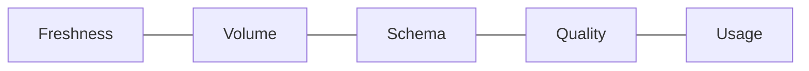
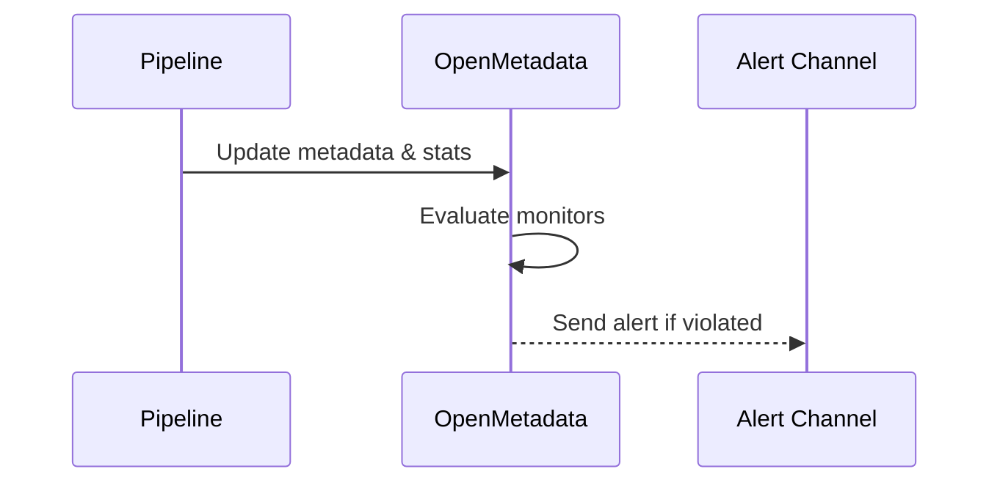

# Data Observability (v1.10.3)

Data observability in OpenMetadata focuses on freshness, volume, schema, quality, and usage signals to detect anomalies and improve trust.

Related: [Monitoring & Maintenance](../../04-deployment-operations/monitoring-maintenance.md) · [Data Quality](../../06-user-guides/data-quality.md)

Last updated: October 29, 2025

## Pillars and signals

- Freshness: time since last successful load
- Volume: row counts, partitions, file sizes
- Schema: column adds/drops/type changes
- Quality: test pass/fail, null % trends
- Usage: query frequency, owners, popularity

## How OM collects signals

- Ingestion profiling (row counts, null %, distincts)
- Pipeline metadata (run times, success rates)
- Warehouse logs (optional)
- Tests (dbt/GE/OM-native)

## Building monitors

Examples:
- Freshness < 24h on critical tables
- Row count change within ±10%
- Null % < 0.5% on key columns
- Schema changes require steward approval

## Dashboards

- Create Grafana dashboards: pass rates by domain, freshness heatmaps, incident trends
- Use OM UI for asset-level history and activity feeds

## Tuning

- Start conservative to reduce noise
- Use rolling windows and seasonal baselines where possible
- Tag noisy assets and relax thresholds with rationale

## Incident workflow

1) Alert triggers → ticket created with lineage context
2) Steward triages root cause upstream vs downstream
3) Fix deployed; backfill if needed
4) Post-incident review and monitor adjustment

## Troubleshooting

- Missing signals: ensure profiling enabled and recent ingestion runs exist
- Too many alerts: widen thresholds and deduplicate within time windows
- Stale freshness: pipeline failed or schedule paused; check orchestrator

---

Next: Define tests in [Data Quality](../../06-user-guides/data-quality.md) and integrate alert channels in [Monitoring & Maintenance](../../04-deployment-operations/monitoring-maintenance.md).
