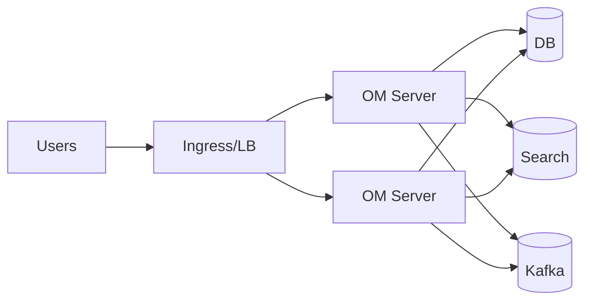

# Performance Optimization (v1.10.3)

Tune OpenMetadata for scale: server, database, search, Kafka, and ingestion.

Related: [Infrastructure Requirements](../../04-deployment-operations/infrastructure-requirements.md) · [Monitoring & Maintenance](../../04-deployment-operations/monitoring-maintenance.md)

Last updated: October 29, 2025

## Architecture levers

## Server (JVM)

- Memory: -Xms512m -Xmx4g (increase with concurrency)
- GC: G1GC usually best; monitor pause times
- Thread pools: tune HTTP and worker pools for expected RPS
- Caching: enable where available for lookups

## Database

- Use managed DB (RDS/Cloud SQL/Aurora) with provisioned IOPS
- Connection pool: maxPoolSize 30–100; monitor saturation
- Indexes: ensure commonly filtered fields are indexed
- Vacuum/analyze (Postgres) on schedule

## Search (OpenSearch/Elasticsearch)

- Shards: size 20–50GB per shard; replicas 1 for HA
- Heap: 50% of memory up to ~30GB; monitor GC and old gen
- Refresh interval: increase for bulk ingestion
- ILM: rollover and retention for large indices

## Kafka (events)

- Partitions: increase for throughput; ISR>=2 for resilience
- Retention: set per topic; avoid excessive retention
- Compression: lz4 or snappy for network efficiency

## Ingestion

- Concurrency: set workers based on source rate limits
- Backoff/retries: exponential with caps
- Batch sizes: tune to balance latency vs throughput
- Avoid full crawls daily; prefer incremental where possible

## UI/search performance

- Use indexPrefix per env to keep indices smaller
- Denormalize frequently queried fields into search docs when supported
- Enable pagination and lazy loading in heavy views

## Capacity and autoscaling

- HPA: target 60–70% CPU; min 3 replicas
- PDB: maxUnavailable 1
- Node sizing: avoid noisy neighbors for DB/Search nodes

## Benchmarks & SLOs

- Target p95 read latency < 500ms, write < 1s under typical load
- Ingestion pipelines complete within SLA windows (e.g., 1–6h)

## Troubleshooting performance

- High DB CPU: add read replicas, optimize queries, add indexes
- Slow search: increase shards/heap, tune refresh interval
- GC pauses: reduce heap or tune G1 regions; profile allocations
- Ingestion throttling: lower concurrency, honor API limits

---

Next: Continuously monitor with [Monitoring & Maintenance](../../04-deployment-operations/monitoring-maintenance.md) and revisit sizing in [Infrastructure Requirements](../../04-deployment-operations/infrastructure-requirements.md).
