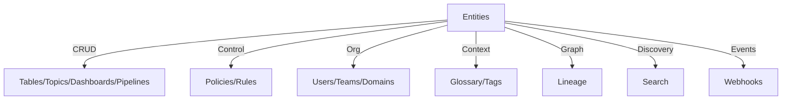

# OpenMetadata API Reference (v1.10.3)

This reference summarizes common REST endpoints and request patterns used by clients and plugins. It complements the official OpenAPI docs exposed by the service.

Base URL examples:
- Local: https://localhost:8585/api
- K8s: https://omd.yourdomain.com/api

Auth:
- Bearer tokens (JWT or personal access tokens)
- Service accounts for ingestion and automation

General request headers:
```
Authorization: Bearer <token>
Content-Type: application/json
Accept: application/json
```

## Entities API
Common entity types: Tables, Topics, Dashboards, Pipelines, GlossaryTerms, Tags, Users, Teams.

- Get by FQN
```
GET /v1/tables/name/{fqn}?fields=owner,tags,followers,usageSummary
```

- Search entities
```
GET /v1/search/query?q=pii AND service:bigquery&from=0&size=10&index=table_search_index
```

- Create or update (JSON Patch preferred for updates)
```
POST /v1/tables
PATCH /v1/tables/{id}
Content-Type: application/json-patch+json
[
	{"op":"replace","path":"/owner","value":{"id":"<uuid>","type":"user"}}
]
```

- Soft delete and restore
```
DELETE /v1/tables/{id}?hardDelete=false
PUT    /v1/tables/{id}/restore
```

Query params:
- fields: comma-separated list of expandable fields (owner,tags,followers,usageSummary,tableProfile,joins)
- include: all | non-deleted | deleted
- limit/offset: pagination

## Lineage API
- Get lineage graph for an entity
```
GET /v1/lineage/{entityType}/{id}?upstreamDepth=2&downstreamDepth=2
```

- Add lineage edge
```
PUT /v1/lineage
{
	"edge": {
		"fromEntity": {"id": "<uuid>", "type": "table"},
		"toEntity": {"id": "<uuid>", "type": "dashboard"},
		"lineageDetails": {"pipeline": {"id": "<uuid>", "type": "pipeline"}}
	}
}
```

## Tags, Glossary, and Classification
- Create a user-defined tag
```
POST /v1/tags
{"name":"confidential","description":"Internal only"}
```

- Apply tags to an entity
```
PUT /v1/tables/{id}/tags
{"tags":[{"tagFQN":"Confidential"}]}
```

## Policies and Access Control
- List policies
```
GET /v1/policies?limit=50&fields=rules
```

- Evaluate a policy (admin only)
```
POST /v1/policies/evaluate
{"resource":"table","operation":"EditTags","userId":"<uuid>","resourceId":"<uuid>"}
```

## Search API
Use the `search/query` endpoint with Lucene syntax (AND/OR, field:term).

Common indices: table_search_index, topic_search_index, dashboard_search_index, pipeline_search_index.

Facets and aggregations can be retrieved via `POST /v1/search/aggregate` with a request body describing aggregations.

## Pagination and filtering
- Use `limit` and `offset` or `from`/`size` for search
- `include` controls soft-deleted visibility
- Use `service`, `tier`, `tags`, `domain`, `owner` filters where applicable

## Errors
- 400: validation errors (missing fields, bad JSON Patch path)
- 401/403: auth/authz issues
- 404: resource not found
- 409: conflict (duplicate FQN or version)
- 429: rate limited

Error schema contains `code`, `message`, and optionally `failures` per field.

## Versioning and history
- Entities maintain version history. Use:
```
GET /v1/tables/{id}/versions
GET /v1/tables/{id}/versions/{version}
```

## Webhooks and Events
- Register webhooks to receive change events
```
POST /v1/webhook
{
	"name":"incident-webhook",
	"endpoint":"https://hooks.example.com/omd",
	"eventFilters":["entityCreated","entityUpdated","entitySoftDeleted"],
	"batchSize":50,
	"enabled":true
}
```

## Rate limits and best practices
- Reuse HTTP connections and paginate
- Prefer JSON Patch for partial updates
- Fetch only required fields using `fields` to minimize payload size
- Backoff and retry on 429/5xx with jitter

## API surface overview


See also:
- [APIs & Integration](../03-technical-deep-dive/apis-integration.md)
- [SDK Reference](../08-sdk-reference/README.md)
- [Developer Guide](./developer-guide.md)
