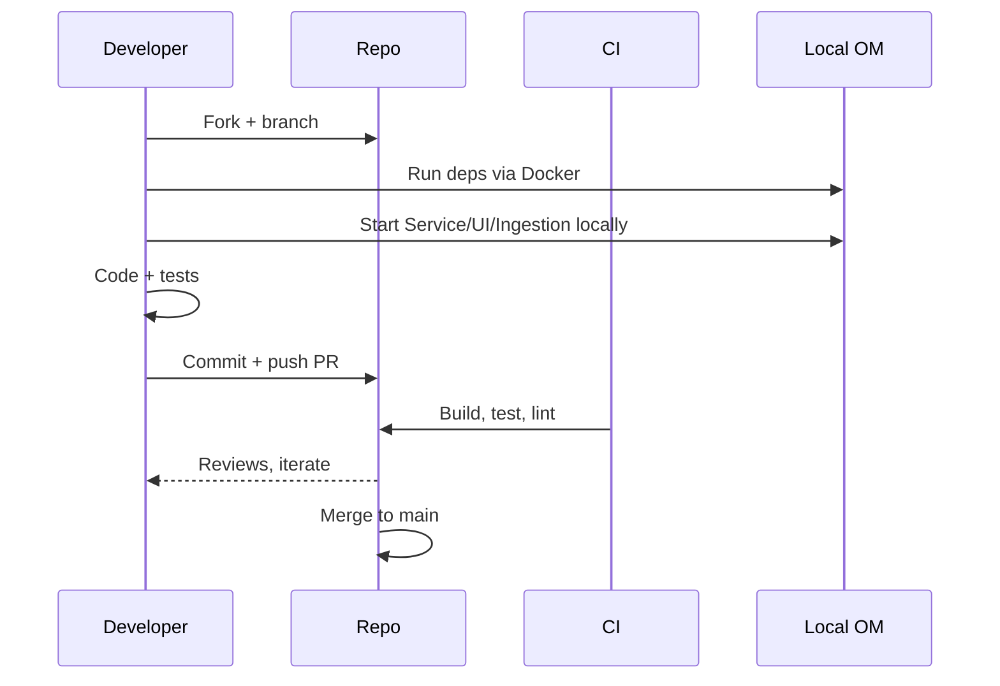

# OpenMetadata Developer Guide

This guide helps engineers set up a local development environment, understand the architecture, make changes safely, and contribute upstream for OpenMetadata v1.10.3.

## Who this is for
- Platform teams extending OpenMetadata (connectors, policies, UI customizations)
- Contributors developing core services or the ingestion framework
- DevOps engineers running and debugging OM locally alongside infrastructure

## Prerequisites
- OS: macOS, Linux, or Windows (WSL2 recommended on Windows)
- Docker Desktop 4.x and Docker Compose
- JDK 17 (core service)
- Node.js 18.x and Yarn (UI)
- Python 3.10+ and pip/poetry (ingestion/connectors)
- Git, Make, and a modern IDE (VS Code/IntelliJ/PyCharm)

References:
- [Configuration Guide](../04-deployment-operations/configuration-guide.md)
- [Architecture Deep Dive](../03-technical-deep-dive/architecture-detailed.md)
- [API Reference (this repo)](./api-reference.md)
- [SDK Reference](../08-sdk-reference/README.md)

## Repository high-level layout
While the monorepo lives at github.com/open-metadata/OpenMetadata, most teams interact with these components:
- Service (Java): metadata service, REST API, auth, storage, workflows
- UI (TypeScript/React): web console
- Ingestion (Python): sources, processors, sinks, workflow orchestration
- Helm charts and Docker Compose: local and production packaging

Mermaid overview
```mermaid
flowchart LR
	subgraph UI[UI (React)]
	end
	subgraph Service[Service (Java)]
		API[REST + Websocket]
		Jobs[Workflows]
	end
	subgraph Ingestion[Ingestion (Python)]
		Sources --> Processors --> Sinks
	end
	DB[(MySQL/Postgres)]
	Search[(OpenSearch/Elasticsearch)]
	Queue[(Kafka)]

	UI <--> API
	API <--> DB
	API <--> Search
	Jobs <--> Queue
	Ingestion <--> API
```

## Local development setup
Choose the role you’re developing for; you can mix and match.

### 1) Run dependencies with Docker Compose
Use the project’s docker-compose to start DB, search, Kafka, and optionally the service and UI. See our [Configuration Guide](../04-deployment-operations/configuration-guide.md) for environment variables and TLS/SSO.

Key services:
- Relational DB: MySQL or Postgres
- Search: Elasticsearch or OpenSearch
- Queue: Kafka/ZooKeeper
- Optional: OM Service, UI

### 2) Backend service (Java)
- JDK 17, Maven/Gradle
- Start the service in your IDE with local `application.yaml` pointing to Docker dependencies
- Enable remote debugging (JDWP) if needed

Common tasks:
- Implement new REST endpoints, entity schemas, or workflow jobs
- Add JSON Patch handlers and entity validations
- Wire feature flags and config into resources

### 3) UI (TypeScript/React)
- Node 18, Yarn
- Start the dev server against your local service URL
- Use feature flags and mock APIs where useful

Common tasks:
- Extend entity pages (tables, topics, dashboards, pipelines)
- Add lineage, search, tagging, or glossary UX
- Accessibility and performance improvements

### 4) Ingestion (Python)
- Python 3.10+
- Install the ingestion package in editable mode (with your connector extras)
- Point workflows to your local OM service URL and auth

Common tasks:
- Create a new Source plugin for a system not yet supported
- Extend Processor/Sink stages (e.g., transform tags, route to topics)
- Add lineage extraction from logs or orchestrators

## Development workflow


### Coding standards
- Java: Spotless/Checkstyle, JUnit 5, AssertJ, Testcontainers for integration tests
- TS/React: ESLint + Prettier, Jest/RTL, Cypress for e2e
- Python: Ruff/Black, pytest, hypothesis where applicable

### Testing matrix
- Unit: fast, isolated (all components)
- Integration: service with DB/Search/Kafka via containers
- E2E: browser automation against dev stack
- Ingestion: connector tests with small fixtures and sanitized recordings

### Branching and PRs
- Conventional commits preferred (feat:, fix:, docs:, chore:)
- Keep PRs small and focused; include UI screenshots or API examples where relevant
- Update docs and changelogs when behavior changes

## Configuration and secrets
- Use `.env` files or a local secrets manager; never commit secrets
- For SSO/TLS/Keys, see [Security & Compliance](../03-technical-deep-dive/security-compliance.md)
- For Helm/Compose samples, see [Configuration Guide](../04-deployment-operations/configuration-guide.md)

## Troubleshooting local dev
- Ports in use: change mapped ports in Compose or service config
- Search index mismatch: reindex or clear indices; verify compatible versions
- DB migrations: ensure schema is up to date; run migration tool if provided
- Kafka not ready: add health checks and retry backoff in the service

## Contributing upstream
1) Fork and create a feature branch
2) Add tests and docs; keep APIs backward compatible when possible
3) Run linters/formatters
4) Open a PR with context and screenshots; link to issues
5) Address reviews; squash and merge

Community:
- GitHub: https://github.com/open-metadata/OpenMetadata
- Contributing: CONTRIBUTING.md (in the main repo)
- Slack: https://slack.open-metadata.org

---

Last Updated: October 29, 2025

