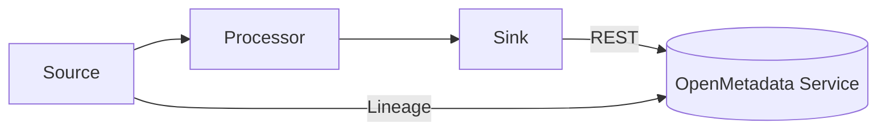

# OpenMetadata Plugin Development

Extend OpenMetadata safely through ingestion connectors, processors, sinks, and event/webhook handlers. This guide covers the Python ingestion framework (most common extension) and highlights other extension points.

## Plugin types
- Source (extract): Connect to external systems and yield Entities/Lineage/Test results
- Processor (transform): Enrich or filter records before persisting
- Sink (load): Write to OM API or alternate destinations
- Topology hooks: Customize how entities relate in a system
- Webhooks/Events: React to entity changes for downstream workflows

Mermaid dataflow


## Building a new ingestion Source
The ingestion framework is a Python package. A new Source implements discovery, entity mapping, and (optionally) lineage and tests.

Core contracts:
- `Source.generate()`: yields `Either[Entity, OMError]`
- Config model (`pydantic`) for connection and selection (projects, schemas, include/exclude)
- Use standard Entity models from the SDK

Skeleton outline (illustrative):
```python
from metadata.ingestion.api.source import Source
from metadata.ingestion.api.common import WorkflowContext
from metadata.ingestion.ometa.ometa_api import OpenMetadata
from metadata.generated.schema.entity.data.table import Table

class MySystemSource(Source):
	def __init__(self, ctx: WorkflowContext):
		super().__init__()
		self.ctx = ctx
		self.client = ...  # connect to your system

	def prepare(self):
		# auth, warmup
		pass

	def yield_tables(self):
		for raw in self.client.list_tables():
			yield Table(
				name=raw.name,
				database=..., schema=...,
				columns=[...],
				service=...
			)

	def generate(self):
		yield from self.yield_tables()

	def close(self):
		self.client.close()
```

### Lineage extraction
Prefer deriving lineage from orchestrator metadata, query logs, or job graphs. Emit edges via lineage models or call the Lineage API. See [Advanced Lineage](../07-advanced-topics/data-lineage.md).

### Configuration schema
Define a `pydantic` config class used in YAML workflows and UI forms. Include:
- Connection fields (host, project, credentials)
- Selection (include/exclude by regex, tags, projects)
- Performance knobs (page size, concurrency)

## Processors and Sinks
- Processors: Add tags/domains, normalize names, redact sensitive fields
- Sinks: Usually the OM REST sink; custom sinks can export to files, topics, or other systems

## Packaging and distribution
- Follow semantic versioning (e.g., `openmetadata-ingestion-connector-mysystem==x.y.z`)
- Provide `extras_require` to install connector deps: `pip install openmetadata-ingestion[mysystem]`
- Document permissions and network requirements

## Testing plugins
- Unit tests with fixtures for metadata samples
- Mock external systems, sanitize any recordings
- Contract tests to verify entity fields, FQNs, and lineage shape
- If possible, run against a local dev instance (Docker Compose)

## Operational guidance
- Idempotency: design for re-runs without duplicates
- Incremental sync: use update timestamps or watermarks
- Backoff and retries on API 429/5xx; log structured errors
- Emit telemetry: counts of entities scanned, created, updated, errors

## Security and compliance
- Never log secrets; use secret managers or env vars
- Support least-privilege credentials and IP allowlists
- Respect PII tagging policies and masking rules

## Other extension points
- Auth providers (SSO, token issuers)
- Policy engines and custom rules
- UI plugins (feature-flagged experimental components)

See also:
- [Custom Connectors](../05-connectors-integrations/custom-connectors.md)
- [APIs & Integration](../03-technical-deep-dive/apis-integration.md)
- [SDK Reference](../08-sdk-reference/README.md)
- [Developer Guide](./developer-guide.md)

---

Last Updated: October 29, 2025
