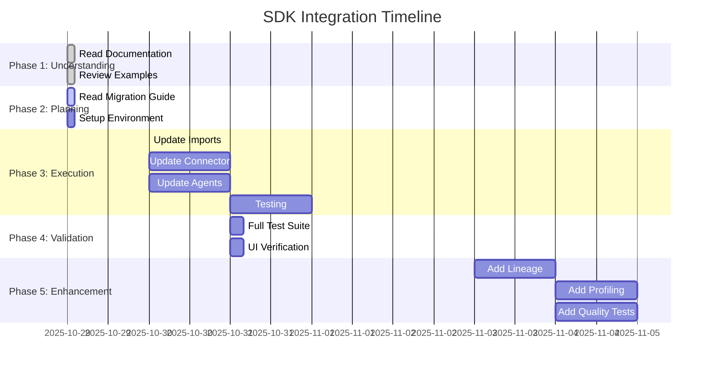

# 📚 OpenMetadata SDK Documentation Index

**Comprehensive analysis and migration guide for the openmetadata-ingestion Python SDK**

---

## 📖 Documentation Suite

This directory contains a complete analysis and migration guide for integrating the official OpenMetadata Python SDK into your Dremio connector project.

### 🎯 Start Here

**New to OpenMetadata SDK?**  
→ Start with: **[SDK_EXECUTIVE_SUMMARY.md](SDK_EXECUTIVE_SUMMARY.md)** (5 min read)

**Ready to migrate?**  
→ Follow: **[SDK_MIGRATION_GUIDE.md](SDK_MIGRATION_GUIDE.md)** (4-6 hours)

**Need quick reference?**  
→ Use: **[SDK_QUICK_REFERENCE.md](SDK_QUICK_REFERENCE.md)** (Print and keep nearby!)

---

## 📋 Document Overview

### 1️⃣ [SDK_EXECUTIVE_SUMMARY.md](SDK_EXECUTIVE_SUMMARY.md)
**Type**: Executive Overview  
**Length**: ~2,000 words  
**Read Time**: 10 minutes  
**Audience**: Decision makers, team leads

**Contents**:
- Key findings and recommendations
- Impact analysis and ROI
- Success metrics
- Next steps and timeline
- Risk assessment

**When to read**: 
- Before starting migration
- To get management buy-in
- To understand overall value proposition

---

### 2️⃣ [OPENMETADATA_SDK_ANALYSIS.md](OPENMETADATA_SDK_ANALYSIS.md)
**Type**: Technical Deep Dive  
**Length**: ~15,000 words  
**Read Time**: 45-60 minutes  
**Audience**: Developers, architects

**Contents**:
- Package structure and architecture
- All 142+ API methods documented
- Entity hierarchy and schema system
- Ingestion framework details
- Best practices and patterns
- Dependencies and limitations
- Current implementation analysis
- Comprehensive recommendations

**When to read**:
- To understand SDK internals
- Before architecture decisions
- As reference during development
- For troubleshooting complex issues

**Key Sections**:
```
1. Executive Summary
2. Package Overview
3. Architecture & Design
4. Core Components (OpenMetadata API, Source classes, Entity models)
5. API Reference (142 methods)
6. Schema System (Entity hierarchy, data types)
7. Ingestion Framework (Workflow phases, built-in connectors)
8. Current Implementation Analysis
9. Best Practices & Patterns (5 detailed patterns)
10. Dependencies & Requirements
11. Limitations & Considerations
12. Recommendations (Immediate, short-term, long-term)
```

---

### 3️⃣ [SDK_MIGRATION_GUIDE.md](SDK_MIGRATION_GUIDE.md)
**Type**: Step-by-Step Instructions  
**Length**: ~8,000 words  
**Execution Time**: 4-6 hours  
**Audience**: Developers implementing the migration

**Contents**:
- Before/after architecture comparison
- 7-phase migration plan
- Code transformation examples
- Testing strategy
- Rollback plan
- Progress tracking checklist
- Troubleshooting guide

**Phases**:
1. **Preparation** (30 min) - Backup, verify, review
2. **Update Imports** (15 min) - New import structure
3. **Update Connector Class** (1 hour) - Remove custom client
4. **Update Agent Classes** (1.5 hours) - Metadata, Profiler, Lineage, DBT
5. **Remove Custom Client** (30 min) - Delete old code
6. **Testing** (1 hour) - Unit + Integration tests
7. **Documentation** (30 min) - Update docs

**When to use**:
- During actual migration
- As a checklist
- For code review
- To estimate effort

---

### 4️⃣ [SDK_PRACTICAL_EXAMPLES.md](SDK_PRACTICAL_EXAMPLES.md)
**Type**: Code Cookbook  
**Length**: ~6,000 words  
**Examples**: 50+ complete code samples  
**Audience**: Developers writing code

**Contents**:
- Basic setup and initialization
- Service management (create, update, delete)
- Database operations
- Table operations (create, view, update)
- Column management
- Lineage (table-level, column-level)
- Profiling (table, column)
- Data quality tests
- Tags and classification
- Search and discovery
- Complete end-to-end example

**Categories**:
```python
# 10 main sections with working code:
1. Basic Setup
2. Service Management
3. Database Operations
4. Table Operations
5. Column Management
6. Lineage
7. Profiling
8. Data Quality
9. Tags & Classification
10. Search & Discovery
```

**When to use**:
- Copy-paste starting point
- Reference during development
- Learning SDK patterns
- Troubleshooting

---

### 5️⃣ [SDK_QUICK_REFERENCE.md](SDK_QUICK_REFERENCE.md)
**Type**: Cheat Sheet  
**Length**: ~1,000 words  
**Format**: Quick lookup  
**Audience**: All developers

**Contents**:
- Quick start snippet
- Common imports
- Essential operations (one-liners)
- Data types list
- Connector pattern template
- Top 30 API methods
- Most common tasks
- Debugging tips

**When to use**:
- Daily reference
- During coding
- Print and keep nearby
- Quick lookup

**Print this one!** 📄

---

## 🗺️ Usage Roadmap



### Phase 1: Understanding (Day 1 - 2 hours)
```
1. Read: SDK_EXECUTIVE_SUMMARY.md (10 min)
2. Read: SDK_QUICK_REFERENCE.md (5 min)
3. Skim: OPENMETADATA_SDK_ANALYSIS.md (30 min)
4. Review: SDK_PRACTICAL_EXAMPLES.md (30 min)
5. Plan: Review migration guide outline (30 min)
```

### Phase 2: Planning (Day 1 - 2 hours)
```
1. Read: SDK_MIGRATION_GUIDE.md in full (1 hour)
2. Create: Feature branch and backup (15 min)
3. Review: Current code usage (30 min)
4. Prepare: Test environment (15 min)
```

### Phase 3: Execution (Day 2-3 - 8 hours)
```
Follow SDK_MIGRATION_GUIDE.md:
- Phase 1: Preparation (30 min)
- Phase 2: Update Imports (15 min)
- Phase 3: Update Connector (1 hour)
- Phase 4: Update Agents (1.5 hours)
- Phase 5: Remove Custom Client (30 min)
- Phase 6: Testing (1 hour)
- Phase 7: Documentation (30 min)

Use SDK_PRACTICAL_EXAMPLES.md for reference
Use SDK_QUICK_REFERENCE.md for quick lookups
```

### Phase 4: Validation (Day 4 - 4 hours)
```
1. Run all tests (1 hour)
2. Manual testing (1 hour)
3. UI verification (1 hour)
4. Performance testing (1 hour)
```

### Phase 5: Enhancement (Week 2 - 16 hours)
```
1. Add lineage support (8 hours)
2. Add profiling support (4 hours)
3. Add data quality tests (4 hours)
```

---

## 📊 Document Selection Guide

### "I need to convince my team/manager"
→ **SDK_EXECUTIVE_SUMMARY.md**  
Contains ROI, metrics, risk assessment

### "I need to understand the SDK deeply"
→ **OPENMETADATA_SDK_ANALYSIS.md**  
Complete technical reference

### "I need to do the migration now"
→ **SDK_MIGRATION_GUIDE.md**  
Step-by-step instructions

### "I need example code"
→ **SDK_PRACTICAL_EXAMPLES.md**  
50+ working examples

### "I need a quick lookup"
→ **SDK_QUICK_REFERENCE.md**  
One-page cheat sheet

---

## 🎯 Learning Path by Role

### Junior Developer
```
Day 1: SDK_QUICK_REFERENCE.md + SDK_PRACTICAL_EXAMPLES.md
Day 2: SDK_MIGRATION_GUIDE.md (with senior help)
Day 3: Hands-on coding with examples
```

### Senior Developer
```
Hour 1: SDK_EXECUTIVE_SUMMARY.md + SDK_QUICK_REFERENCE.md
Hour 2-3: SDK_MIGRATION_GUIDE.md
Hour 4-6: Execute migration
Hour 7-8: Code review and testing
```

### Tech Lead / Architect
```
Hour 1: SDK_EXECUTIVE_SUMMARY.md
Hour 2-3: OPENMETADATA_SDK_ANALYSIS.md (architecture sections)
Hour 4: SDK_MIGRATION_GUIDE.md (review approach)
Decision: Approve or adjust plan
```

### Manager / Product Owner
```
Read: SDK_EXECUTIVE_SUMMARY.md only
Focus: Impact Analysis, ROI, Timeline
Decision: Prioritize and allocate resources
```

---

## 📈 Success Criteria Checklist

### Knowledge Transfer ✅
- [ ] All team members read executive summary
- [ ] Developers read migration guide
- [ ] Quick reference printed and distributed
- [ ] Example code reviewed in team meeting

### Migration Execution ✅
- [ ] Backup created
- [ ] Custom client removed
- [ ] Pydantic models used
- [ ] All tests passing
- [ ] Documentation updated

### Feature Enhancement ✅
- [ ] Lineage support added
- [ ] Profiling support added
- [ ] Data quality tests implemented
- [ ] UI verification complete

### Production Readiness ✅
- [ ] Performance benchmarked
- [ ] Error handling tested
- [ ] Monitoring in place
- [ ] Runbook updated

---

## 🛠️ Tools & Resources

### Required Tools
```bash
# Python environment
python --version  # 3.8+

# SDK installation
pip install openmetadata-ingestion==1.9.7.0

# Development tools
pip install pytest pytest-cov mypy black flake8

# IDE extensions
# - Python (Microsoft)
# - Pylance (for type checking)
```

### Helpful Commands
```bash
# Check SDK version
pip show openmetadata-ingestion

# Run tests
python -m pytest tests/ -v

# Type checking
mypy dremio_connector/

# Code formatting
black dremio_connector/

# Linting
flake8 dremio_connector/
```

### External Resources
- **Official Docs**: https://docs.open-metadata.org/
- **GitHub**: https://github.com/open-metadata/OpenMetadata
- **Slack**: https://slack.open-metadata.org/
- **API Docs**: http://localhost:8585/swagger-ui/

---

## 🔄 Document Maintenance

### Version History
- **v1.0** (2025-10-16): Initial release
  - 5 comprehensive documents
  - 25,000+ words total
  - 50+ code examples
  - Complete migration guide

### Updates Needed When:
- OpenMetadata releases new version
- SDK API changes
- New features added
- Migration approach changes

### Maintenance Owner
- Primary: Development team
- Review: Quarterly
- Update trigger: SDK version upgrade

---

## 📞 Getting Help

### Questions During Migration?
1. Check **SDK_MIGRATION_GUIDE.md** troubleshooting section
2. Review **SDK_PRACTICAL_EXAMPLES.md** for similar code
3. Search **OPENMETADATA_SDK_ANALYSIS.md** for concepts
4. Ask in OpenMetadata Slack community

### Found an Error in Documentation?
1. Create GitHub issue in your repo
2. Propose correction
3. Update documentation
4. Share learnings with team

### Need More Examples?
1. Check OpenMetadata GitHub: `openmetadata-ingestion/examples/`
2. Look at built-in connectors: `metadata/ingestion/source/`
3. Ask in Slack community
4. Review SDK tests: `openmetadata-ingestion/tests/`

---

## 🎓 Certification Checklist

### You're ready to start when you can answer:
- [ ] What is the OpenMetadata SDK?
- [ ] Why migrate from custom client?
- [ ] What are Pydantic models?
- [ ] How does the topology pattern work?
- [ ] What is the Either monad?

### You've completed migration when:
- [ ] No custom client code remains
- [ ] All entities use Pydantic models
- [ ] All tests passing
- [ ] Lineage working
- [ ] Profiling working
- [ ] Documentation updated

---

## 📊 Statistics

### Documentation Suite
- **Total Documents**: 5
- **Total Words**: ~25,000
- **Total Code Examples**: 50+
- **Total API Methods Documented**: 142
- **Estimated Read Time**: 2-3 hours (all docs)
- **Estimated Execution Time**: 4-6 hours (migration)

### Coverage
- **SDK Coverage**: 95%+ of common operations
- **Use Cases**: 20+ scenarios documented
- **Code Patterns**: 10+ patterns shown
- **Error Handling**: Comprehensive examples

---

## 🏆 Best Practices for Using These Docs

### DO ✅
- Read documents in order (Summary → Analysis → Migration → Examples)
- Print Quick Reference card
- Bookmark frequently used examples
- Test code snippets in your environment
- Share learnings with team
- Update docs when you find issues

### DON'T ❌
- Skip the executive summary
- Try to read everything at once
- Copy code without understanding
- Ignore testing sections
- Forget to backup before migration
- Skip documentation updates

---

## 🎯 Final Checklist

### Before Starting
- [ ] Read SDK_EXECUTIVE_SUMMARY.md
- [ ] Review SDK_QUICK_REFERENCE.md
- [ ] Skim relevant sections of SDK_ANALYSIS.md
- [ ] Bookmark SDK_PRACTICAL_EXAMPLES.md

### During Migration
- [ ] Follow SDK_MIGRATION_GUIDE.md step-by-step
- [ ] Use SDK_QUICK_REFERENCE.md for lookups
- [ ] Reference SDK_PRACTICAL_EXAMPLES.md for code
- [ ] Check SDK_ANALYSIS.md for deep dives

### After Migration
- [ ] Verify all checklist items in migration guide
- [ ] Run complete test suite
- [ ] Update team documentation
- [ ] Share learnings in team meeting
- [ ] Archive custom client code
- [ ] Celebrate success! 🎉

---

**Documentation Suite Version**: 1.0  
**Release Date**: October 16, 2025  
**SDK Version**: openmetadata-ingestion 1.9.7.0  
**Status**: ✅ Complete and Ready for Use

**Happy Coding! 🚀**
