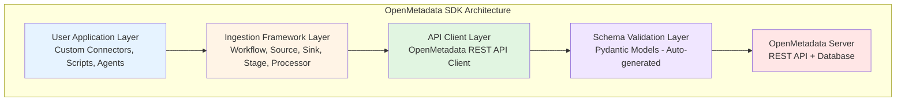

# 📘 OpenMetadata-Ingestion SDK - Full Analysis

**Date**: October 16, 2025  
**SDK Version**: 1.9.7.0  
**Analysis Scope**: Complete architectural and implementation analysis  
**Project Context**: Dremio Connector for OpenMetadata

---

## 📋 Table of Contents

1. [Executive Summary](#executive-summary)
2. [Package Overview](#package-overview)
3. [Architecture & Design](#architecture--design)
4. [Core Components](#core-components)
5. [API Reference](#api-reference)
6. [Schema System](#schema-system)
7. [Ingestion Framework](#ingestion-framework)
8. [Current Implementation Analysis](#current-implementation-analysis)
9. [Best Practices & Patterns](#best-practices--patterns)
10. [Dependencies & Requirements](#dependencies--requirements)
11. [Limitations & Considerations](#limitations--considerations)
12. [Recommendations](#recommendations)

---

## 📊 Executive Summary

### What is openmetadata-ingestion?

The `openmetadata-ingestion` package is the **official Python SDK** for OpenMetadata, providing:

- **Metadata Ingestion Framework**: Extract metadata from 100+ data sources
- **Connector Development**: Build custom connectors for proprietary systems
- **API Client**: Programmatic access to OpenMetadata's REST API
- **Schema Validation**: Pydantic-based models for all OpenMetadata entities
- **Workflow Management**: Orchestrate complex ingestion pipelines
- **Data Quality**: Profiling, testing, and quality checks

### Key Statistics

```
Version: 1.9.7.0
License: Collate Community License Agreement v1.0
Package Size: ~45 MB (with dependencies)
Python Support: 3.8+
Total API Methods: 142+ methods in OpenMetadata class
Dependencies: 40+ packages (including Azure, AWS, GCP connectors)
```

---

## 🎯 Package Overview

### Installation Options

```bash
# Basic installation
pip install openmetadata-ingestion

# With specific connectors
pip install openmetadata-ingestion[postgres]
pip install openmetadata-ingestion[mysql]
pip install openmetadata-ingestion[snowflake]

# All connectors (VERY HEAVY - 500+ MB)
pip install openmetadata-ingestion[all]

# Database connectors bundle
pip install openmetadata-ingestion[postgres,mysql,opensearch]
```

### Package Structure

```
metadata/
├── __init__.py
├── antlr/                    # SQL parser (ANTLR4-based)
├── applications/             # Application integrations
├── automations/              # Automation workflows
├── cli/                      # Command-line interface
├── clients/                  # Client implementations
├── config/                   # Configuration management
├── data_quality/             # Data quality framework
├── examples/                 # Example workflows
├── generated/                # Auto-generated Pydantic models
│   ├── schema/
│   │   ├── entity/          # Entity models (Table, Database, etc.)
│   │   ├── api/             # API request/response models
│   │   ├── type/            # Common type definitions
│   │   └── metadataIngestion/ # Workflow configurations
├── great_expectations/       # Great Expectations integration
├── ingestion/                # Core ingestion framework
│   ├── api/                 # Ingestion API interfaces
│   ├── ometa/               # OpenMetadata API client
│   │   └── ometa_api.py    # Main API class (142+ methods)
│   ├── source/              # Built-in connectors
│   │   ├── database/        # Database connectors
│   │   ├── dashboard/       # BI tool connectors
│   │   ├── pipeline/        # Pipeline connectors
│   │   ├── messaging/       # Messaging connectors
│   │   └── storage/         # Storage connectors
│   └── models.py            # Core data models
├── mixins/                   # Utility mixins
├── parsers/                  # Query parsers
├── pii/                      # PII detection
├── profiler/                 # Data profiling
├── readers/                  # Data readers
├── sampler/                  # Data sampling
├── timer/                    # Performance monitoring
└── utils/                    # Utility functions
```

---

## 🏗️ Architecture & Design

### Design Philosophy

The SDK follows a **multi-layered architecture**:



### Key Design Patterns

1. **Abstract Base Classes**: Extensible connector framework
2. **Iterator Pattern**: Memory-efficient data streaming
3. **Either Monad**: Functional error handling
4. **Plugin Architecture**: Dynamic connector loading
5. **Schema-First**: All entities defined via JSON Schema → Pydantic

---

## 🔧 Core Components

### 1. OpenMetadata API Client (`ometa_api.py`)

The central class for all API operations:

```python
from metadata.ingestion.ometa.ometa_api import OpenMetadata
from metadata.generated.schema.entity.services.connections.metadata.openMetadataConnection import (
    OpenMetadataConnection
)
from metadata.generated.schema.security.client.openMetadataJWTClientConfig import (
    OpenMetadataJWTClientConfig
)

# Initialize client
server_config = OpenMetadataJWTClientConfig(
    hostPort="http://localhost:8585/api",
    jwtToken="your-jwt-token"
)
metadata = OpenMetadata(server_config)
```

#### Key API Methods (142 total)

**Entity CRUD Operations:**
```python
# Create
metadata.create(entity=table_request)

# Read
metadata.get_by_name(entity=Table, fqn="service.database.schema.table")
metadata.get_by_id(entity=Table, entity_id=uuid)

# Update
metadata.patch(entity=Table, source=existing, destination=updated)

# Delete
metadata.delete(entity=Table, entity_id=uuid, hard_delete=True)
```

**Service Management:**
```python
metadata.create_or_update(data=service_request)
metadata.get_service_or_create(config=service_config)
metadata.list_entities(entity=DatabaseService)
```

**Lineage Operations:**
```python
metadata.add_lineage(lineage=lineage_request)
metadata.add_lineage_by_query(query="SELECT * FROM table1")
metadata.add_mlmodel_lineage(lineage=ml_lineage)
```

**Data Quality:**
```python
metadata.add_test_case_results(test_results)
metadata.create_test_case_resolution(resolution)
metadata.add_kpi_result(kpi_result)
metadata.add_data_insight_report_data(report_data)
```

**Profiling:**
```python
metadata.create_or_update_table_profiler_config(config)
metadata.ingest_profile_data(table_fqn, profile_data)
```

**Pipeline Status:**
```python
metadata.create_or_update_pipeline_status(status)
metadata.add_pipeline_status(status)
metadata.clean_pipeline_tasks(pipeline_fqn)
```

**Custom Properties:**
```python
metadata.create_or_update_custom_property(property_def)
metadata.create_or_update_custom_metric(metric_def)
```

**Asset Management:**
```python
metadata.add_assets_to_data_product(data_product_fqn, assets)
metadata.add_task_to_pipeline(pipeline_fqn, task)
```

**Search & Discovery:**
```python
metadata.es_search_from_fqn(fqn="service.database.*")
metadata.list_all_entities(entity=Table, fields=["columns", "tags"])
```

**Settings & Configuration:**
```python
metadata.create_or_update_settings(settings)
metadata.get_settings_by_name(name="email_config")
```

### 2. Source Abstract Classes

Base classes for building connectors:

```python
from metadata.ingestion.api.steps import Source
from metadata.ingestion.source.database.database_service import DatabaseServiceSource

class CustomConnector(DatabaseServiceSource):
    """Custom database connector"""
    
    def __init__(self, config, metadata):
        super().__init__(config, metadata)
        # Initialize your client
    
    @classmethod
    def create(cls, config_dict, metadata, pipeline_name=None):
        """Factory method"""
        config = WorkflowSource.parse_obj(config_dict)
        return cls(config, metadata)
    
    def prepare(self):
        """Initialize connections"""
        pass
    
    # Topology methods (auto-called by framework)
    def get_database_names(self) -> Iterable[str]:
        """Return database names"""
        yield from ["db1", "db2"]
    
    def yield_database(self, database_name: str) -> Iterable[Either[CreateDatabaseRequest]]:
        """Create database entities"""
        yield Either(right=CreateDatabaseRequest(...))
    
    def get_database_schema_names(self) -> Iterable[str]:
        """Return schema names"""
        yield from ["schema1", "schema2"]
    
    def yield_database_schema(self, schema_name: str) -> Iterable[Either[CreateDatabaseSchemaRequest]]:
        """Create schema entities"""
        yield Either(right=CreateDatabaseSchemaRequest(...))
    
    def get_tables_name_and_type(self) -> Iterable[Tuple[str, TableType]]:
        """Return table names and types"""
        yield ("table1", TableType.Regular)
    
    def yield_table(self, table_name_and_type: Tuple[str, TableType]) -> Iterable[Either[CreateTableRequest]]:
        """Create table entities"""
        table_name, table_type = table_name_and_type
        yield Either(right=CreateTableRequest(...))
```

### 3. Entity Models (Pydantic)

All OpenMetadata entities are Pydantic models:

```python
from metadata.generated.schema.entity.data.table import Table, Column, DataType
from metadata.generated.schema.entity.data.database import Database
from metadata.generated.schema.entity.data.databaseSchema import DatabaseSchema
from metadata.generated.schema.entity.services.databaseService import DatabaseService
from metadata.generated.schema.type.entityReference import EntityReference

# Example: Create a table
table = Table(
    id=uuid.uuid4(),
    name="customers",
    displayName="Customers Table",
    description="Customer master data",
    tableType=TableType.Regular,
    columns=[
        Column(
            name="customer_id",
            dataType=DataType.BIGINT,
            description="Primary key"
        ),
        Column(
            name="email",
            dataType=DataType.VARCHAR,
            dataLength=255
        )
    ],
    databaseSchema=EntityReference(
        id=schema_id,
        type="databaseSchema"
    )
)
```

### 4. Request Models

API request models for CRUD operations:

```python
from metadata.generated.schema.api.data.createDatabase import CreateDatabaseRequest
from metadata.generated.schema.api.data.createDatabaseSchema import CreateDatabaseSchemaRequest
from metadata.generated.schema.api.data.createTable import CreateTableRequest

# Create database
db_request = CreateDatabaseRequest(
    name="production",
    displayName="Production Database",
    description="Production database",
    service="service_fqn"
)

# Create schema
schema_request = CreateDatabaseSchemaRequest(
    name="public",
    displayName="Public Schema",
    database="service.production"
)

# Create table
table_request = CreateTableRequest(
    name="orders",
    displayName="Orders",
    tableType=TableType.Regular,
    columns=[...],
    databaseSchema="service.production.public"
)
```

### 5. Workflow System

Orchestrate ingestion pipelines:

```python
from metadata.generated.schema.metadataIngestion.workflow import (
    Source as WorkflowSource,
    Sink,
    Processor
)

workflow_config = {
    "source": {
        "type": "custom-connector",
        "serviceName": "my-service",
        "serviceConnection": {
            "config": {
                "type": "CustomDatabase",
                "connectionOptions": {
                    "url": "http://localhost:9047",
                    "username": "admin",
                    "password": "password"
                }
            }
        },
        "sourceConfig": {
            "config": {
                "type": "DatabaseMetadata"
            }
        }
    },
    "sink": {
        "type": "metadata-rest",
        "config": {}
    },
    "workflowConfig": {
        "openMetadataServerConfig": {
            "hostPort": "http://localhost:8585/api",
            "authProvider": "openmetadata",
            "securityConfig": {
                "jwtToken": "token"
            }
        }
    }
}
```

---

## 📚 Schema System

### Entity Hierarchy

```
Entity (Base)
├── DataAsset
│   ├── Table
│   ├── Topic
│   ├── Dashboard
│   ├── Pipeline
│   ├── Container
│   └── MlModel
├── DatabaseService
├── Database
├── DatabaseSchema
├── User
├── Team
├── Role
├── Policy
└── ...
```

### Common Entity Properties

Every entity has:
```python
id: UUID                           # Unique identifier
name: str                          # Entity name
fullyQualifiedName: str           # Full path (e.g., "service.db.schema.table")
displayName: Optional[str]        # Human-readable name
description: Optional[str]        # Markdown description
owner: Optional[EntityReference]  # Owner reference
tags: Optional[List[TagLabel]]    # Classification tags
version: Optional[float]          # Entity version
updatedAt: Optional[int]          # Last update timestamp
updatedBy: Optional[str]          # Last updater
href: Optional[str]               # API URL
changeDescription: Optional[ChangeDescription]
deleted: Optional[bool]           # Soft delete flag
```

### Data Types

Comprehensive type system:

```python
from metadata.generated.schema.entity.data.table import DataType

# Numeric types
DataType.INT
DataType.BIGINT
DataType.FLOAT
DataType.DOUBLE
DataType.DECIMAL
DataType.NUMBER

# String types
DataType.VARCHAR
DataType.CHAR
DataType.TEXT
DataType.STRING

# Date/Time types
DataType.DATE
DataType.TIME
DataType.TIMESTAMP
DataType.DATETIME
DataType.TIMESTAMP_Z

# Complex types
DataType.ARRAY
DataType.STRUCT
DataType.MAP
DataType.JSON

# Binary types
DataType.BINARY
DataType.VARBINARY
DataType.BYTES

# Boolean
DataType.BOOLEAN

# Special types
DataType.UUID
DataType.ENUM
DataType.GEOGRAPHY
DataType.GEOMETRY
```

---

## 🔄 Ingestion Framework

### Workflow Phases

```
1. SOURCE    → Extract metadata from source system
2. PROCESSOR → Transform/enrich metadata
3. STAGE     → Temporary storage (optional)
4. SINK      → Load into OpenMetadata
5. WORKFLOW  → Orchestration & configuration
```

### Built-in Connectors

**Databases** (40+):
- PostgreSQL, MySQL, Oracle, SQL Server
- Snowflake, Redshift, BigQuery
- MongoDB, Cassandra, DynamoDB
- **Dremio** (via JDBC PostgreSQL wire protocol)

**Dashboards** (15+):
- Tableau, PowerBI, Looker, Metabase
- Superset, Redash, Mode, Sisense

**Pipelines** (10+):
- Airflow, Dagster, Prefect, Fivetran
- dbt, Glue, Azure Data Factory

**Messaging** (5+):
- Kafka, Kinesis, Pulsar, RabbitMQ

**Storage** (5+):
- S3, GCS, Azure Blob, HDFS

---

## 🔍 Current Implementation Analysis

### Your Dremio Connector Architecture

```python
# File: dremio_connector/dremio_source.py
class DremioConnector(DatabaseServiceSource):
    """
    Custom Dremio connector using DatabaseServiceSource base.
    Follows OpenMetadata's topology pattern.
    """
```

**✅ Strengths:**
1. Correct base class (`DatabaseServiceSource`)
2. Proper topology methods implementation
3. Uses `Either` monad for error handling
4. FQN (Fully Qualified Name) construction
5. Context management via `self.context.get()`

**⚠️ Areas for Improvement:**
1. Not using official SDK methods extensively
2. Custom `OpenMetadataClient` duplicates SDK functionality
3. Direct API calls instead of SDK methods
4. Missing schema validation via Pydantic models

### Current vs. Recommended Patterns

#### ❌ Current Pattern (Custom Client)
```python
# dremio_connector/clients/openmetadata_client.py
class OpenMetadataClient:
    def create_table(self, table_definition: Dict[str, Any]) -> bool:
        # Manual API calls with requests
        response = self.session.post(url, json=table_payload)
```

#### ✅ Recommended Pattern (SDK Client)
```python
from metadata.ingestion.ometa.ometa_api import OpenMetadata
from metadata.generated.schema.api.data.createTable import CreateTableRequest

# Use official SDK
table_request = CreateTableRequest(...)
result = metadata.create_or_update(data=table_request)
```

### Migration Strategy

**Phase 1: Gradual SDK Adoption**
```python
# Keep existing connector, add SDK client
from metadata.ingestion.ometa.ometa_api import OpenMetadata

class DremioConnector(DatabaseServiceSource):
    def __init__(self, config, metadata: OpenMetadata):
        super().__init__(config, metadata)
        # metadata is already the SDK client!
        self.ometa = metadata  # Use SDK directly
```

**Phase 2: Replace Custom Client Methods**
```python
# Old way (custom client)
self.om_client.create_table(table_dict)

# New way (SDK)
from metadata.generated.schema.api.data.createTable import CreateTableRequest
table_request = CreateTableRequest.parse_obj(table_dict)
yield Either(right=table_request)  # Framework handles creation
```

**Phase 3: Leverage Advanced Features**
```python
# Add lineage
from metadata.generated.schema.type.entityLineage import EntitiesEdge
metadata.add_lineage(edge=EntitiesEdge(...))

# Add profiling
metadata.ingest_profile_data(table_fqn, profile_sample)

# Add data quality tests
metadata.add_test_case_results(test_results)
```

---

## 💡 Best Practices & Patterns

### 1. Entity Creation Pattern

```python
from metadata.generated.schema.api.data.createTable import CreateTableRequest
from metadata.generated.schema.entity.data.table import Column, DataType, TableType
from metadata.utils import fqn

def yield_table(self, table_name_and_type):
    table_name, table_type = table_name_and_type
    
    # Build FQN for parent schema
    schema_fqn = fqn.build(
        self.metadata,
        entity_type=DatabaseSchema,
        service_name=self.context.get().database_service,
        database_name=self.context.get().database,
        schema_name=self.context.get().database_schema,
    )
    
    # Create columns with proper types
    columns = [
        Column(
            name="id",
            dataType=DataType.BIGINT,
            description="Primary key",
            ordinalPosition=1
        ),
        Column(
            name="name",
            dataType=DataType.VARCHAR,
            dataLength=255,
            ordinalPosition=2
        )
    ]
    
    # Create table request
    table_request = CreateTableRequest(
        name=table_name,
        displayName=table_name,
        tableType=table_type,
        columns=columns,
        databaseSchema=schema_fqn,
        description="Auto-generated table"
    )
    
    # Yield with error handling
    yield Either(right=table_request)
    
    # Register for context tracking
    self.register_record(table_request=table_request)
```

### 2. Error Handling Pattern

```python
from metadata.ingestion.api.models import Either, StackTraceError

def yield_table(self, table_name_and_type):
    try:
        # ... create table_request
        yield Either(right=table_request)
    except Exception as exc:
        yield Either(
            left=StackTraceError(
                name=table_name,
                error=f"Failed to create table: {exc}",
                stackTrace=traceback.format_exc()
            )
        )
```

### 3. Connection Testing Pattern

```python
from metadata.ingestion.connections.test_connections import test_connection_steps
from metadata.generated.schema.entity.services.connections.testConnectionResult import (
    TestConnectionResult,
    StatusType
)

def test_connection(self) -> TestConnectionResult:
    """Test connection to source system"""
    test_results = []
    
    # Test 1: Authentication
    try:
        self.client.authenticate()
        test_results.append(
            TestConnectionStepResult(
                name="Authentication",
                status=StatusType.Successful
            )
        )
    except Exception as e:
        test_results.append(
            TestConnectionStepResult(
                name="Authentication",
                status=StatusType.Failed,
                errorLog=str(e)
            )
        )
    
    return TestConnectionResult(steps=test_results)
```

### 4. Lineage Pattern

```python
from metadata.generated.schema.api.lineage.addLineage import AddLineageRequest
from metadata.generated.schema.type.entityLineage import EntitiesEdge, LineageDetails

def add_table_lineage(self, from_table_fqn, to_table_fqn):
    """Add lineage between tables"""
    lineage = AddLineageRequest(
        edge=EntitiesEdge(
            fromEntity=EntityReference(
                id=from_table_id,
                type="table",
                fullyQualifiedName=from_table_fqn
            ),
            toEntity=EntityReference(
                id=to_table_id,
                type="table",
                fullyQualifiedName=to_table_fqn
            ),
            lineageDetails=LineageDetails(
                sqlQuery="SELECT * FROM source_table",
                columnsLineage=[]  # Column-level lineage
            )
        )
    )
    
    self.metadata.add_lineage(lineage)
```

### 5. Profiling Pattern

```python
from metadata.generated.schema.entity.data.table import TableProfile, ColumnProfile

def create_table_profile(self, table_fqn, row_count):
    """Create table profile data"""
    profile = TableProfile(
        timestamp=int(datetime.now().timestamp() * 1000),
        rowCount=row_count,
        columnCount=len(columns),
        profileSample=50.0,
        columnProfile=[
            ColumnProfile(
                name="customer_id",
                valuesCount=row_count,
                nullCount=0,
                uniqueCount=row_count,
                min=1,
                max=row_count
            )
        ]
    )
    
    self.metadata.ingest_profile_data(table_fqn, profile)
```

---

## 📦 Dependencies & Requirements

### Core Dependencies

```
python >= 3.8

# Core framework
pydantic >= 1.10.0
pydantic-settings
sqlalchemy >= 1.4.0
requests >= 2.28.0
PyYAML >= 6.0

# Authentication
cryptography
azure-identity
azure-keyvault-secrets
google-cloud-secret-manager

# Data processing
pandas
numpy
pyarrow

# SQL parsing
antlr4-python3-runtime
sqlparse
collate-sqllineage

# Database connectors (optional extras)
psycopg2-binary      # PostgreSQL
pymysql              # MySQL
snowflake-connector-python
google-cloud-bigquery
pyodbc               # SQL Server

# Cloud SDKs (optional)
boto3                # AWS
azure-storage-blob   # Azure
google-cloud-storage # GCP

# Monitoring
memory-profiler
```

### Installation Profiles

```bash
# Minimal (no connectors)
pip install openmetadata-ingestion

# Database bundle
pip install openmetadata-ingestion[db]

# Cloud bundle
pip install openmetadata-ingestion[aws,azure,gcp]

# Full bundle (HEAVY - 500+ MB)
pip install openmetadata-ingestion[all]
```

---

## ⚠️ Limitations & Considerations

### 1. Package Size
- **Basic**: ~45 MB
- **With [all]**: 500+ MB
- **Recommendation**: Install only needed connectors

### 2. Dependency Conflicts
- Pydantic version sensitive (1.x vs 2.x)
- SQLAlchemy version conflicts with other tools
- Use virtual environments

### 3. Performance
- Large metadata catalogs can be slow
- Batch operations recommended for 1000+ tables
- Use pagination for list operations

### 4. API Rate Limiting
- No built-in rate limiting
- Implement retry logic for production
- Use connection pooling

### 5. Schema Changes
- Generated models tied to OpenMetadata version
- API changes between versions
- Test thoroughly when upgrading

### 6. Documentation
- Official docs sometimes outdated
- Best to read source code
- Community support via Slack

### 7. Debugging
- Complex stack traces
- Enable debug logging: `metadata.utils.logger.set_loggers_level(logging.DEBUG)`

---

## 🎯 Recommendations

### For Your Dremio Connector

#### 1. **Immediate Actions** (High Priority)

**A. Replace Custom OpenMetadataClient**
```python
# REMOVE: dremio_connector/clients/openmetadata_client.py
# USE: metadata.ingestion.ometa.ometa_api.OpenMetadata (already injected!)

class DremioConnector(DatabaseServiceSource):
    def __init__(self, config, metadata: OpenMetadata):
        super().__init__(config, metadata)
        # metadata is the official SDK client!
        # No need for custom client
```

**B. Use Pydantic Request Models**
```python
# OLD (dict-based)
table_dict = {
    "name": "customers",
    "columns": [...]
}
self.custom_client.create_table(table_dict)

# NEW (Pydantic-based)
from metadata.generated.schema.api.data.createTable import CreateTableRequest
table_request = CreateTableRequest(
    name="customers",
    columns=[...]
)
yield Either(right=table_request)  # Framework handles it
```

**C. Leverage SDK Methods**
```python
# Get existing entities
existing_service = self.metadata.get_by_name(
    entity=DatabaseService,
    fqn="dremio-prod"
)

# Search entities
tables = self.metadata.list_all_entities(
    entity=Table,
    fields=["columns", "tags"]
)

# Add lineage
self.metadata.add_lineage(lineage_request)
```

#### 2. **Short-term Improvements** (Medium Priority)

**A. Implement Proper Connection Testing**
```python
def test_connection(self) -> TestConnectionResult:
    """
    Implement structured connection testing
    Returns: TestConnectionResult with multiple test steps
    """
    return test_connection_steps(
        metadata=self.metadata,
        test_fn=self._run_connection_tests,
        service_type=DatabaseService
    )
```

**B. Add Data Lineage Support**
```python
from metadata.generated.schema.api.lineage.addLineage import AddLineageRequest

def yield_table_lineage(self, table_fqn):
    """Add automatic lineage detection"""
    # Parse Dremio view definitions
    # Extract source tables
    # Create lineage edges
    lineage = AddLineageRequest(...)
    yield Either(right=lineage)
```

**C. Implement Incremental Ingestion**
```python
def prepare(self):
    """Initialize with last run timestamp"""
    self.last_run = self.metadata.get_last_ingestion_run_timestamp(
        service_name=self.service_name
    )

def get_tables_name_and_type(self):
    """Yield only modified tables"""
    for table in self.dremio_client.get_tables():
        if table['modified_at'] > self.last_run:
            yield (table['name'], TableType.Regular)
```

#### 3. **Long-term Enhancements** (Low Priority)

**A. Add Data Profiling**
```python
from metadata.generated.schema.entity.data.table import TableProfile

def profile_table(self, table_fqn):
    """Generate table profile statistics"""
    stats = self.dremio_client.get_table_stats(table_fqn)
    profile = TableProfile(
        timestamp=int(time.time() * 1000),
        rowCount=stats['row_count'],
        columnCount=stats['column_count']
    )
    self.metadata.ingest_profile_data(table_fqn, profile)
```

**B. Implement Data Quality Checks**
```python
from metadata.generated.schema.tests.testCase import TestCase

def create_quality_tests(self, table_fqn):
    """Create automatic quality tests"""
    test_case = TestCase(
        name=f"{table_fqn}_row_count",
        testDefinition="tableRowCountToBeBetween",
        parameterValues=[
            {"name": "minValue", "value": "0"},
            {"name": "maxValue", "value": "1000000"}
        ]
    )
    self.metadata.create_or_update(data=test_case)
```

**C. Add Usage Statistics**
```python
from metadata.generated.schema.type.usageRequest import UsageRequest

def ingest_usage_stats(self, table_fqn):
    """Ingest query usage statistics"""
    usage = UsageRequest(
        date=date.today(),
        count=100,  # Query count
        entity_fqn=table_fqn
    )
    self.metadata.publish_usage(usage)
```

### Code Quality Improvements

**A. Add Type Hints**
```python
from typing import Iterable, Optional, List, Dict, Any
from metadata.ingestion.ometa.ometa_api import OpenMetadata
from metadata.generated.schema.entity.data.table import Table

def yield_tables(self) -> Iterable[Table]:
    """Properly typed method"""
    ...
```

**B. Add Comprehensive Logging**
```python
from metadata.utils.logger import ingestion_logger

logger = ingestion_logger()

def get_tables(self):
    logger.info("Starting table discovery")
    logger.debug(f"Connecting to {self.dremio_url}")
    
    try:
        tables = self.client.list_tables()
        logger.info(f"Found {len(tables)} tables")
    except Exception as e:
        logger.error(f"Failed to get tables: {e}", exc_info=True)
```

**C. Add Configuration Validation**
```python
from pydantic import BaseModel, validator

class DremioConfig(BaseModel):
    """Validated configuration"""
    url: str
    username: str
    password: str
    timeout: int = 30
    
    @validator('url')
    def validate_url(cls, v):
        if not v.startswith('http'):
            raise ValueError('URL must start with http:// or https://')
        return v
```

### Testing Strategy

```python
# tests/test_dremio_connector_sdk.py
import pytest
from metadata.ingestion.ometa.ometa_api import OpenMetadata
from dremio_connector.dremio_source import DremioConnector

@pytest.fixture
def metadata_client():
    """Mock OpenMetadata client"""
    return Mock(spec=OpenMetadata)

def test_connector_initialization(metadata_client):
    """Test connector init"""
    connector = DremioConnector(config, metadata_client)
    assert connector.metadata is metadata_client

def test_table_creation_with_sdk(metadata_client):
    """Test table creation uses SDK"""
    connector = DremioConnector(config, metadata_client)
    
    # Test table generation
    tables = list(connector.get_tables_name_and_type())
    assert len(tables) > 0
    
    # Verify SDK methods called
    metadata_client.get_by_name.assert_called()
```

---

## 📚 Additional Resources

### Official Documentation
- **OpenMetadata Docs**: https://docs.open-metadata.org/
- **SDK Reference**: https://docs.open-metadata.org/sdk/python
- **Connector Development**: https://docs.open-metadata.org/connectors/custom-connectors

### Source Code
- **GitHub Repository**: https://github.com/open-metadata/OpenMetadata
- **SDK Package**: `openmetadata-ingestion/src/metadata/`
- **Examples**: `openmetadata-ingestion/examples/`

### Community
- **Slack**: https://slack.open-metadata.org/
- **GitHub Discussions**: https://github.com/open-metadata/OpenMetadata/discussions

### API Documentation
- **REST API**: http://localhost:8585/swagger-ui/
- **GraphQL**: http://localhost:8585/graphql

---

## 🎓 Summary & Next Steps

### Key Takeaways

1. ✅ **You're already using the SDK** - `DatabaseServiceSource` is the right base class
2. ⚠️ **Custom client is redundant** - The injected `metadata` parameter IS the SDK
3. 🎯 **Use Pydantic models** - Type-safe, validated entity creation
4. 🔄 **Leverage topology methods** - Framework handles orchestration
5. 📊 **Extend with lineage/profiling** - SDK has built-in support

### Migration Checklist

- [ ] Remove `dremio_connector/clients/openmetadata_client.py`
- [ ] Update imports to use SDK models
- [ ] Replace dict-based API calls with Pydantic requests
- [ ] Add proper error handling with `Either`
- [ ] Implement connection testing
- [ ] Add lineage support
- [ ] Add profiling support
- [ ] Add comprehensive logging
- [ ] Write SDK-based tests
- [ ] Update documentation

### Immediate Next Steps

```bash
# 1. Install SDK with full type hints
pip install openmetadata-ingestion[postgres]

# 2. Update connector to use SDK directly
# See: DREMIO_CONNECTOR_SDK_REFACTOR.md (create this next)

# 3. Test with SDK client
python -m pytest tests/ -v

# 4. Deploy and validate
docker-compose up -d
```

---

**Analysis completed on**: October 16, 2025  
**Analyzed by**: GitHub Copilot  
**SDK Version**: openmetadata-ingestion 1.9.7.0  
**Status**: ✅ Ready for implementation
