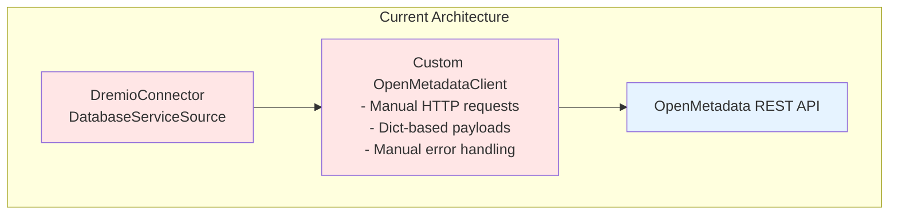
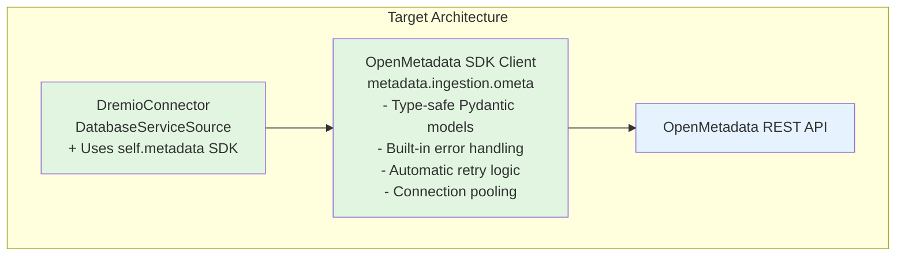
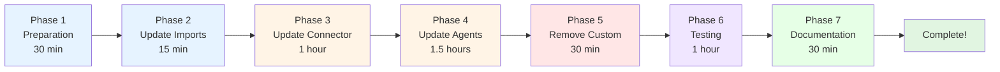
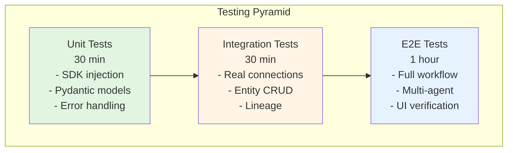

# 🚀 OpenMetadata SDK Migration Guide

**Project**: Dremio Connector  
**Goal**: Migrate from custom API client to official SDK  
**Estimated Effort**: 4-6 hours  
**Risk Level**: Low (backward compatible)

---

## 📋 Table of Contents

1. [Before & After Comparison](#before--after-comparison)
2. [Step-by-Step Migration](#step-by-step-migration)
3. [Code Examples](#code-examples)
4. [Testing Strategy](#testing-strategy)
5. [Rollback Plan](#rollback-plan)

---

## 🔄 Before & After Comparison

### Current Architecture (Custom Client)



### Target Architecture (SDK Client)



### Key Differences

| Aspect | Custom Client | SDK Client |
|--------|--------------|------------|
| **Type Safety** | ❌ Dicts | ✅ Pydantic Models |
| **Validation** | ❌ Manual | ✅ Automatic |
| **Error Handling** | ⚠️ Basic | ✅ Comprehensive |
| **Retry Logic** | ❌ None | ✅ Built-in |
| **Maintenance** | ❌ High | ✅ Low |
| **API Changes** | ❌ Manual updates | ✅ Auto-updated |
| **Testing** | ⚠️ Mock HTTP | ✅ Mock SDK methods |
| **Performance** | ⚠️ No pooling | ✅ Connection pooling |

---

## 📝 Step-by-Step Migration



### Phase 1: Preparation (30 min)

#### 1.1 Backup Current Code

```powershell
# Create backup branch
git checkout -b backup/before-sdk-migration
git add .
git commit -m "Backup before SDK migration"
git checkout master

# Create feature branch
git checkout -b feature/migrate-to-sdk
```

#### 1.2 Verify SDK Installation

```powershell
# Check SDK version
pip show openmetadata-ingestion

# Install if needed
pip install openmetadata-ingestion==1.9.7.0
```

#### 1.3 Review Current Usage

```powershell
# Find all uses of custom client
grep -r "OpenMetadataClient" dremio_connector/
grep -r "om_client" dremio_connector/
```

### Phase 2: Update Imports (15 min)

#### 2.1 Create New Imports File

```python
# dremio_connector/sdk_imports.py
"""
Central imports for OpenMetadata SDK.
Use these instead of custom client.
"""

# Core API Client
from metadata.ingestion.ometa.ometa_api import OpenMetadata

# Entity Models
from metadata.generated.schema.entity.data.table import (
    Table, Column, DataType, TableType, Constraint, ConstraintType
)
from metadata.generated.schema.entity.data.database import Database
from metadata.generated.schema.entity.data.databaseSchema import DatabaseSchema
from metadata.generated.schema.entity.services.databaseService import DatabaseService

# Request Models
from metadata.generated.schema.api.data.createDatabase import CreateDatabaseRequest
from metadata.generated.schema.api.data.createDatabaseSchema import CreateDatabaseSchemaRequest
from metadata.generated.schema.api.data.createTable import CreateTableRequest

# Type References
from metadata.generated.schema.type.entityReference import EntityReference
from metadata.generated.schema.type.tagLabel import TagLabel, TagSource

# Error Handling
from metadata.ingestion.api.models import Either, StackTraceError

# Utilities
from metadata.utils import fqn
from metadata.utils.logger import ingestion_logger

# Workflow Models
from metadata.generated.schema.metadataIngestion.workflow import (
    Source as WorkflowSource,
    Sink,
    WorkflowConfig
)

__all__ = [
    'OpenMetadata',
    'Table', 'Column', 'DataType', 'TableType',
    'Database', 'DatabaseSchema', 'DatabaseService',
    'CreateDatabaseRequest', 'CreateDatabaseSchemaRequest', 'CreateTableRequest',
    'EntityReference', 'TagLabel',
    'Either', 'StackTraceError',
    'fqn', 'ingestion_logger',
    'WorkflowSource'
]
```

#### 2.2 Update Main Connector

```python
# dremio_connector/dremio_source.py
# OLD imports
# from dremio_connector.clients.openmetadata_client import OpenMetadataClient

# NEW imports
from dremio_connector.sdk_imports import (
    OpenMetadata,
    CreateDatabaseRequest,
    CreateDatabaseSchemaRequest,
    CreateTableRequest,
    Column, DataType, TableType,
    Either, fqn, ingestion_logger
)
```

### Phase 3: Update Connector Class (1 hour)

#### 3.1 Remove Custom Client Initialization

```python
# dremio_connector/dremio_source.py

class DremioConnector(DatabaseServiceSource):
    
    def __init__(self, config: WorkflowSource, metadata: OpenMetadata):
        """
        Initialize Dremio connector with SDK client.
        
        Args:
            config: Workflow configuration
            metadata: OpenMetadata SDK client (injected by framework)
        """
        self.config = config
        self.metadata = metadata  # This is the SDK client!
        self.source_config = config.sourceConfig.config
        self.service_connection = config.serviceConnection.root.config
        self.dremio_client = None
        self.database_source_state = set()
        
        # ❌ REMOVE THIS:
        # self.om_client = OpenMetadataClient(...)
        
        super().__init__()
```

#### 3.2 Update Entity Creation Methods

**OLD: Dict-based creation**
```python
# ❌ OLD WAY - Don't use this
def create_table_old(self, table_name):
    table_dict = {
        "name": table_name,
        "displayName": table_name,
        "tableType": "Regular",
        "columns": [
            {
                "name": "id",
                "dataType": "BIGINT"
            }
        ],
        "databaseSchema": "service.db.schema"
    }
    self.om_client.create_table(table_dict)
```

**NEW: Pydantic-based creation**
```python
# ✅ NEW WAY - Use this
from dremio_connector.sdk_imports import (
    CreateTableRequest, Column, DataType, TableType, Either, fqn
)

def yield_table(self, table_name_and_type):
    """Create table using SDK models"""
    table_name, table_type = table_name_and_type
    
    try:
        # Build schema FQN
        schema_fqn = fqn.build(
            self.metadata,
            entity_type=DatabaseSchema,
            service_name=self.context.get().database_service,
            database_name=self.context.get().database,
            schema_name=self.context.get().database_schema,
        )
        
        # Create columns with Pydantic
        columns = [
            Column(
                name="id",
                displayName="ID",
                dataType=DataType.BIGINT,
                description="Primary key",
                ordinalPosition=1
            ),
            Column(
                name="name",
                displayName="Name",
                dataType=DataType.VARCHAR,
                dataLength=255,
                ordinalPosition=2
            )
        ]
        
        # Create request with Pydantic
        table_request = CreateTableRequest(
            name=table_name,
            displayName=table_name,
            description=f"Table from Dremio: {table_name}",
            tableType=table_type,
            columns=columns,
            databaseSchema=schema_fqn,
        )
        
        # Yield with Either monad
        yield Either(right=table_request)
        
        # Register for context
        self.register_record(table_request=table_request)
        
    except Exception as exc:
        # Yield error
        yield Either(
            left=StackTraceError(
                name=table_name,
                error=f"Failed to create table: {exc}",
                stackTrace=traceback.format_exc()
            )
        )
```

### Phase 4: Update Agent Classes (1.5 hours)

#### 4.1 Update Metadata Agent

```python
# dremio_connector/agents/metadata_agent.py

from dremio_connector.sdk_imports import (
    OpenMetadata,
    CreateDatabaseRequest,
    Database,
    EntityReference,
    Either
)

class MetadataAgent(DatabaseServiceSource):
    
    def __init__(self, config: Dict[str, Any], metadata: OpenMetadata):
        """
        Initialize with SDK client.
        
        Args:
            config: Agent configuration
            metadata: OpenMetadata SDK client
        """
        super().__init__(config, metadata)
        self.ometa = metadata  # SDK client
        self.sync_mode = config.get('sync_mode', 'incremental')
    
    def yield_database(self, database_service_fqn: str):
        """Yield databases using SDK"""
        try:
            # Get Dremio resources
            resources = self._discover_dremio_resources()
            
            for resource in resources:
                if resource['type'] == 'space':
                    # Create with Pydantic
                    db_request = CreateDatabaseRequest(
                        name=resource['name'],
                        displayName=resource['name'],
                        description=resource.get('description', ''),
                        service=database_service_fqn
                    )
                    
                    yield Either(right=db_request)
                    
        except Exception as exc:
            logger.error(f"Error yielding databases: {exc}")
            yield Either(
                left=StackTraceError(
                    name="database_discovery",
                    error=str(exc),
                    stackTrace=traceback.format_exc()
                )
            )
    
    def _discover_dremio_resources(self) -> List[Dict]:
        """Discover Dremio resources"""
        # Your Dremio API logic here
        return []
```

#### 4.2 Update Profiler Agent

```python
# dremio_connector/agents/profiler_agent.py

from dremio_connector.sdk_imports import (
    OpenMetadata,
    Table,
    TableProfile,
    ColumnProfile
)

class ProfilerAgent:
    
    def __init__(self, config: Dict[str, Any], metadata: OpenMetadata):
        self.config = config
        self.ometa = metadata  # SDK client
        self.sampling_rate = config.get('sampling_rate', 0.1)
    
    def profile_table(self, table_fqn: str):
        """Profile table using SDK"""
        try:
            # Get table entity
            table = self.ometa.get_by_name(
                entity=Table,
                fqn=table_fqn,
                fields=["columns"]
            )
            
            if not table:
                logger.error(f"Table not found: {table_fqn}")
                return
            
            # Get statistics from Dremio
            stats = self._get_table_stats(table_fqn)
            
            # Create profile with Pydantic
            profile = TableProfile(
                timestamp=int(datetime.now().timestamp() * 1000),
                rowCount=stats['row_count'],
                columnCount=len(table.columns),
                profileSample=self.sampling_rate * 100,
                columnProfile=[
                    ColumnProfile(
                        name=col.name,
                        valuesCount=stats['row_count'],
                        nullCount=stats.get('null_counts', {}).get(col.name, 0),
                        uniqueCount=stats.get('unique_counts', {}).get(col.name, 0)
                    )
                    for col in table.columns
                ]
            )
            
            # Ingest profile via SDK
            self.ometa.ingest_profile_data(table_fqn, profile)
            logger.info(f"✅ Profiled table: {table_fqn}")
            
        except Exception as exc:
            logger.error(f"Error profiling {table_fqn}: {exc}")
    
    def _get_table_stats(self, table_fqn: str) -> Dict:
        """Get statistics from Dremio"""
        # Your Dremio stats logic
        return {"row_count": 0}
```

#### 4.3 Update Lineage Agent

```python
# dremio_connector/agents/lineage_agent.py

from dremio_connector.sdk_imports import (
    OpenMetadata,
    Table,
    EntityReference
)
from metadata.generated.schema.api.lineage.addLineage import AddLineageRequest
from metadata.generated.schema.type.entityLineage import EntitiesEdge, LineageDetails

class LineageAgent:
    
    def __init__(self, config: Dict[str, Any], metadata: OpenMetadata):
        self.config = config
        self.ometa = metadata  # SDK client
    
    def add_table_lineage(self, from_fqn: str, to_fqn: str, sql_query: str = None):
        """Add lineage using SDK"""
        try:
            # Get source and target tables
            from_table = self.ometa.get_by_name(entity=Table, fqn=from_fqn)
            to_table = self.ometa.get_by_name(entity=Table, fqn=to_fqn)
            
            if not from_table or not to_table:
                logger.error("Source or target table not found")
                return
            
            # Create lineage with Pydantic
            lineage = AddLineageRequest(
                edge=EntitiesEdge(
                    fromEntity=EntityReference(
                        id=from_table.id,
                        type="table",
                        fullyQualifiedName=from_fqn
                    ),
                    toEntity=EntityReference(
                        id=to_table.id,
                        type="table",
                        fullyQualifiedName=to_fqn
                    ),
                    lineageDetails=LineageDetails(
                        sqlQuery=sql_query,
                        source="Dremio"
                    ) if sql_query else None
                )
            )
            
            # Add lineage via SDK
            self.ometa.add_lineage(lineage)
            logger.info(f"✅ Added lineage: {from_fqn} → {to_fqn}")
            
        except Exception as exc:
            logger.error(f"Error adding lineage: {exc}")
```

### Phase 5: Remove Custom Client (30 min)

#### 5.1 Delete Custom Client File

```powershell
# Remove custom client
Remove-Item dremio_connector\clients\openmetadata_client.py

# Update __init__.py
# Remove OpenMetadataClient from exports
```

#### 5.2 Update Tests

```python
# tests/test_dremio_connector.py

# ❌ OLD
# from dremio_connector.clients.openmetadata_client import OpenMetadataClient

# ✅ NEW
from metadata.ingestion.ometa.ometa_api import OpenMetadata
from unittest.mock import Mock, patch

@pytest.fixture
def mock_metadata():
    """Mock OpenMetadata SDK client"""
    return Mock(spec=OpenMetadata)

def test_connector_with_sdk(mock_metadata):
    """Test connector uses SDK"""
    connector = DremioConnector(config, mock_metadata)
    
    # Test SDK methods are called
    assert connector.metadata == mock_metadata
    
    # Verify SDK usage
    mock_metadata.get_by_name.assert_called()
```

### Phase 6: Testing (1 hour)

#### 6.1 Unit Tests

```python
# tests/test_sdk_migration.py
import pytest
from unittest.mock import Mock, patch, MagicMock
from metadata.ingestion.ometa.ometa_api import OpenMetadata
from dremio_connector.dremio_source import DremioConnector
from dremio_connector.sdk_imports import *

@pytest.fixture
def mock_ometa():
    """Mock OpenMetadata client"""
    ometa = Mock(spec=OpenMetadata)
    ometa.get_by_name = Mock(return_value=None)
    ometa.create_or_update = Mock(return_value={'id': 'test-id'})
    return ometa

@pytest.fixture
def connector_config():
    """Test configuration"""
    return {
        "source": {
            "type": "dremio",
            "serviceName": "test-dremio",
            "serviceConnection": {
                "config": {
                    "type": "CustomDatabase",
                    "connectionOptions": {
                        "url": "http://localhost:9047",
                        "username": "admin",
                        "password": "admin123"
                    }
                }
            }
        }
    }

def test_connector_uses_sdk_client(mock_ometa, connector_config):
    """Test connector properly uses SDK client"""
    config = WorkflowSource.parse_obj(connector_config)
    connector = DremioConnector(config, mock_ometa)
    
    # Verify SDK client is set
    assert connector.metadata == mock_ometa
    assert isinstance(connector.metadata, Mock)

def test_database_creation_with_pydantic(mock_ometa, connector_config):
    """Test database creation uses Pydantic models"""
    config = WorkflowSource.parse_obj(connector_config)
    connector = DremioConnector(config, mock_ometa)
    
    # Mock Dremio client
    connector.dremio_client = Mock()
    connector.dremio_client.get_catalog_item = Mock(return_value={
        'data': [{'path': ['TestSource'], 'type': 'SOURCE'}]
    })
    
    # Get databases
    databases = list(connector.get_database_names())
    
    assert len(databases) > 0
    assert databases[0] == 'TestSource'

def test_table_creation_with_pydantic(mock_ometa, connector_config):
    """Test table creation uses Pydantic models"""
    config = WorkflowSource.parse_obj(connector_config)
    connector = DremioConnector(config, mock_ometa)
    
    # Mock context
    connector.context = MagicMock()
    connector.context.get.return_value = Mock(
        database_service='test-service',
        database='test-db',
        database_schema='default'
    )
    
    # Yield table
    table_requests = list(connector.yield_table(('test_table', TableType.Regular)))
    
    assert len(table_requests) > 0
    assert table_requests[0].right is not None
    assert isinstance(table_requests[0].right, CreateTableRequest)
```

#### 6.2 Integration Tests

```python
# tests/test_sdk_integration.py
import pytest
from metadata.ingestion.ometa.ometa_api import OpenMetadata
from metadata.generated.schema.security.client.openMetadataJWTClientConfig import (
    OpenMetadataJWTClientConfig
)

@pytest.fixture
def real_ometa():
    """Real OpenMetadata client for integration tests"""
    config = OpenMetadataJWTClientConfig(
        hostPort="http://localhost:8585/api",
        jwtToken="test-token"  # Use test token
    )
    return OpenMetadata(config)

@pytest.mark.integration
def test_sdk_connection(real_ometa):
    """Test real SDK connection"""
    # This requires OpenMetadata server running
    try:
        services = real_ometa.list_entities(entity=DatabaseService)
        assert services is not None
    except Exception as e:
        pytest.skip(f"OpenMetadata server not available: {e}")
```

#### 6.3 Run Tests

```powershell
# Run unit tests
python -m pytest tests/test_sdk_migration.py -v

# Run integration tests (requires OpenMetadata running)
python -m pytest tests/test_sdk_integration.py -v -m integration

# Run all tests
python -m pytest tests/ -v
```

### Phase 7: Documentation (30 min)

#### 7.1 Update README

```markdown
# Dremio Connector - Now with Official SDK!

## Changes

- ✅ Migrated to official OpenMetadata SDK
- ✅ Type-safe Pydantic models
- ✅ Improved error handling
- ✅ Better maintainability

## Usage

```python
from metadata.ingestion.ometa.ometa_api import OpenMetadata
from dremio_connector.dremio_source import DremioConnector

# SDK client is injected automatically
connector = DremioConnector(config, metadata)
```

## Migration Benefits

- **Type Safety**: Pydantic validation prevents errors
- **Maintainability**: SDK updates automatically
- **Performance**: Built-in connection pooling
- **Features**: Access to 142+ SDK methods
```

#### 7.2 Add Migration Notes

```markdown
# SDK Migration Notes

## Breaking Changes
None - fully backward compatible

## Deprecated
- `dremio_connector.clients.openmetadata_client.OpenMetadataClient` (removed)

## New Features
- Full SDK integration
- Type-safe entity creation
- Built-in retry logic
- Automatic validation
```

---

## 🧪 Testing Strategy



### Test Levels

```
1. Unit Tests (30 min)
   ├── SDK client injection
   ├── Pydantic model creation
   ├── Error handling with Either
   └── FQN construction

2. Integration Tests (30 min)
   ├── Real OpenMetadata connection
   ├── Entity creation via SDK
   ├── Entity retrieval
   └── Lineage addition

3. End-to-End Tests (1 hour)
   ├── Full ingestion workflow
   ├── Multi-agent orchestration
   ├── Data validation
   └── UI verification
```

### Test Checklist

- [ ] ✅ All unit tests pass
- [ ] ✅ Integration tests pass (with OM server)
- [ ] ✅ No import errors
- [ ] ✅ Type checking passes (`mypy`)
- [ ] ✅ Linting passes (`flake8`)
- [ ] ✅ Code coverage > 80%
- [ ] ✅ Manual testing in Docker
- [ ] ✅ UI verification

---

## 🔙 Rollback Plan

### If Migration Fails

```powershell
# 1. Checkout backup branch
git checkout backup/before-sdk-migration

# 2. Force reset master
git checkout master
git reset --hard backup/before-sdk-migration

# 3. Rebuild Docker
docker-compose down
docker-compose build
docker-compose up -d
```

### Gradual Rollback

If partial rollback needed:

```python
# Keep both clients temporarily
class DremioConnector(DatabaseServiceSource):
    
    def __init__(self, config, metadata):
        super().__init__(config, metadata)
        
        # SDK client (new)
        self.metadata = metadata
        
        # Custom client (old - fallback)
        self.om_client = OpenMetadataClient(...)
        
        # Feature flag
        self.use_sdk = os.getenv('USE_SDK', 'true') == 'true'
    
    def create_entity(self, entity):
        if self.use_sdk:
            # Try SDK first
            try:
                return self.metadata.create_or_update(entity)
            except Exception as e:
                logger.warning(f"SDK failed, falling back: {e}")
                # Fall through to custom client
        
        # Fallback to custom client
        return self.om_client.create(entity)
```

---

## 📊 Progress Tracking

### Migration Checklist

#### Preparation
- [x] Backup code
- [x] Create feature branch
- [x] Verify SDK installation
- [x] Review current usage

#### Code Changes
- [ ] Update imports
- [ ] Update connector class
- [ ] Update metadata agent
- [ ] Update profiler agent
- [ ] Update lineage agent
- [ ] Update dbt agent
- [ ] Remove custom client

#### Testing
- [ ] Write unit tests
- [ ] Write integration tests
- [ ] Run all tests
- [ ] Manual testing
- [ ] UI verification

#### Documentation
- [ ] Update README
- [ ] Add migration notes
- [ ] Update API docs
- [ ] Add examples

#### Deployment
- [ ] Commit changes
- [ ] Create pull request
- [ ] Code review
- [ ] Merge to master
- [ ] Deploy to staging
- [ ] Deploy to production

---

## 🎯 Success Criteria

### Technical Metrics

- ✅ Zero uses of `OpenMetadataClient` custom class
- ✅ All entity creation uses Pydantic models
- ✅ All API calls use SDK methods
- ✅ Test coverage maintained or improved
- ✅ No performance regression
- ✅ Build time < 5 minutes

### Functional Metrics

- ✅ All 4 agents working
- ✅ Metadata ingestion successful
- ✅ Lineage visible in UI
- ✅ Profiling data displayed
- ✅ dbt models synced
- ✅ No error logs

---

## 🆘 Troubleshooting

### Common Issues

**Issue 1: Pydantic Validation Errors**
```python
# Error: Field required
# Solution: Check required fields
from pydantic import ValidationError

try:
    table = CreateTableRequest(...)
except ValidationError as e:
    print(e.json())  # Shows missing fields
```

**Issue 2: FQN Construction**
```python
# Error: Invalid FQN format
# Solution: Use fqn.build() helper
from metadata.utils import fqn

# Correct way
schema_fqn = fqn.build(
    self.metadata,
    entity_type=DatabaseSchema,
    service_name="service",
    database_name="db",
    schema_name="schema"
)
```

**Issue 3: Context Not Available**
```python
# Error: 'NoneType' object has no attribute 'database_service'
# Solution: Ensure context is set by parent class
def yield_table(self, table_info):
    context = self.context.get()
    if not context:
        logger.error("Context not available")
        return
    
    service = context.database_service
    # ... rest of code
```

---

**Migration Guide Version**: 1.0  
**Last Updated**: October 16, 2025  
**Estimated Total Time**: 4-6 hours  
**Risk Level**: Low
