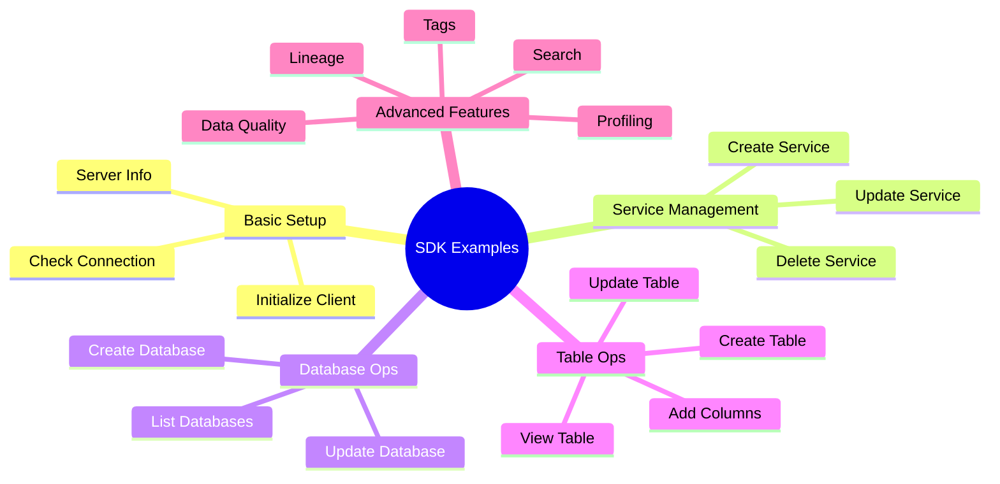

# 📚 OpenMetadata SDK - Practical Examples

**Purpose**: Real-world code examples for common tasks  
**SDK Version**: 1.9.7.0  
**Language**: Python 3.8+

---

## 📋 Table of Contents



1. [Basic Setup](#basic-setup)
2. [Service Management](#service-management)
3. [Database Operations](#database-operations)
4. [Table Operations](#table-operations)
5. [Column Management](#column-management)
6. [Lineage](#lineage)
7. [Profiling](#profiling)
8. [Data Quality](#data-quality)
9. [Tags & Classification](#tags--classification)
10. [Search & Discovery](#search--discovery)

---

## 🚀 Basic Setup

### Initialize SDK Client

```python
from metadata.ingestion.ometa.ometa_api import OpenMetadata
from metadata.generated.schema.entity.services.connections.metadata.openMetadataConnection import (
    OpenMetadataConnection
)
from metadata.generated.schema.security.client.openMetadataJWTClientConfig import (
    OpenMetadataJWTClientConfig
)

# Method 1: JWT Token Authentication
server_config = OpenMetadataJWTClientConfig(
    hostPort="http://localhost:8585/api",
    jwtToken="eyJraWQiOiJHYjM4OWEtOWY3Ni1nZGpzLWE5MmotMDI0MmJrOTQzNTYiLCJ0eXAiOiJKV1QiLCJhbGciOiJSUzI1NiJ9..."
)

metadata = OpenMetadata(server_config)

# Method 2: Basic Auth (less common)
from metadata.generated.schema.security.client.openMetadataJWTClientConfig import (
    OpenMetadataJWTClientConfig
)

server_config = OpenMetadataJWTClientConfig(
    hostPort="http://localhost:8585/api",
    jwtToken="token"
)

metadata = OpenMetadata(server_config)

# Verify connection
print(f"✅ Connected to OpenMetadata: {metadata.health_check()}")
```

### Check Server Info

```python
# Get server version
version = metadata.get_server_version()
print(f"Server version: {version}")

# List available entity types
from metadata.generated.schema.entity.data.table import Table
from metadata.generated.schema.entity.data.database import Database
from metadata.generated.schema.entity.services.databaseService import DatabaseService

# Health check
health = metadata.health_check()
print(f"Server healthy: {health}")
```

---

## 🔧 Service Management

### Create Database Service

```python
from metadata.generated.schema.api.services.createDatabaseService import CreateDatabaseServiceRequest
from metadata.generated.schema.entity.services.connections.database.customDatabaseConnection import (
    CustomDatabaseConnection
)
from metadata.generated.schema.entity.services.databaseService import (
    DatabaseServiceType,
    DatabaseConnection
)

# Create service
service_request = CreateDatabaseServiceRequest(
    name="dremio-prod",
    displayName="Dremio Production",
    description="Production Dremio instance",
    serviceType=DatabaseServiceType.CustomDatabase,
    connection=DatabaseConnection(
        config=CustomDatabaseConnection(
            sourcePythonClass="dremio_connector.dremio_source.DremioConnector",
            connectionOptions={
                "url": "http://dremio.company.com:9047",
                "username": "admin",
                "password": "secure_password"
            }
        )
    )
)

# Create or update
service = metadata.create_or_update(data=service_request)
print(f"✅ Created service: {service.fullyQualifiedName}")
```

### Get Existing Service

```python
# Get by name
service = metadata.get_by_name(
    entity=DatabaseService,
    fqn="dremio-prod"
)

if service:
    print(f"Service ID: {service.id}")
    print(f"Service FQN: {service.fullyQualifiedName}")
    print(f"Service Type: {service.serviceType}")
else:
    print("❌ Service not found")
```

### List All Services

```python
# List all database services
services = metadata.list_all_entities(
    entity=DatabaseService,
    fields=["owner", "tags"]
)

for service in services:
    print(f"- {service.name} ({service.serviceType})")
```

### Update Service

```python
# Get existing service
service = metadata.get_by_name(entity=DatabaseService, fqn="dremio-prod")

# Update properties
service.description = "Updated description"
service.displayName = "Dremio Production v2"

# Patch (partial update)
updated_service = metadata.patch(
    entity=DatabaseService,
    source=service,
    destination=service
)

print(f"✅ Updated service: {updated_service.fullyQualifiedName}")
```

### Delete Service

```python
# Soft delete
metadata.delete(
    entity=DatabaseService,
    entity_id=service.id,
    hard_delete=False  # Soft delete (can be restored)
)

# Hard delete (permanent)
metadata.delete(
    entity=DatabaseService,
    entity_id=service.id,
    hard_delete=True  # Permanent deletion
)
```

---

## 🗄️ Database Operations

### Create Database

```python
from metadata.generated.schema.api.data.createDatabase import CreateDatabaseRequest

# Create database
db_request = CreateDatabaseRequest(
    name="production_data",
    displayName="Production Data",
    description="Production database containing all business data",
    service="dremio-prod",  # Service FQN
    tags=[
        {
            "tagFQN": "PII.Sensitive",
            "labelType": "Automated"
        }
    ]
)

database = metadata.create_or_update(data=db_request)
print(f"✅ Created database: {database.fullyQualifiedName}")
```

### Get Database

```python
# Get by FQN
database = metadata.get_by_name(
    entity=Database,
    fqn="dremio-prod.production_data",
    fields=["owner", "tags", "databaseSchemas"]
)

if database:
    print(f"Database: {database.name}")
    print(f"Service: {database.service.name}")
    print(f"Schemas: {len(database.databaseSchemas or [])}")
```

### List Databases

```python
# List all databases for a service
databases = metadata.list_all_entities(
    entity=Database,
    fields=["service", "owner"]
)

for db in databases:
    print(f"- {db.name} (Service: {db.service.name})")
```

---

## 📊 Table Operations

### Create Table

```python
from metadata.generated.schema.api.data.createTable import CreateTableRequest
from metadata.generated.schema.entity.data.table import (
    Column, DataType, TableType, Constraint, ConstraintType
)

# Define columns
columns = [
    Column(
        name="customer_id",
        displayName="Customer ID",
        dataType=DataType.BIGINT,
        dataLength=1,
        description="Unique customer identifier",
        ordinalPosition=1,
        constraint=Constraint.PRIMARY_KEY
    ),
    Column(
        name="email",
        displayName="Email Address",
        dataType=DataType.VARCHAR,
        dataLength=255,
        description="Customer email address",
        ordinalPosition=2,
        constraint=Constraint.UNIQUE
    ),
    Column(
        name="first_name",
        displayName="First Name",
        dataType=DataType.VARCHAR,
        dataLength=100,
        ordinalPosition=3
    ),
    Column(
        name="last_name",
        displayName="Last Name",
        dataType=DataType.VARCHAR,
        dataLength=100,
        ordinalPosition=4
    ),
    Column(
        name="created_at",
        displayName="Created At",
        dataType=DataType.TIMESTAMP,
        description="Account creation timestamp",
        ordinalPosition=5
    )
]

# Create table
table_request = CreateTableRequest(
    name="customers",
    displayName="Customers",
    description="Customer master data table",
    tableType=TableType.Regular,
    columns=columns,
    databaseSchema="dremio-prod.production_data.public",
    tags=[
        {
            "tagFQN": "PII.Sensitive",
            "labelType": "Automated"
        }
    ]
)

table = metadata.create_or_update(data=table_request)
print(f"✅ Created table: {table.fullyQualifiedName}")
```

### Create View

```python
# Create view with SQL definition
view_request = CreateTableRequest(
    name="active_customers",
    displayName="Active Customers",
    description="View of customers who logged in last 30 days",
    tableType=TableType.View,
    viewDefinition="""
        SELECT 
            customer_id,
            email,
            first_name,
            last_name,
            last_login_at
        FROM customers
        WHERE last_login_at > CURRENT_DATE - INTERVAL '30 days'
        AND status = 'active'
    """,
    columns=columns,  # Same columns as source
    databaseSchema="dremio-prod.production_data.public"
)

view = metadata.create_or_update(data=view_request)
print(f"✅ Created view: {view.fullyQualifiedName}")
```

### Get Table

```python
# Get table with all details
table = metadata.get_by_name(
    entity=Table,
    fqn="dremio-prod.production_data.public.customers",
    fields=["columns", "tags", "owner", "tableConstraints", "sampleData"]
)

if table:
    print(f"Table: {table.name}")
    print(f"Type: {table.tableType}")
    print(f"Columns: {len(table.columns)}")
    print(f"Owner: {table.owner.name if table.owner else 'None'}")
    
    # Print columns
    for col in table.columns:
        print(f"  - {col.name} ({col.dataType})")
```

### Update Table

```python
# Get existing table
table = metadata.get_by_name(
    entity=Table,
    fqn="dremio-prod.production_data.public.customers"
)

# Update description
table.description = "**Updated**: Customer master data with enhanced PII protection"

# Add tags
table.tags = table.tags or []
table.tags.append({
    "tagFQN": "BusinessGlossary.CustomerData",
    "labelType": "Manual"
})

# Patch table
updated_table = metadata.patch(
    entity=Table,
    source=table,
    destination=table
)

print(f"✅ Updated table: {updated_table.fullyQualifiedName}")
```

### Delete Table

```python
# Get table
table = metadata.get_by_name(
    entity=Table,
    fqn="dremio-prod.production_data.public.old_table"
)

# Soft delete
metadata.delete(
    entity=Table,
    entity_id=table.id,
    hard_delete=False
)

print(f"✅ Deleted table: {table.fullyQualifiedName}")
```

---

## 📝 Column Management

### Add Column Description

```python
# Get table
table = metadata.get_by_name(
    entity=Table,
    fqn="dremio-prod.production_data.public.customers",
    fields=["columns"]
)

# Update specific column
for column in table.columns:
    if column.name == "email":
        column.description = "**PII**: Customer email address (encrypted at rest)"
        column.tags = [
            {
                "tagFQN": "PII.Email",
                "labelType": "Automated"
            }
        ]

# Patch table
metadata.patch(entity=Table, source=table, destination=table)
```

### Add Column Tags

```python
from metadata.generated.schema.type.tagLabel import TagLabel, TagSource

# Get table
table = metadata.get_by_name(
    entity=Table,
    fqn="dremio-prod.production_data.public.customers",
    fields=["columns"]
)

# Tag specific columns
pii_columns = ["email", "first_name", "last_name", "phone"]

for column in table.columns:
    if column.name in pii_columns:
        column.tags = column.tags or []
        column.tags.append(
            TagLabel(
                tagFQN="PII.Sensitive",
                source=TagSource.Classification,
                labelType="Automated"
            )
        )

# Update table
metadata.patch(entity=Table, source=table, destination=table)
```

---

## 🔗 Lineage

### Add Table-to-Table Lineage

```python
from metadata.generated.schema.api.lineage.addLineage import AddLineageRequest
from metadata.generated.schema.type.entityLineage import EntitiesEdge, LineageDetails
from metadata.generated.schema.type.entityReference import EntityReference

# Get source and target tables
source_table = metadata.get_by_name(
    entity=Table,
    fqn="dremio-prod.raw.orders"
)

target_table = metadata.get_by_name(
    entity=Table,
    fqn="dremio-prod.analytics.order_summary"
)

# Create lineage
lineage = AddLineageRequest(
    edge=EntitiesEdge(
        fromEntity=EntityReference(
            id=source_table.id,
            type="table",
            fullyQualifiedName=source_table.fullyQualifiedName
        ),
        toEntity=EntityReference(
            id=target_table.id,
            type="table",
            fullyQualifiedName=target_table.fullyQualifiedName
        ),
        lineageDetails=LineageDetails(
            sqlQuery="""
                INSERT INTO analytics.order_summary
                SELECT 
                    customer_id,
                    COUNT(*) as order_count,
                    SUM(amount) as total_amount
                FROM raw.orders
                GROUP BY customer_id
            """,
            source="Dremio ETL",
            description="Aggregates raw orders into summary"
        )
    )
)

# Add lineage
metadata.add_lineage(lineage)
print(f"✅ Added lineage: {source_table.name} → {target_table.name}")
```

### Add Column-Level Lineage

```python
from metadata.generated.schema.type.entityLineage import ColumnLineage

# Create column lineage
column_lineage = [
    ColumnLineage(
        fromColumns=["raw.orders.customer_id"],
        toColumn="analytics.order_summary.customer_id"
    ),
    ColumnLineage(
        fromColumns=["raw.orders.amount"],
        toColumn="analytics.order_summary.total_amount",
        function="SUM"
    ),
    ColumnLineage(
        fromColumns=["raw.orders.order_id"],
        toColumn="analytics.order_summary.order_count",
        function="COUNT"
    )
]

# Add to lineage request
lineage = AddLineageRequest(
    edge=EntitiesEdge(
        fromEntity=source_ref,
        toEntity=target_ref,
        lineageDetails=LineageDetails(
            sqlQuery=sql_query,
            columnsLineage=column_lineage
        )
    )
)

metadata.add_lineage(lineage)
```

### Add Lineage by Query

```python
# Automatically parse SQL and create lineage
sql_query = """
    CREATE TABLE analytics.customer_orders AS
    SELECT 
        c.customer_id,
        c.email,
        o.order_id,
        o.order_date,
        o.amount
    FROM raw.customers c
    LEFT JOIN raw.orders o ON c.customer_id = o.customer_id
"""

# SDK automatically parses SQL and creates lineage
metadata.add_lineage_by_query(
    query=sql_query,
    service_name="dremio-prod"
)
```

---

## 📈 Profiling

### Add Table Profile

```python
from metadata.generated.schema.entity.data.table import TableProfile, ColumnProfile
from datetime import datetime

# Create table profile
profile = TableProfile(
    timestamp=int(datetime.now().timestamp() * 1000),
    rowCount=1500000,
    columnCount=25,
    profileSample=10.0,  # 10% sample
    profileDate=datetime.now().strftime("%Y-%m-%d")
)

# Ingest profile
metadata.ingest_profile_data(
    table_fqn="dremio-prod.production_data.public.customers",
    profile_sample=profile
)

print("✅ Added table profile")
```

### Add Column Profiles

```python
from metadata.generated.schema.entity.data.table import ColumnProfile, Histogram

# Create column profiles
column_profiles = [
    ColumnProfile(
        name="customer_id",
        timestamp=int(datetime.now().timestamp() * 1000),
        valuesCount=1500000,
        uniqueCount=1500000,
        uniqueProportion=1.0,
        nullCount=0,
        nullProportion=0.0,
        min=1,
        max=1500000,
        mean=750000.5,
        median=750000.0,
        stddev=433012.7
    ),
    ColumnProfile(
        name="email",
        timestamp=int(datetime.now().timestamp() * 1000),
        valuesCount=1500000,
        uniqueCount=1485000,
        uniqueProportion=0.99,
        nullCount=15000,
        nullProportion=0.01,
        validCount=1485000
    ),
    ColumnProfile(
        name="age",
        timestamp=int(datetime.now().timestamp() * 1000),
        valuesCount=1500000,
        uniqueCount=80,
        min=18,
        max=98,
        mean=45.2,
        median=44.0,
        stddev=15.3,
        histogram=Histogram(
            boundaries=["18", "30", "40", "50", "60", "98"],
            frequencies=[150000, 450000, 300000, 375000, 225000]
        )
    )
]

# Add to table profile
profile = TableProfile(
    timestamp=int(datetime.now().timestamp() * 1000),
    rowCount=1500000,
    columnCount=25,
    columnProfile=column_profiles
)

metadata.ingest_profile_data(
    table_fqn="dremio-prod.production_data.public.customers",
    profile_sample=profile
)

print("✅ Added column profiles")
```

---

## ✅ Data Quality

### Create Test Case

```python
from metadata.generated.schema.api.tests.createTestCase import CreateTestCaseRequest
from metadata.generated.schema.tests.testCase import TestCaseParameterValue

# Create test case
test_case = CreateTestCaseRequest(
    name="customers_row_count_check",
    displayName="Customers Row Count Check",
    description="Ensure customers table has expected row count",
    testDefinition="tableRowCountToBeBetween",
    entityLink="<#E::table::dremio-prod.production_data.public.customers>",
    parameterValues=[
        TestCaseParameterValue(
            name="minValue",
            value="1000000"
        ),
        TestCaseParameterValue(
            name="maxValue",
            value="2000000"
        )
    ]
)

# Create test
test = metadata.create_or_update(data=test_case)
print(f"✅ Created test: {test.name}")
```

### Add Test Results

```python
from metadata.generated.schema.tests.basic import TestCaseResult, TestCaseStatus
from datetime import datetime

# Create test result
result = TestCaseResult(
    timestamp=int(datetime.now().timestamp() * 1000),
    testCaseStatus=TestCaseStatus.Success,
    result="Row count: 1,500,000 (within range)",
    sampleData="N/A",
    testResultValue=[
        {
            "name": "rowCount",
            "value": "1500000"
        }
    ]
)

# Add result
metadata.add_test_case_results(
    test_case_fqn=test.fullyQualifiedName,
    test_case_result=result
)

print("✅ Added test result")
```

---

## 🏷️ Tags & Classification

### Create Tag Category

```python
from metadata.generated.schema.api.classification.createTag import CreateTagRequest
from metadata.generated.schema.api.classification.createClassification import (
    CreateClassificationRequest
)

# Create classification (tag category)
classification = CreateClassificationRequest(
    name="DataPrivacy",
    displayName="Data Privacy",
    description="Classification for data privacy levels"
)

created_classification = metadata.create_or_update(data=classification)

# Create tags
tags = [
    CreateTagRequest(
        classification=classification.name,
        name="Public",
        description="Publicly accessible data"
    ),
    CreateTagRequest(
        classification=classification.name,
        name="Internal",
        description="Internal use only"
    ),
    CreateTagRequest(
        classification=classification.name,
        name="Confidential",
        description="Confidential business data"
    ),
    CreateTagRequest(
        classification=classification.name,
        name="Restricted",
        description="Highly restricted data"
    )
]

for tag in tags:
    metadata.create_or_update(data=tag)

print("✅ Created classification and tags")
```

### Apply Tags to Table

```python
# Get table
table = metadata.get_by_name(
    entity=Table,
    fqn="dremio-prod.production_data.public.customers"
)

# Add tags
table.tags = [
    {
        "tagFQN": "DataPrivacy.Confidential",
        "labelType": "Manual"
    },
    {
        "tagFQN": "PII.Sensitive",
        "labelType": "Automated"
    }
]

# Update table
metadata.patch(entity=Table, source=table, destination=table)
```

---

## 🔍 Search & Discovery

### Search Tables

```python
# Search by name
results = metadata.es_search_from_fqn(
    entity_type=Table,
    fqn_search_string="customer*"
)

for table in results:
    print(f"- {table.fullyQualifiedName}")
```

### List All Tables

```python
# List all tables with pagination
tables = metadata.list_all_entities(
    entity=Table,
    fields=["columns", "tags", "owner"],
    limit=100
)

for table in tables:
    print(f"- {table.name} ({len(table.columns)} columns)")
```

### Advanced Search

```python
from metadata.generated.schema.api.search.searchRequest import SearchRequest

# Complex search
search_request = SearchRequest(
    query="customers",
    filters={
        "tags": ["PII.Sensitive"],
        "service": ["dremio-prod"]
    },
    from_=0,
    size=20
)

results = metadata.search_entities(request=search_request)

for hit in results['hits']['hits']:
    print(f"- {hit['_source']['name']}")
```

---

## 📚 Complete Example: End-to-End Ingestion

```python
from metadata.ingestion.ometa.ometa_api import OpenMetadata
from metadata.generated.schema.security.client.openMetadataJWTClientConfig import (
    OpenMetadataJWTClientConfig
)
from metadata.generated.schema.api.services.createDatabaseService import (
    CreateDatabaseServiceRequest
)
from metadata.generated.schema.api.data.createDatabase import CreateDatabaseRequest
from metadata.generated.schema.api.data.createDatabaseSchema import CreateDatabaseSchemaRequest
from metadata.generated.schema.api.data.createTable import CreateTableRequest
from metadata.generated.schema.entity.data.table import Column, DataType, TableType
from metadata.generated.schema.entity.services.databaseService import DatabaseServiceType
from datetime import datetime

def ingest_dremio_metadata():
    """Complete example: Ingest Dremio metadata into OpenMetadata"""
    
    # 1. Initialize SDK client
    print("📡 Connecting to OpenMetadata...")
    server_config = OpenMetadataJWTClientConfig(
        hostPort="http://localhost:8585/api",
        jwtToken="your-jwt-token"
    )
    metadata = OpenMetadata(server_config)
    print("✅ Connected")
    
    # 2. Create service
    print("\n🔧 Creating service...")
    service_request = CreateDatabaseServiceRequest(
        name="dremio-prod",
        serviceType=DatabaseServiceType.CustomDatabase,
        connection={"config": {"type": "CustomDatabase"}}
    )
    service = metadata.create_or_update(data=service_request)
    print(f"✅ Service: {service.fullyQualifiedName}")
    
    # 3. Create database
    print("\n🗄️ Creating database...")
    db_request = CreateDatabaseRequest(
        name="analytics",
        service=service.fullyQualifiedName
    )
    database = metadata.create_or_update(data=db_request)
    print(f"✅ Database: {database.fullyQualifiedName}")
    
    # 4. Create schema
    print("\n📂 Creating schema...")
    schema_request = CreateDatabaseSchemaRequest(
        name="public",
        database=database.fullyQualifiedName
    )
    schema = metadata.create_or_update(data=schema_request)
    print(f"✅ Schema: {schema.fullyQualifiedName}")
    
    # 5. Create table
    print("\n📊 Creating table...")
    table_request = CreateTableRequest(
        name="customers",
        databaseSchema=schema.fullyQualifiedName,
        tableType=TableType.Regular,
        columns=[
            Column(name="id", dataType=DataType.BIGINT, ordinalPosition=1),
            Column(name="email", dataType=DataType.VARCHAR, dataLength=255, ordinalPosition=2),
            Column(name="name", dataType=DataType.VARCHAR, dataLength=200, ordinalPosition=3)
        ]
    )
    table = metadata.create_or_update(data=table_request)
    print(f"✅ Table: {table.fullyQualifiedName}")
    
    # 6. Add profiling
    print("\n📈 Adding profile...")
    from metadata.generated.schema.entity.data.table import TableProfile, ColumnProfile
    
    profile = TableProfile(
        timestamp=int(datetime.now().timestamp() * 1000),
        rowCount=10000,
        columnCount=3
    )
    metadata.ingest_profile_data(table.fullyQualifiedName, profile)
    print("✅ Profile added")
    
    print("\n🎉 Ingestion complete!")

if __name__ == "__main__":
    ingest_dremio_metadata()
```

---

**Document Version**: 1.0  
**Last Updated**: October 16, 2025  
**SDK Version**: openmetadata-ingestion 1.9.7.0
