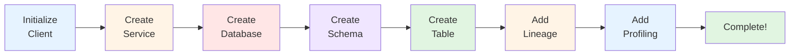

# 🎯 OpenMetadata SDK - Quick Reference Card

**Version**: 1.9.7.0 | **Updated**: October 16, 2025



---

## 🚀 Quick Start

```python
# Initialize
from metadata.ingestion.ometa.ometa_api import OpenMetadata
from metadata.generated.schema.security.client.openMetadataJWTClientConfig import OpenMetadataJWTClientConfig

config = OpenMetadataJWTClientConfig(
    hostPort="http://localhost:8585/api",
    jwtToken="your-token"
)
metadata = OpenMetadata(config)
```

---

## 📦 Common Imports

```python
# API Client
from metadata.ingestion.ometa.ometa_api import OpenMetadata

# Entities
from metadata.generated.schema.entity.data.table import Table, Column, DataType, TableType
from metadata.generated.schema.entity.data.database import Database
from metadata.generated.schema.entity.data.databaseSchema import DatabaseSchema
from metadata.generated.schema.entity.services.databaseService import DatabaseService

# Request Models
from metadata.generated.schema.api.data.createTable import CreateTableRequest
from metadata.generated.schema.api.data.createDatabase import CreateDatabaseRequest
from metadata.generated.schema.api.data.createDatabaseSchema import CreateDatabaseSchemaRequest

# Utilities
from metadata.ingestion.api.models import Either, StackTraceError
from metadata.utils import fqn
from metadata.utils.logger import ingestion_logger
```

---

## 🔧 Essential Operations

### Create Service
```python
from metadata.generated.schema.api.services.createDatabaseService import CreateDatabaseServiceRequest
service = metadata.create_or_update(data=CreateDatabaseServiceRequest(...))
```

### Get Entity
```python
table = metadata.get_by_name(entity=Table, fqn="service.db.schema.table")
service = metadata.get_by_id(entity=DatabaseService, entity_id=uuid)
```

### List Entities
```python
tables = metadata.list_all_entities(entity=Table, fields=["columns", "tags"])
```

### Update Entity
```python
updated = metadata.patch(entity=Table, source=old_table, destination=new_table)
```

### Delete Entity
```python
metadata.delete(entity=Table, entity_id=uuid, hard_delete=False)
```

---

## 📊 Data Types

```python
DataType.INT, DataType.BIGINT, DataType.FLOAT, DataType.DOUBLE
DataType.VARCHAR, DataType.CHAR, DataType.TEXT, DataType.STRING
DataType.DATE, DataType.TIME, DataType.TIMESTAMP, DataType.DATETIME
DataType.BOOLEAN, DataType.JSON, DataType.ARRAY, DataType.STRUCT
```

---

## 🔗 Lineage

```python
from metadata.generated.schema.api.lineage.addLineage import AddLineageRequest
from metadata.generated.schema.type.entityLineage import EntitiesEdge

lineage = AddLineageRequest(
    edge=EntitiesEdge(
        fromEntity=source_ref,
        toEntity=target_ref,
        lineageDetails=LineageDetails(sqlQuery="...")
    )
)
metadata.add_lineage(lineage)
```

---

## 📈 Profiling

```python
from metadata.generated.schema.entity.data.table import TableProfile, ColumnProfile

profile = TableProfile(
    timestamp=int(time.time() * 1000),
    rowCount=10000,
    columnProfile=[ColumnProfile(...)]
)
metadata.ingest_profile_data(table_fqn, profile)
```

---

## ✅ Data Quality

```python
from metadata.generated.schema.api.tests.createTestCase import CreateTestCaseRequest

test = metadata.create_or_update(data=CreateTestCaseRequest(...))
metadata.add_test_case_results(test_fqn, test_result)
```

---

## 🏷️ Tags

```python
# Apply tags
table.tags = [{"tagFQN": "PII.Sensitive", "labelType": "Automated"}]
metadata.patch(entity=Table, source=table, destination=table)
```

---

## 🔍 Search

```python
# Simple search
results = metadata.es_search_from_fqn(entity_type=Table, fqn_search_string="customer*")

# List all
tables = metadata.list_all_entities(entity=Table)
```

---

## 🛠️ Error Handling

```python
from metadata.ingestion.api.models import Either, StackTraceError

try:
    yield Either(right=table_request)
except Exception as e:
    yield Either(left=StackTraceError(name="table", error=str(e)))
```

---

## 🎯 Connector Pattern

```python
from metadata.ingestion.source.database.database_service import DatabaseServiceSource

class MyConnector(DatabaseServiceSource):
    def __init__(self, config, metadata: OpenMetadata):
        super().__init__(config, metadata)
        self.ometa = metadata  # SDK client
    
    def get_database_names(self) -> Iterable[str]:
        yield "database1"
    
    def yield_database(self, db_name: str):
        yield Either(right=CreateDatabaseRequest(...))
    
    def get_database_schema_names(self) -> Iterable[str]:
        yield "schema1"
    
    def yield_database_schema(self, schema_name: str):
        yield Either(right=CreateDatabaseSchemaRequest(...))
    
    def get_tables_name_and_type(self) -> Iterable[Tuple[str, TableType]]:
        yield ("table1", TableType.Regular)
    
    def yield_table(self, table_info: Tuple[str, TableType]):
        table_name, table_type = table_info
        yield Either(right=CreateTableRequest(...))
```

---

## 📋 142 API Methods (Top 30)

```python
# CRUD
metadata.create()
metadata.create_or_update()
metadata.patch()
metadata.delete()

# Retrieval
metadata.get_by_name()
metadata.get_by_id()
metadata.list_all_entities()
metadata.list_entities()

# Lineage
metadata.add_lineage()
metadata.add_lineage_by_query()
metadata.add_mlmodel_lineage()

# Profiling
metadata.ingest_profile_data()
metadata.create_or_update_table_profiler_config()

# Data Quality
metadata.add_test_case_results()
metadata.create_test_case_resolution()

# Pipeline
metadata.create_or_update_pipeline_status()
metadata.add_pipeline_status()

# Custom Properties
metadata.create_or_update_custom_property()
metadata.create_or_update_custom_metric()

# Search
metadata.es_search_from_fqn()

# Health
metadata.health_check()

# Assets
metadata.add_assets_to_data_product()

# Settings
metadata.create_or_update_settings()
```

---

## 🐛 Debugging

```python
# Enable debug logging
import logging
from metadata.utils.logger import set_loggers_level

set_loggers_level(logging.DEBUG)

# Check connection
assert metadata.health_check(), "Connection failed"

# Validate Pydantic models
try:
    table = CreateTableRequest(...)
except ValidationError as e:
    print(e.json())
```

---

## 📚 Complete Documentation

1. **OPENMETADATA_SDK_ANALYSIS.md** - Full analysis (15,000 words)
2. **SDK_MIGRATION_GUIDE.md** - Step-by-step migration
3. **SDK_PRACTICAL_EXAMPLES.md** - 50+ code examples
4. **SDK_EXECUTIVE_SUMMARY.md** - Executive overview

---

## 🔗 Resources

- **Docs**: https://docs.open-metadata.org/
- **GitHub**: https://github.com/open-metadata/OpenMetadata
- **Slack**: https://slack.open-metadata.org/
- **API**: http://localhost:8585/swagger-ui/

---

## ⚡ Most Common Tasks

### 1. Create a Table
```python
table = CreateTableRequest(
    name="customers",
    databaseSchema="service.db.schema",
    columns=[Column(name="id", dataType=DataType.BIGINT)]
)
metadata.create_or_update(data=table)
```

### 2. Add Lineage
```python
metadata.add_lineage(AddLineageRequest(
    edge=EntitiesEdge(fromEntity=src, toEntity=dst)
))
```

### 3. Add Profile
```python
metadata.ingest_profile_data(
    table_fqn,
    TableProfile(rowCount=1000)
)
```

### 4. Search Tables
```python
tables = metadata.list_all_entities(entity=Table)
```

### 5. Tag Entity
```python
table.tags = [{"tagFQN": "PII.Sensitive"}]
metadata.patch(entity=Table, source=table, destination=table)
```

---

**Print this card for quick reference!**  
**Last Updated**: October 16, 2025
