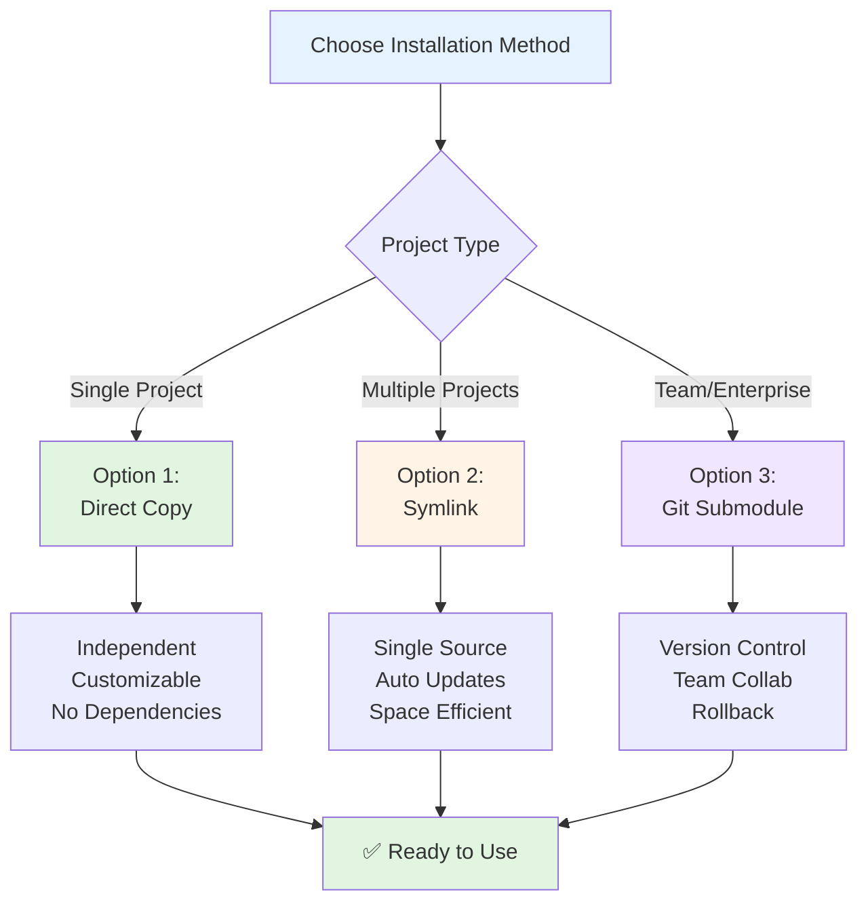
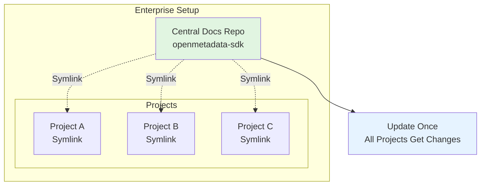

# 🚀 How to Use This Documentation in Other Projects

This guide shows you how to reuse this OpenMetadata SDK documentation library in any project.

---

## 📦 Installation Options



### Option 1: Direct Copy (Recommended)

**Best for**: Each project has its own copy

```bash
# From your new project directory
mkdir -p docs
cp -r /path/to/dremio/docs/openmetadata-sdk docs/

# Verify
ls docs/openmetadata-sdk/
# Should see: README.md, 00-INDEX.md, 01-EXECUTIVE_SUMMARY.md, etc.
```

**Pros**: 
- ✅ Independent of source project
- ✅ Can customize per project
- ✅ No dependencies

**Cons**:
- ⚠️ Must update manually
- ⚠️ Takes disk space (minimal)

---

### Option 2: Symlink

**Best for**: Multiple projects, centralized updates

```bash
# Keep docs in one place, link to others
ln -s /path/to/dremio/docs/openmetadata-sdk /your-project/docs/openmetadata-sdk

# Windows equivalent
mklink /D "C:\your-project\docs\openmetadata-sdk" "C:\projets\dremio\docs\openmetadata-sdk"
```

**Pros**:
- ✅ Single source of truth
- ✅ Updates propagate automatically
- ✅ Saves disk space

**Cons**:
- ⚠️ Requires original location
- ⚠️ Changes affect all projects

---

### Option 3: Git Submodule (Advanced)

**Best for**: Team environment, version control

```bash
# Convert to separate repo first
cd /path/to/dremio/docs/openmetadata-sdk
git init
git add .
git commit -m "Initial SDK documentation"
# Push to your Git server

# Then in other projects
git submodule add <your-repo-url> docs/openmetadata-sdk
git submodule update --init --recursive
```

**Pros**:
- ✅ Version controlled
- ✅ Team can contribute
- ✅ Rollback capability

**Cons**:
- ⚠️ More complex setup
- ⚠️ Requires Git knowledge

---

## 🎯 Project-Specific Customization

### 1. Update Project References

After copying, update these sections in documents:

#### In `01-EXECUTIVE_SUMMARY.md`:
```markdown
# Find:
**Project**: Dremio Connector

# Replace with:
**Project**: Your Project Name
```

#### In `03-MIGRATION_GUIDE.md`:
```markdown
# Find:
dremio_connector/

# Replace with:
your_connector/
```

### 2. Add Your Project Context

Create a new file: `00-PROJECT_CONTEXT.md`

```markdown
# Project-Specific Context

## Our Implementation
- **Project**: YourProjectName
- **Connector Type**: Database/Dashboard/Pipeline
- **Source System**: MySQL/Tableau/Airflow
- **Team**: Data Engineering
- **Contact**: team@company.com

## Custom Patterns
[Document your project-specific patterns here]

## Known Issues
[Document issues specific to your integration]

## Team Notes
[Team-specific information]
```

---

## 📝 Template Checklist

Use this checklist when copying to a new project:

### Initial Setup ✅
- [ ] Copy or link documentation folder
- [ ] Verify all 6 files are present
- [ ] Create `00-PROJECT_CONTEXT.md`
- [ ] Update project name in key files
- [ ] Test links work

### Customization ✅
- [ ] Replace "Dremio" references with your project
- [ ] Update connector paths in code examples
- [ ] Add project-specific examples
- [ ] Document custom patterns
- [ ] Add team contact info

### Integration ✅
- [ ] Link from main project README
- [ ] Add to developer onboarding docs
- [ ] Share with team
- [ ] Schedule documentation review
- [ ] Plan update schedule

---

## 📚 Recommended Project Structure

```
your-project/
├── README.md                          # Main project README
├── docs/
│   ├── README.md                      # Docs overview
│   ├── openmetadata-sdk/              # ⭐ THIS LIBRARY
│   │   ├── README.md
│   │   ├── 00-INDEX.md
│   │   ├── 00-PROJECT_CONTEXT.md      # Your additions
│   │   ├── 01-EXECUTIVE_SUMMARY.md
│   │   ├── 02-COMPLETE_ANALYSIS.md
│   │   ├── 03-MIGRATION_GUIDE.md
│   │   ├── 04-PRACTICAL_EXAMPLES.md
│   │   └── 05-QUICK_REFERENCE.md
│   ├── architecture/                  # Your architecture docs
│   ├── api/                           # Your API docs
│   └── development/                   # Your dev guides
├── src/
│   └── your_connector/
├── tests/
└── requirements.txt
```

---

## 🔗 Link from Main README

Add this section to your main project `README.md`:

```markdown
## 📚 Documentation

### OpenMetadata SDK Reference
Complete OpenMetadata SDK documentation and migration guide.

**Quick Links**:
- 📍 [Start Here](docs/openmetadata-sdk/00-INDEX.md) - Documentation index
- ⚡ [Executive Summary](docs/openmetadata-sdk/01-EXECUTIVE_SUMMARY.md) - 10-min overview
- 🎯 [Quick Reference](docs/openmetadata-sdk/05-QUICK_REFERENCE.md) - Cheat sheet
- 💻 [Code Examples](docs/openmetadata-sdk/04-PRACTICAL_EXAMPLES.md) - 50+ examples

**For Developers**:
1. New to OpenMetadata? Start with [Executive Summary](docs/openmetadata-sdk/01-EXECUTIVE_SUMMARY.md)
2. Building a connector? Follow [Migration Guide](docs/openmetadata-sdk/03-MIGRATION_GUIDE.md)
3. Need examples? Check [Practical Examples](docs/openmetadata-sdk/04-PRACTICAL_EXAMPLES.md)
4. Quick lookup? Use [Quick Reference](docs/openmetadata-sdk/05-QUICK_REFERENCE.md)
```

---

## 🎓 Team Onboarding



```mermaid
gantt
    title New Team Member Onboarding - Day 1
    dateFormat HH:mm
    axisFormat %H:%M
    
    section Reading
    Executive Summary     :done, 09:00, 10min
    Quick Reference      :done, 09:10, 15min
    Practical Examples   :active, 09:25, 90min
    
    section Hands-on
    Setup Environment    :10:55, 30min
    Run Examples         :11:25, 45min
    Create Test Service  :12:10, 15min
    
    section Practice
    Create Test Table    :14:00, 30min
    Add Lineage         :14:30, 30min
    Review with Mentor   :15:00, 30min
```

Add to your onboarding documentation:

```markdown
## Day 1: OpenMetadata SDK Training

### Reading (2 hours)
- [ ] Read [Executive Summary](docs/openmetadata-sdk/01-EXECUTIVE_SUMMARY.md) (10 min)
- [ ] Read [Quick Reference](docs/openmetadata-sdk/05-QUICK_REFERENCE.md) (15 min)
- [ ] Study [Practical Examples](docs/openmetadata-sdk/04-PRACTICAL_EXAMPLES.md) (1.5 hours)

### Hands-on (2 hours)
- [ ] Set up development environment
- [ ] Run example code from documentation
- [ ] Create a test service in OpenMetadata
- [ ] Create a test table
- [ ] Add sample lineage

### Resources
- Documentation: `docs/openmetadata-sdk/`
- Mentor: [Team Lead Name]
- Slack Channel: #openmetadata-dev
```

---

## 🔄 Keeping Documentation Updated

### Update Schedule

```markdown
## Documentation Review Schedule

- **Weekly**: Review practical examples for accuracy
- **Monthly**: Check for SDK version updates
- **Quarterly**: Full documentation review
- **After SDK Upgrade**: Update all version references
```

### Update Checklist

```markdown
## When Updating SDK Version

- [ ] Update version in README.md
- [ ] Update version in all documents
- [ ] Test all code examples
- [ ] Update API method list if changed
- [ ] Update dependencies list
- [ ] Add to version history
- [ ] Notify team
```

---

## 💼 Enterprise Usage

### Multi-Project Organization



For organizations with many OpenMetadata projects:

```
company-docs/
├── openmetadata-sdk/          # Central copy
│   └── [all documentation]
│
├── project-templates/
│   └── connector-template/
│       └── docs/
│           └── openmetadata-sdk/  # Symlink to central
│
└── projects/
    ├── project-a/
    │   └── docs/
    │       └── openmetadata-sdk/  # Symlink to central
    ├── project-b/
    │   └── docs/
    │       └── openmetadata-sdk/  # Symlink to central
    └── project-c/
        └── docs/
            └── openmetadata-sdk/  # Symlink to central
```

### Version Management

```bash
# Tag versions for rollback
cd /path/to/central/openmetadata-sdk
git tag v1.0-sdk-1.9.7
git tag v1.1-sdk-1.10.0
git push --tags

# Projects can pin to specific versions
git submodule add -b v1.0-sdk-1.9.7 <repo> docs/openmetadata-sdk
```

---

## 🚀 Quick Copy Commands

### Linux/Mac

```bash
# Copy to new project
cp -r /path/to/dremio/docs/openmetadata-sdk /path/to/new-project/docs/

# Create symlink
ln -s /path/to/dremio/docs/openmetadata-sdk /path/to/new-project/docs/openmetadata-sdk

# Verify
ls -la /path/to/new-project/docs/openmetadata-sdk/
```

### Windows PowerShell

```powershell
# Copy to new project
Copy-Item -Path "C:\projets\dremio\docs\openmetadata-sdk" `
          -Destination "C:\projects\new-project\docs\" `
          -Recurse -Force

# Create symlink (requires admin)
New-Item -ItemType SymbolicLink `
         -Path "C:\projects\new-project\docs\openmetadata-sdk" `
         -Target "C:\projets\dremio\docs\openmetadata-sdk"

# Verify
Get-ChildItem "C:\projects\new-project\docs\openmetadata-sdk"
```

### Git

```bash
# If using git submodules
cd /path/to/new-project
git submodule add <repo-url> docs/openmetadata-sdk
git commit -m "Add OpenMetadata SDK documentation"
```

---

## 📋 Success Stories Template

Document how the docs helped your project:

```markdown
# Success Story: [Project Name]

## Challenge
[What problem were you solving?]

## Solution
[How did this documentation help?]

## Results
- Time saved: [X hours/days]
- Issues avoided: [Y bugs/problems]
- Team velocity: [+Z%]

## Key Documents Used
- Most helpful: [Document name]
- Most referenced: [Document name]
- Team favorite: [Document name]

## Recommendations
[What would you tell other teams?]
```

---

## ✅ Final Checklist

Before considering the documentation "installed":

- [ ] Documentation copied/linked successfully
- [ ] All files accessible and readable
- [ ] Project-specific context added
- [ ] Main README updated with links
- [ ] Team notified and trained
- [ ] Update schedule established
- [ ] Success metrics defined
- [ ] First team member onboarded using docs

---

## 🎉 You're Done!

The documentation is now ready to use in your project. 

**Next Steps**:
1. Share this guide with your team
2. Schedule a documentation walkthrough
3. Start your first migration
4. Document your learnings

---

**Questions?** Check the [main README](README.md) or reach out to your team lead.

**Happy Building! 🚀**
