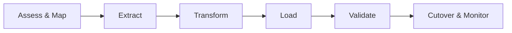

# Migration Guide: Move to OpenMetadata

This guide describes how to migrate from legacy catalogs (e.g., Collibra, Purview, Alation, custom solutions) to OpenMetadata v1.10.3 with confidence and minimal downtime.

## Migration phases


### 1) Assess & map
- Inventory current metadata: entities, owners, tags, glossary, lineage, policies, domains
- Define mapping to OM models: Tables/Topics/Dashboards/Pipelines, Tags/Tiers, GlossaryTerms, Policies, Users/Teams, Domains
- Identify data sources feeding the legacy tool; prefer migrating from source-of-truth where possible

Deliverables:
- Field-by-field mapping sheets
- Out-of-scope list (e.g., deprecated assets)
- Success criteria and validation plan

### 2) Extract
Options:
- Export from legacy tool (CSV, JSON dumps, APIs)
- Pull from source systems using OM connectors (preferred for freshness)

Recommended:
- Use OM ingestion for sources (DBs, BI, pipelines) to bootstrap assets
- Export only additional curation from legacy (terms, descriptions, ownership) via CSV/API

### 3) Transform
- Normalize FQNs and names to OM conventions
- Map tags/terms/tiers/domains and ownership to OM schemas
- Validate references (owners, teams, services) exist or pre-create them

### 4) Load
Paths:
- Bulk load via REST APIs (Tags, Glossary, Domains, Policies, Users/Teams)
- Apply descriptions/owners via JSON Patch
- Load lineage via Lineage API

Safety:
- Dry run in a non-prod environment; snapshot and rollback plan
- Batch changes and rate limit; handle 429/5xx with retries

### 5) Validate
Checklist:
- Asset counts by service match expectations (± agreed tolerance)
- Key entities have ownership, tiers, and descriptions
- Terms and tags applied according to mapping
- Lineage graphs show critical flows end-to-end

### 6) Cutover & monitor
- Freeze changes in legacy tool; communicate switch date
- Grant access and train users on OpenMetadata
- Monitor ingestion, search indexing, and error rates post-cutover

## Concept mapping examples
| Legacy concept | OpenMetadata |
|---|---|
| Business Glossary Term | GlossaryTerm |
| Steward/Owner | Owner (User/Team) |
| Criticality | Tier (Tier1..Tier5) |
| Domain | Domain |
| Tag | TagCategory.Tag |
| Data Flow | Lineage Edge |

## Minimal API playbook
- Create a Tag:
```
POST /v1/tags {"name":"Confidential"}
```
- Add a GlossaryTerm under a Glossary:
```
POST /v1/glossaryTerms {"name":"Customer","glossary":{"id":"<uuid>"}}
```
- Assign an owner to a Table:
```
PATCH /v1/tables/{id} [ {"op":"replace","path":"/owner","value":{"id":"<uuid>","type":"user"}} ]
```

## Rollback strategy
- Take DB snapshots and export indices before loads
- Apply changes in idempotent batches; keep operation logs
- For failures, restore snapshot or replay from previous checkpoint

## Tips and pitfalls
- Trust source systems more than legacy exports when possible
- Establish FQN rules early to avoid duplicate entities
- Import glossary/terms before applying tags that reference them
- Plan lineage carefully—start with key pipelines, expand iteratively

## Related documentation
- [APIs & Integration](../03-technical-deep-dive/apis-integration.md)
- [Data Lineage](../07-advanced-topics/data-lineage.md)
- [User Governance Guide](../06-user-guides/data-governance.md)
- [Configuration Guide](../04-deployment-operations/configuration-guide.md)

---

Last Updated: October 29, 2025
