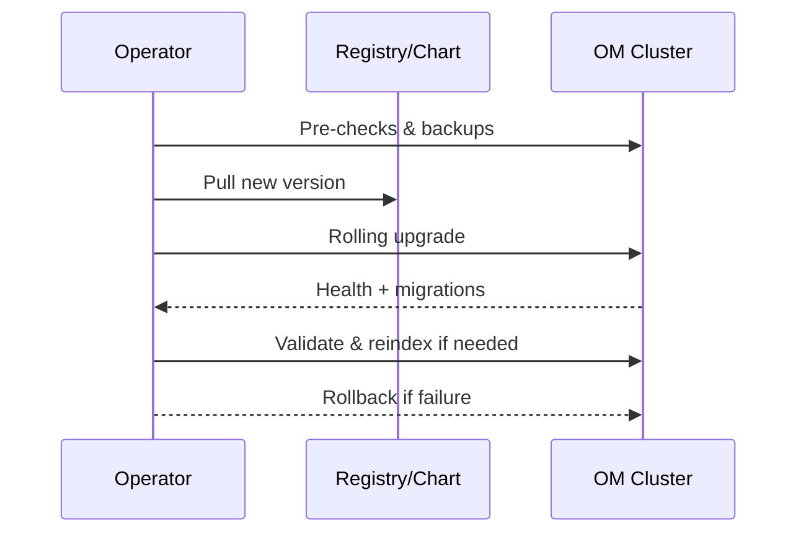

# Upgrade Guide: OpenMetadata

This guide describes how to upgrade OpenMetadata deployments (Docker Compose and Helm/Kubernetes) safely, including pre-checks, backup, version compatibility, and rollback.

## Summary flow

## Pre-upgrade checklist
- Read release notes for breaking changes
- Confirm platform versions: DB (MySQL/Postgres), Search (OpenSearch/Elasticsearch), Kafka
- Backup metadata DB and configuration
- Export configuration values (Helm values.yaml or env files)
- Verify availability SLOs and maintenance window

## Version compatibility
- Minor upgrades (x.y.z ➜ x.y.(z+1)): typically safe, rolling
- Patch releases usually contain bug fixes
- Major/minor bumps may require DB migrations and search reindexing

## Docker Compose
1) Stop ingestion jobs to reduce churn
2) Update image tags in docker-compose.yaml (service, UI, ingestion)
3) Pull images and restart in dependency order (DB/Search first if upgraded separately)
4) Verify service health endpoints and UI
5) Run data migrations if required by release notes
6) Resume ingestion and monitor

Rollback: Revert image tags and restart; restore DB snapshot if migrations changed schema incompatibly.

## Helm/Kubernetes
1) Backup: take DB snapshot and save current values.yaml
2) Update Helm repo/chart to target version
3) Apply changes with a rolling strategy; set maxUnavailable appropriately
4) Watch rollout status of deployments/statefulsets
5) Validate service health, metrics, and search index integrity
6) If needed, trigger reindex jobs or backfills

Zero/minimal downtime tips:
- Run rolling upgrades; ensure readiness and liveness probes are correct
- Stagger ingestion jobs; pause non-critical connectors
- Use PDBs and HPA to maintain availability

Rollback:
- `helm rollback <release> <rev>` to prior revision
- Restore DB from snapshot if schema changed

## Post-upgrade validation
- Smoke tests: login, search, view entity pages, lineage graph
- Verify background jobs, webhooks, and policy evaluations
- Check logs for warnings/errors; review metrics and alerts

## Troubleshooting
- Pods crashlooping: inspect config/env diff; check secrets and TLS certs
- 500s on API: check DB connections, pending migrations, or search connectivity
- Search results stale: run reindex or verify index mappings
- Ingestion failures: update connector versions to match OM server

## References
- [Configuration Guide](../04-deployment-operations/configuration-guide.md)
- [Infrastructure Requirements](../04-deployment-operations/infrastructure-requirements.md)
- [Monitoring & Maintenance](../04-deployment-operations/monitoring-maintenance.md)

---

Last Updated: October 29, 2025
