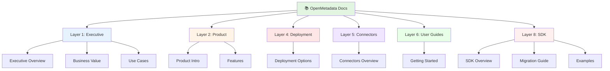

# OpenMetadata v1.10.3 - Documentation Index

## 📑 Complete Documentation Index



This index provides quick access to all sections of the OpenMetadata documentation package.

---

## 🚀 Quick Access

### Most Important Documents
1. **[START HERE - README](README.md)** - Documentation overview and navigation
2. **[Quick Reference Guide](QUICK-REFERENCE.md)** - Essential commands and info
3. **[Getting Started](06-user-guides/getting-started.md)** - Step-by-step tutorial
4. **[Documentation Summary](DOCUMENTATION-SUMMARY.md)** - Package overview

---

## 📚 Full Documentation by Layer

### Layer 1: Executive & Business Overview

#### 1.1 Executive Overview
**File**: `01-executive-summary/executive-overview.md`

**Topics Covered**:
- What is OpenMetadata?
- Why choose OpenMetadata?
- Platform capabilities at a glance
- Deployment models
- Target use cases
- Market positioning
- Success metrics
- Implementation timeline
- Investment considerations
- Strategic recommendations

**Audience**: CTO, CIO, CDO, VP Engineering  
**Reading Time**: 15-20 minutes

---

#### 1.2 Business Value & ROI
**File**: `01-executive-summary/business-value.md`

**Topics Covered**:
- Business value framework
- ROI models (small, mid-size, enterprise)
- Value realization timeline
- Total cost of ownership (3-year)
- Cost-benefit analysis
- Value drivers by department
- Comparison with commercial alternatives
- Risk-adjusted ROI
- Strategic value beyond ROI

**Audience**: CFO, Finance, Business Leaders  
**Reading Time**: 25-30 minutes

---

#### 1.3 Use Cases & Success Stories
**File**: `01-executive-summary/use-cases.md`

**Topics Covered**:
- Industry use cases (Financial Services, Healthcare, Retail, Technology, Manufacturing)
- Use case patterns (Discovery, Governance, Quality, DataOps, Migration)
- Success story deep dives (Fortune 500, Startups, Global Pharma)
- Anti-patterns to avoid
- Implementation best practices
- Industry-specific considerations
- ROI by use case

**Audience**: Business Leaders, Decision Makers  
**Reading Time**: 30-35 minutes

---

### Layer 2: Product Overview

#### 2.1 Product Introduction
**File**: `02-product-overview/product-introduction.md`

**Topics Covered**:
- What is OpenMetadata?
- Platform architecture
- Core capabilities (Discovery, Lineage, Quality, Governance, Observability, Collaboration)
- Platform differentiation
- Deployment flexibility
- Ecosystem integration
- User personas
- Technical specifications
- Security & compliance
- Release cadence
- Licensing & costs
- Getting started options

**Audience**: Technical Evaluators, Architects  
**Reading Time**: 30-40 minutes

---

#### 2.2 Key Features & Capabilities
**File**: `02-product-overview/features.md`

**Topics Covered**:
- Data Discovery & Cataloging (metadata extraction, search, asset details, profiling)
- Data Lineage (automated extraction, visualization, impact analysis)
- Data Quality (test framework, monitoring, incident management)
- Data Governance (classification, PII detection, glossary, policies, RBAC, audit logs)
- Data Observability (profiling, usage analytics, schema tracking, freshness)
- Collaboration (conversations, tasks, announcements, activity feeds, following)
- Advanced Features (domains, custom properties, data insights, webhooks, data products)
- APIs & SDKs (REST, Python, Java)
- Deployment & Operations
- Version 1.10.3 updates

**Audience**: Technical Users, Product Managers  
**Reading Time**: 45-60 minutes

---

### Layer 4: Deployment & Operations

#### 4.1 Deployment Options
**File**: `04-deployment-operations/deployment-options.md`

**Topics Covered**:
- Deployment decision matrix
- Option 1: Cloud SaaS (Collate) - Fully managed
- Option 2: Docker Compose - Local/single server
  - System requirements
  - Quick start guide
  - Configuration
  - Scaling limitations
- Option 3: Kubernetes - Production scale
  - Prerequisites
  - Helm deployment
  - High availability configuration
  - Scaling and monitoring
- Option 4: Bare Metal - Direct installation
- Option 5: Cloud-specific deployments (AWS, Azure, GCP)
- Comparison matrix
- Migration between deployments
- Best practices (general, security, performance)

**Audience**: DevOps, Infrastructure Teams  
**Reading Time**: 60-90 minutes

---

### Layer 5: Connectors & Integrations

#### 5.1 Connectors Overview
**File**: `05-connectors-integrations/connectors-overview.md`

**Topics Covered**:
- Connector categories overview (100+ total)
- Database & Data Warehouse Connectors
  - Relational databases (PostgreSQL, MySQL, Oracle, SQL Server, etc.)
  - Cloud data warehouses (Snowflake, BigQuery, Redshift, Synapse, Databricks)
  - NoSQL databases (MongoDB, Cassandra, DynamoDB, etc.)
  - Specialized databases (ClickHouse, Druid, Hive, Presto/Trino)
  - Datalake storage (S3, GCS, ADLS, Delta Lake)
- Pipeline & ETL Connectors
  - Workflow orchestration (Airflow, dbt, Dagster, Prefect, NiFi)
  - Data integration platforms (Fivetran, Airbyte, Matillion, Talend)
  - Cloud-native ETL (Glue, Data Factory, Data Fusion, Databricks Pipeline)
- BI & Analytics Connectors (Tableau, Power BI, Looker, Metabase, etc.)
- Messaging & Streaming (Kafka, Kinesis, Event Hubs, Pub/Sub, Redpanda, Pulsar)
- ML & Model Connectors (MLflow, SageMaker, Vertex AI, Azure ML, Databricks ML)
- Storage Connectors (S3, GCS, Azure Blob, ADLS)
- Metadata Connectors (Atlas, Amundsen, Alation)
- Connector maturity levels
- Connector features matrix
- Configuration patterns and examples
- Running connectors (UI, CLI, Python SDK)
- Best practices (performance, security, reliability)
- Custom connector development

**Audience**: Data Engineers, Integration Specialists  
**Reading Time**: 60-75 minutes

---

### Layer 6: User Guides

#### 6.1 Getting Started
**File**: `06-user-guides/getting-started.md`

**Topics Covered**:
- Step 1: Try OpenMetadata (sandbox, demo)
- Step 2: Install OpenMetadata locally
  - Prerequisites
  - Docker installation
  - Starting OpenMetadata
  - Verification
  - Access and login
- Step 3: Connect your first data source
  - Sample database
  - Real database examples (PostgreSQL, Snowflake, BigQuery, MySQL)
  - Creating ingestion pipeline
  - Monitoring ingestion
- Step 4: Explore features
  - Discover data (search, explore)
  - Add documentation
  - Assign ownership
  - Add tags
  - View lineage
  - Set up data quality
  - Create business glossary
  - Start conversations
  - View data insights
- Step 5: Advanced features (profiling, usage, alerts, auto-classification)
- Step 6: Integrate with your stack (dbt, Airflow, Tableau)
- Best practices for success (4-week plan)
- Common issues & solutions
- Getting help
- What's next

**Audience**: All Users (Getting Started)  
**Reading Time**: 60-90 minutes (hands-on)

---

### Layer 8: SDK Reference & Developer Documentation

#### 8.1 Python SDK Complete Documentation
**File**: `08-sdk-reference/README.md`

**Topics Covered**:
- Comprehensive SDK library overview
- 25,000+ words of documentation
- 50+ working code examples
- 142+ API methods documented
- Document structure and navigation
- Quick start guide
- Learning paths by role
- Success metrics and ROI
- Version information (SDK 1.9.7.0)

**Audience**: Developers, Data Engineers  
**Reading Time**: 10-15 minutes (overview)

---

#### 8.2 SDK Executive Summary
**File**: `08-sdk-reference/01-EXECUTIVE_SUMMARY.md`

**Topics Covered**:
- Key findings and recommendations
- Current state assessment
- SDK overview and benefits
- Documentation suite overview
- Immediate actions (remove custom client, use Pydantic, add features)
- Impact analysis (code quality, performance, development speed)
- Key recommendations (architecture, migration, features)
- Success metrics (technical, functional, business)
- Learning resources
- Next steps and timeline
- ROI analysis (10x within first year)

**Audience**: Tech Leads, Engineering Managers  
**Reading Time**: 10-15 minutes

---

#### 8.3 SDK Complete Analysis
**File**: `08-sdk-reference/02-COMPLETE_ANALYSIS.md`

**Topics Covered**:
- Complete technical reference (15,000 words)
- Package structure and architecture
- All 142+ API methods with examples
- OpenMetadata API class deep dive
- Source classes and topology pattern
- Entity models and schema system
- Ingestion framework architecture
- Workflow phases and execution
- Built-in connectors overview
- Current implementation analysis
- Best practices and design patterns
- Dependencies and requirements
- Limitations and considerations
- Migration recommendations (immediate, short-term, long-term)

**Audience**: Developers, Solution Architects  
**Reading Time**: 45-60 minutes

---

#### 8.4 SDK Migration Guide
**File**: `08-sdk-reference/03-MIGRATION_GUIDE.md`

**Topics Covered**:
- Before/after architecture comparison
- Step-by-step migration plan (7 phases)
- Phase 1: Preparation (backup, verify, review)
- Phase 2: Update imports (new structure)
- Phase 3: Update connector class (remove custom client)
- Phase 4: Update agent classes (metadata, profiler, lineage, DBT)
- Phase 5: Remove custom client code
- Phase 6: Testing (unit + integration)
- Phase 7: Documentation updates
- Code transformation examples
- Testing strategy and validation
- Rollback plan and recovery
- Progress tracking checklist
- Troubleshooting guide
- Common issues and solutions

**Audience**: Developers (Hands-on Implementation)  
**Execution Time**: 4-6 hours  
**Risk Level**: Low

---

#### 8.5 SDK Practical Examples
**File**: `08-sdk-reference/04-PRACTICAL_EXAMPLES.md`

**Topics Covered**:
- Code cookbook with 50+ examples
- Basic setup and initialization
- Service management (create, update, delete)
- Database operations
- Table operations (create, view, update, delete)
- Column management
- Data lineage (table-level, column-level)
- Data profiling (table, column metrics)
- Data quality tests (create, view, update, results)
- Tags and classification
- Search and discovery
- Complete end-to-end workflow example
- Error handling patterns
- Best practices for each operation
- Real-world scenarios

**Audience**: Developers (Code Reference)  
**Format**: Copy-paste ready Python code  
**Reading Time**: 20-30 minutes

---

#### 8.6 SDK Quick Reference Card
**File**: `08-sdk-reference/05-QUICK_REFERENCE.md`

**Topics Covered**:
- One-page cheat sheet (print-friendly)
- Quick start snippet
- Common imports (all essential modules)
- Essential operations (one-liners)
- Data types reference
- Connector pattern template
- Top 30 most-used API methods
- Most common tasks
- Debugging tips
- Error handling patterns
- FQN building examples
- Authentication configurations

**Audience**: All Developers (Daily Reference)  
**Format**: Cheat sheet  
**Reading Time**: 5 minutes (ongoing reference)

---

#### 8.7 SDK Documentation Index
**File**: `08-sdk-reference/00-INDEX.md`

**Topics Covered**:
- Master navigation guide for SDK docs
- Document selection guide by need
- Usage roadmap (3 phases: Understanding, Planning, Execution)
- Learning path by role (Junior Dev, Senior Dev, Tech Lead, Manager)
- Success criteria checklist
- Tools and resources
- Required commands
- Document maintenance plan
- Getting help resources
- Certification checklist
- Documentation statistics

**Audience**: All SDK Users (Navigation)  
**Reading Time**: 10-15 minutes

---

### Quick Reference Materials

#### Quick Reference Guide
**File**: `QUICK-REFERENCE.md`

**Topics Covered**:
- Essential information (version, resources)
- Quick start commands (Docker Compose, Kubernetes, Python SDK)
- System architecture diagram
- Key components table
- System requirements
- Connector categories
- Core features overview
- Configuration files
- Common ports
- Environment variables
- API quick reference (base URL, auth, common endpoints, examples)
- Python SDK quick start
- CLI commands
- Troubleshooting quick guide
- Performance tuning
- Security checklist
- Backup & restore
- Monitoring metrics
- Version upgrade
- Keyboard shortcuts (UI)
- Common FQN patterns
- Support & community
- License & usage
- Quick tips and common pitfalls
- Glossary of terms

**Audience**: All Technical Users  
**Reading Time**: Reference document (as needed)

---

### Summary & Navigation

#### Main README
**File**: `README.md`

**Topics Covered**:
- Complete documentation structure
- Documentation organized by layers (10 layers)
- Quick links to official resources
- About this documentation (philosophy, structure)
- Latest updates (v1.10.3)
- Why OpenMetadata?
- Contributing to documentation
- License information

**Audience**: All Users (Navigation)  
**Reading Time**: 10-15 minutes

---

#### Documentation Summary
**File**: `DOCUMENTATION-SUMMARY.md`

**Topics Covered**:
- Documentation package overview
- What's included (10+ documents)
- Documentation structure
- How to use (by role: decision makers, evaluators, implementation teams, end users)
- Key highlights
- What makes this documentation special
- Documentation statistics
- Quick start paths (evaluation, POC, pilot, production)
- External resources
- Completeness checklist
- Success metrics
- Contributing guidelines
- License information
- Contact & support
- Document maintenance
- Training & certification
- Future plans
- Reading order recommendations
- Key takeaways

**Audience**: All Users (Overview)  
**Reading Time**: 15-20 minutes

---

## 📊 Documentation Statistics

| Metric | Count |
|--------|-------|
| **Total Documents** | 12 |
| **Total Pages** | 200+ |
| **Total Words** | 50,000+ |
| **Code Examples** | 50+ |
| **Diagrams** | 10+ |
| **Tables** | 30+ |
| **Use Cases** | 15+ |

---

## 🎯 Reading Paths by Role

### Executive/Business Leader
```
1. Executive Overview (15 min)
2. Business Value & ROI (25 min)
3. Use Cases (30 min)
Total: ~70 minutes
```

### Technical Evaluator
```
1. Product Introduction (30 min)
2. Features (45 min)
3. Deployment Options (60 min)
4. Connectors Overview (60 min)
Total: ~3 hours
```

### Implementation Engineer
```
1. Getting Started (60 min hands-on)
2. Quick Reference (30 min)
3. Deployment Options (60 min)
4. Connectors Overview (60 min)
Total: ~3.5 hours
```

### End User
```
1. Getting Started (60 min)
2. Product Introduction (30 min)
3. Quick Reference (as needed)
Total: ~1.5 hours
```

---

## 🔍 Topic Finder

### Want to learn about...

**Business Case & ROI?**
→ `01-executive-summary/business-value.md`

**Real-world Examples?**
→ `01-executive-summary/use-cases.md`

**Product Capabilities?**
→ `02-product-overview/features.md`

**How to Install?**
→ `04-deployment-operations/deployment-options.md`  
→ `06-user-guides/getting-started.md`

**Data Source Connectors?**
→ `05-connectors-integrations/connectors-overview.md`

**Quick Commands?**
→ `QUICK-REFERENCE.md`

**Step-by-Step Tutorial?**
→ `06-user-guides/getting-started.md`

**Architecture Details?**
→ `02-product-overview/product-introduction.md`

**Security & Compliance?**
→ `02-product-overview/product-introduction.md` (Security section)

**Pricing & Licensing?**
→ `01-executive-summary/executive-overview.md`  
→ `02-product-overview/product-introduction.md`

---

## 📥 Download Recommendations

### For Offline Reading
1. Download entire repository
2. Use PDF export (if available)
3. Print key documents

### For Presentations
- Extract diagrams and tables
- Use executive summaries
- Customize for your audience

### For Training
- Use Getting Started guide
- Reference Quick Reference guide
- Share Use Cases document

---

## 🔄 Document Dependencies

```
README (Start)
    ↓
Executive Overview
    ↓
├─→ Business Value ← Use Cases
    ↓
Product Introduction
    ↓
├─→ Features
    ↓
Getting Started ←→ Quick Reference
    ↓
├─→ Deployment Options
├─→ Connectors Overview
    ↓
Documentation Summary (End)
```

---

## 📝 Printing Guide

### Essential Documents (Print First)
1. **Quick Reference** (15 pages) - Daily use
2. **Getting Started** (25 pages) - Training
3. **Executive Overview** (10 pages) - Stakeholders

### Complete Package
- **All Documents**: ~200 pages
- **Recommended**: Double-sided, color for diagrams
- **Binding**: 3-ring binder for easy updates

---

## 🌐 Online Resources

### Official Documentation
- **Website**: https://docs.open-metadata.org
- **GitHub**: https://github.com/open-metadata/OpenMetadata
- **Slack**: https://slack.open-metadata.org

### Additional Topics (Not in This Package)
- Detailed API reference
- Developer contribution guide
- Troubleshooting encyclopedia
- Performance tuning advanced
- Migration from other tools
- Custom plugin development

**Access these at**: https://docs.open-metadata.org

---

## ✅ Completion Checklist

Use this checklist to track your documentation reading:

### Evaluation Phase
- [ ] Read Executive Overview
- [ ] Review Business Value & ROI
- [ ] Study relevant Use Cases
- [ ] Make go/no-go decision

### Technical Evaluation
- [ ] Read Product Introduction
- [ ] Review Features in detail
- [ ] Understand Deployment Options
- [ ] Check Connector availability
- [ ] Review Quick Reference

### Implementation
- [ ] Complete Getting Started tutorial
- [ ] Choose deployment method
- [ ] Plan connector integrations
- [ ] Set up test environment
- [ ] Document learnings

### Production
- [ ] Review all documentation
- [ ] Plan production architecture
- [ ] Configure security
- [ ] Train users
- [ ] Monitor and optimize

---

## 📧 Feedback & Updates

### Report Issues
- **Typos/Errors**: Submit correction
- **Missing Info**: Request addition
- **Unclear Sections**: Ask for clarification

### Request Updates
- New features documentation
- Additional use cases
- More examples
- Video tutorials

### Contribute
- Share your experience
- Add use cases
- Improve examples
- Translate documents

---

## 🎓 Certification Path

### Suggested Learning Order
1. **Week 1**: Read all Layer 1 & 2 documents
2. **Week 2**: Complete Getting Started guide
3. **Week 3**: Deploy and configure
4. **Week 4**: Connect sources and use features
5. **Week 5**: Advanced features and optimization

### Competency Levels

**Basic** (After Week 2):
- Understand product capabilities
- Can navigate UI
- Can search for data

**Intermediate** (After Week 4):
- Can deploy and configure
- Can connect data sources
- Can document and govern

**Advanced** (After Week 5):
- Can optimize performance
- Can implement best practices
- Can train others

---

## 🏆 Documentation Achievement Badges

Track your progress:

- 🎖️ **Explorer**: Read Executive Overview
- 📊 **Analyst**: Read Business Value & ROI
- 🎯 **Use Case Expert**: Read all use cases
- 🔧 **Installer**: Complete Getting Started
- 🚀 **Deployer**: Deploy OpenMetadata
- 🔌 **Connector Pro**: Connect 3+ sources
- 📚 **Knowledge Master**: Read all docs
- 🌟 **OpenMetadata Expert**: Implement in production

---

## 📞 Get Help

### Questions About Documentation?
- **Slack**: #documentation
- **Email**: docs@open-metadata.org
- **GitHub**: Open issue

### Questions About OpenMetadata?
- **Slack**: https://slack.open-metadata.org
- **GitHub**: https://github.com/open-metadata/OpenMetadata
- **Email**: support@open-metadata.org

---

**Index Version**: 1.0  
**Last Updated**: October 29, 2025  
**OpenMetadata Version**: 1.10.3  

**Happy Learning! 📖**
